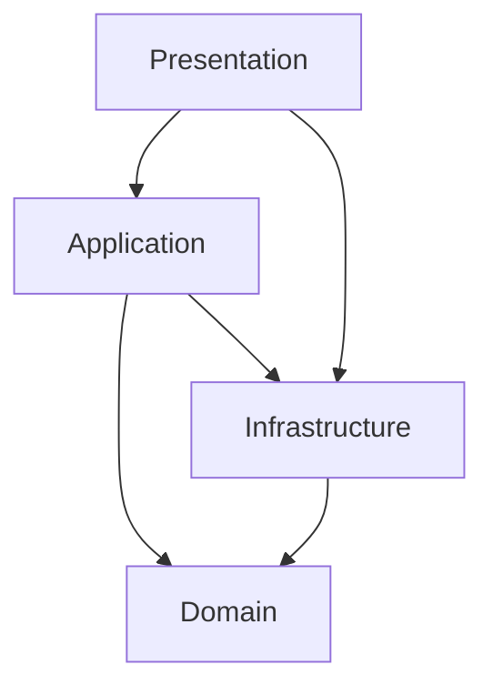

# 📐 Architecture DDD Skill

Define y valida la arquitectura Domain-Driven Design (DDD) de Silexar Pulse Antygravity, asegurando consistencia entre todos los módulos.

## Cuándo Usar Este Skill

- Al crear un nuevo módulo
- Al agregar entidades, value objects, commands, queries o handlers
- Al revisar que un módulo cumple con la arquitectura
- Al resolver dudas sobre dónde colocar código

## Estructura de Módulos

Cada módulo DDD vive en `src/modules/<nombre-modulo>/` y DEBE seguir esta estructura:

```
src/modules/<nombre-modulo>/
├── domain/                     # Capa de Dominio (Core)
│   ├── entities/               # Entidades del dominio
│   │   ├── MiEntidad.ts
│   │   └── __tests__/
│   ├── value-objects/          # Value Objects inmutables
│   │   ├── MiValueObject.ts
│   │   └── __tests__/
│   └── repositories/          # Interfaces de repositorios
│       └── IMiRepositorio.ts
├── application/                # Capa de Aplicación
│   ├── commands/              # Comandos (escritura/mutación)
│   │   ├── CrearMiEntidadCommand.ts
│   │   └── __tests__/
│   ├── queries/               # Queries (lectura)
│   │   ├── ObtenerMiEntidadQuery.ts
│   │   └── __tests__/
│   └── handlers/              # Handlers de eventos
│       └── MiEventoHandler.ts
├── infrastructure/            # Capa de Infraestructura
│   ├── repositories/         # Implementaciones de repositorios
│   │   └── MiRepositorioImpl.ts
│   ├── mappers/              # Mappers domain <-> persistence
│   │   └── MiEntidadMapper.ts
│   └── api/                  # Clientes API externos
│       └── MiApiClient.ts
└── presentation/             # Capa de Presentación
    ├── components/           # Componentes React del módulo
    │   └── MiComponente.tsx
    ├── pages/                # Páginas del módulo
    │   └── MiPagina.tsx
    └── hooks/                # Hooks específicos del módulo
        └── useMiEntidad.ts
```

## Módulos Existentes

| Módulo               | Path                              | Estado      |
| -------------------- | --------------------------------- | ----------- |
| `equipos-ventas`     | `src/modules/equipos-ventas/`     | ✅ Completo |
| `contratos`          | `src/modules/contratos/`          | ✅ Completo |
| `campanas`           | `src/modules/campanas/`           | ✅ Completo |
| `agencias-creativas` | `src/modules/agencias-creativas/` | ✅ Completo |
| `auth`               | `src/modules/auth/`               | Parcial     |
| `narratives`         | `src/modules/narratives/`         | Parcial     |

## Reglas de Dependencia entre Capas



### Reglas OBLIGATORIAS

| Desde              | Puede importar de                 | NO puede importar de                                     |
| ------------------ | --------------------------------- | -------------------------------------------------------- |
| **Domain**         | Solo librerías base (Zod, uuid)   | Application, Infrastructure, Presentation, otros módulos |
| **Application**    | Domain, Infrastructure interfaces | Presentation, otros módulos                              |
| **Infrastructure** | Domain (interfaces)               | Application, Presentation, otros módulos                 |
| **Presentation**   | Application, Domain (tipos)       | Infrastructure directamente, otros módulos               |

### Validación de Imports

```bash
# ❌ PROHIBIDO: Domain importando de Infrastructure
# src/modules/equipos-ventas/domain/entities/Equipo.ts
import { PostgresRepo } from '../../infrastructure/repositories/PostgresRepo'; // ❌ NUNCA

# ❌ PROHIBIDO: Imports cruzados entre módulos
# src/modules/equipos-ventas/domain/entities/Equipo.ts
import { Contrato } from '@/modules/contratos/domain/entities/Contrato'; // ❌ NUNCA

# ✅ CORRECTO: Domain solo usa interfaces propias y librerías base
import { z } from 'zod';
import { v4 as uuidv4 } from 'uuid';
import { IEquipoRepository } from '../repositories/IEquipoRepository';
```

## Convenciones de Naming

### Archivos

| Tipo             | Formato                | Ejemplo                      |
| ---------------- | ---------------------- | ---------------------------- |
| Entidad          | PascalCase             | `EquipoVentas.ts`            |
| Value Object     | PascalCase             | `NivelRendimiento.ts`        |
| Interface Repo   | `I` + PascalCase       | `IEquipoVentasRepository.ts` |
| Command          | PascalCase + `Command` | `CrearEquipoCommand.ts`      |
| Query            | PascalCase + `Query`   | `ObtenerEquipoQuery.ts`      |
| Handler          | PascalCase + `Handler` | `EquipoCreadoHandler.ts`     |
| Componente React | PascalCase             | `SalesTeamCard.tsx`          |
| Hook             | `use` + PascalCase     | `useEquipoVentas.ts`         |
| Test             | kebab-case + `.test`   | `equipo-ventas.test.ts`      |

### Código

| Tipo       | Formato                 | Ejemplo                                  |
| ---------- | ----------------------- | ---------------------------------------- |
| Clases     | PascalCase              | `class EquipoVentas`                     |
| Interfaces | `I` + PascalCase        | `interface IEquipoRepository`            |
| Funciones  | camelCase               | `calcularRendimiento()`                  |
| Constantes | UPPER_SNAKE_CASE        | `MAX_MIEMBROS_EQUIPO`                    |
| Types      | PascalCase              | `type EquipoProps`                       |
| Enums      | PascalCase (keys UPPER) | `enum EstadoEquipo { ACTIVO, INACTIVO }` |

## Patrones Requeridos

### Entity Pattern

```typescript
export class MiEntidad {
  private constructor(
    public readonly id: string,
    public readonly nombre: string,
    private _estado: EstadoEntidad,
    public readonly creadoEn: Date,
  ) {}

  static create(props: CrearEntidadProps): MiEntidad {
    // Validar con Zod
    const validated = crearEntidadSchema.parse(props);
    return new MiEntidad(
      uuidv4(),
      validated.nombre,
      EstadoEntidad.ACTIVO,
      new Date(),
    );
  }

  // Métodos de dominio
  activar(): void {
    /* lógica de negocio */
  }
  desactivar(): void {
    /* lógica de negocio */
  }

  // Getters
  get estado(): EstadoEntidad {
    return this._estado;
  }
  get estaActivo(): boolean {
    return this._estado === EstadoEntidad.ACTIVO;
  }
}
```

### Value Object Pattern

```typescript
export class MiValueObject {
  private constructor(private readonly _valor: string) {}

  static create(valor: string): MiValueObject {
    if (!valor || valor.trim().length === 0) {
      throw new Error("El valor no puede estar vacío");
    }
    return new MiValueObject(valor.trim());
  }

  get valor(): string {
    return this._valor;
  }

  equals(other: MiValueObject): boolean {
    return this._valor === other._valor;
  }

  toString(): string {
    return this._valor;
  }
}
```

### Repository Interface Pattern

```typescript
export interface IMiRepository {
  findById(id: string): Promise<MiEntidad | null>;
  findAll(filters?: FiltrosBusqueda): Promise<MiEntidad[]>;
  save(entity: MiEntidad): Promise<void>;
  update(entity: MiEntidad): Promise<void>;
  delete(id: string): Promise<void>;
  count(filters?: FiltrosBusqueda): Promise<number>;
}
```

### Command Pattern

```typescript
export interface CrearEntidadCommandInput {
  nombre: string;
  // ... props
}

export class CrearEntidadCommand {
  constructor(private readonly repo: IMiRepository) {}

  async execute(input: CrearEntidadCommandInput): Promise<MiEntidad> {
    const validated = crearEntidadSchema.parse(input);
    const entidad = MiEntidad.create(validated);
    await this.repo.save(entidad);
    return entidad;
  }
}
```

## Path Aliases

El proyecto usa `@/` como alias para `src/`:

```typescript
// ✅ CORRECTO
import { EquipoVentas } from "@/modules/equipos-ventas/domain/entities/EquipoVentas";

// ❌ EVITAR: rutas relativas largas
import { EquipoVentas } from "../../../../modules/equipos-ventas/domain/entities/EquipoVentas";
```

## Checklist de Validación de Módulo

Usar esta checklist al crear o auditar un módulo:

```
[ ] Estructura de carpetas completa (domain/, application/, infrastructure/, presentation/)
[ ] Entidades con constructor privado y factory method `create`
[ ] Value Objects inmutables con método `equals`
[ ] Interfaces de repositorios en domain/repositories/
[ ] Implementaciones de repositorios en infrastructure/repositories/
[ ] Commands para operaciones de escritura
[ ] Queries para operaciones de lectura
[ ] Tests para cada capa (__tests__/ en cada directorio)
[ ] Sin imports cruzados entre módulos
[ ] Domain no importa de infrastructure ni presentation
[ ] Naming conventions respetadas
[ ] Validación con Zod en entities y commands
```
