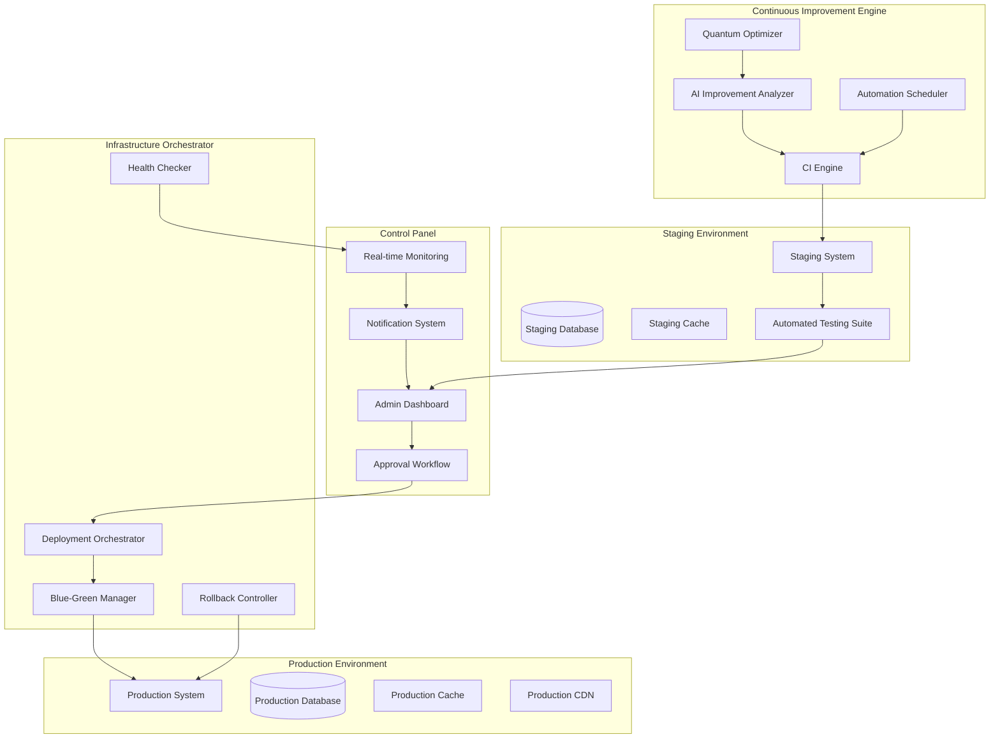
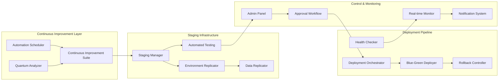
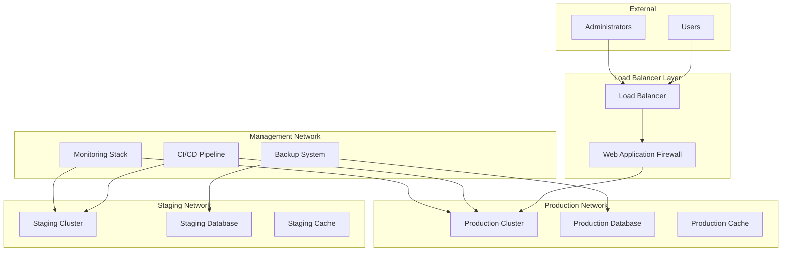

# Design Document

## Overview

El Sistema de Mejora Continua con Entorno de Staging es una arquitectura avanzada que extiende el sistema SILEXAR PULSE QUANTUM existente con capacidades de mejora continua automatizada, testing paralelo y despliegue controlado. El sistema opera con tres entornos principales: Producción (usuarios finales), Staging (testing automatizado) y Development (desarrollo continuo), con un orquestador central que gestiona el flujo de mejoras entre entornos.

La arquitectura implementa patrones de Blue-Green Deployment, Infrastructure as Code, y Continuous Integration/Continuous Deployment (CI/CD) con validación automática y rollback instantáneo. El sistema mantiene el estándar TIER 0 SUPREMACY mientras permite evolución continua sin riesgo para los usuarios finales.

## Architecture

### High-Level Architecture



### System Components Architecture



## Components and Interfaces

### 1. Continuous Improvement Engine

**Ubicación**: `src/lib/continuous-improvement-staging/`

#### Core Components:

- **ImprovementEngine**: Motor principal que genera mejoras automáticas
- **QuantumAnalyzer**: Analizador cuántico para optimizaciones avanzadas
- **AIRecommendationSystem**: Sistema de recomendaciones basado en IA
- **AutomationScheduler**: Programador de tareas automatizadas

#### Interfaces:

```typescript
interface ContinuousImprovementEngine {
  generateImprovement(): Promise<ImprovementProposal>
  analyzeSystemHealth(): Promise<SystemHealthReport>
  scheduleAutomatedTasks(): Promise<TaskSchedule>
  getImprovementHistory(): Promise<ImprovementHistory[]>
}

interface ImprovementProposal {
  id: string
  type: 'performance' | 'security' | 'quality' | 'architecture'
  priority: 'low' | 'medium' | 'high' | 'critical'
  description: string
  codeChanges: CodeChange[]
  testCases: TestCase[]
  estimatedImpact: ImpactMetrics
  quantumEnhanced: boolean
  consciousnessLevel: number
}
```

### 2. Staging Environment Manager

**Ubicación**: `src/lib/staging-environment/`

#### Core Components:

- **EnvironmentReplicator**: Replica exacta del entorno de producción
- **DataSynchronizer**: Sincronización de datos anonimizados
- **ConfigurationManager**: Gestión de configuraciones de entorno
- **ResourceMonitor**: Monitor de recursos del entorno de staging

#### Interfaces:

```typescript
interface StagingEnvironmentManager {
  createStagingEnvironment(): Promise<StagingEnvironment>
  replicateProductionConfig(): Promise<EnvironmentConfig>
  synchronizeData(): Promise<DataSyncResult>
  deployImprovement(improvement: ImprovementProposal): Promise<DeploymentResult>
  runAutomatedTests(): Promise<TestResults>
  destroyStagingEnvironment(): Promise<void>
}

interface StagingEnvironment {
  id: string
  status: 'creating' | 'ready' | 'testing' | 'failed' | 'destroyed'
  configuration: EnvironmentConfig
  resources: ResourceAllocation
  testResults: TestResults[]
  createdAt: Date
  expiresAt: Date
}
```

### 3. Admin Control Panel

**Ubicación**: `src/components/continuous-improvement-staging/`

#### Core Components:

- **ImprovementDashboard**: Panel principal de control
- **ApprovalWorkflow**: Flujo de trabajo de aprobación
- **NotificationCenter**: Centro de notificaciones
- **MonitoringDashboard**: Dashboard de monitoreo en tiempo real

#### Interfaces:

```typescript
interface AdminControlPanel {
  displayPendingImprovements(): Promise<ImprovementProposal[]>
  approveImprovement(id: string): Promise<ApprovalResult>
  rejectImprovement(id: string, reason: string): Promise<void>
  monitorDeployment(deploymentId: string): Promise<DeploymentStatus>
  triggerRollback(deploymentId: string): Promise<RollbackResult>
}

interface ApprovalWorkflow {
  submitForApproval(improvement: ImprovementProposal): Promise<string>
  getApprovalStatus(approvalId: string): Promise<ApprovalStatus>
  addApprovalComment(approvalId: string, comment: string): Promise<void>
  escalateApproval(approvalId: string): Promise<void>
}
```

### 4. Deployment Orchestrator

**Ubicación**: `src/lib/deployment-orchestrator/`

#### Core Components:

- **BlueGreenDeployer**: Implementación de despliegue blue-green
- **RollbackController**: Controlador de rollback automático
- **HealthChecker**: Verificador de salud del sistema
- **TrafficManager**: Gestor de tráfico entre entornos

#### Interfaces:

```typescript
interface DeploymentOrchestrator {
  initiateBlueGreenDeployment(improvement: ImprovementProposal): Promise<DeploymentResult>
  switchTraffic(fromEnvironment: string, toEnvironment: string): Promise<TrafficSwitchResult>
  performHealthCheck(environment: string): Promise<HealthCheckResult>
  executeRollback(deploymentId: string): Promise<RollbackResult>
}

interface BlueGreenDeployment {
  deploymentId: string
  blueEnvironment: Environment
  greenEnvironment: Environment
  currentActive: 'blue' | 'green'
  trafficSplit: TrafficSplit
  healthStatus: HealthStatus
  rollbackPlan: RollbackPlan
}
```

## Data Models

### Core Data Models

```typescript
// Improvement Proposal Model
interface ImprovementProposal {
  id: string
  title: string
  description: string
  type: ImprovementType
  priority: Priority
  status: ImprovementStatus
  codeChanges: CodeChange[]
  testCases: TestCase[]
  estimatedImpact: ImpactMetrics
  createdBy: string
  createdAt: Date
  approvedBy?: string
  approvedAt?: Date
  deployedAt?: Date
  rollbackAt?: Date
  metadata: ImprovementMetadata
}

// Staging Environment Model
interface StagingEnvironment {
  id: string
  name: string
  status: EnvironmentStatus
  configuration: EnvironmentConfiguration
  resources: ResourceAllocation
  database: DatabaseConfiguration
  services: ServiceConfiguration[]
  testResults: TestResult[]
  createdAt: Date
  expiresAt: Date
  lastHealthCheck: Date
  metadata: EnvironmentMetadata
}

// Deployment Model
interface Deployment {
  id: string
  improvementId: string
  type: DeploymentType
  status: DeploymentStatus
  sourceEnvironment: string
  targetEnvironment: string
  strategy: DeploymentStrategy
  startTime: Date
  endTime?: Date
  healthChecks: HealthCheck[]
  rollbackPlan: RollbackPlan
  trafficSplit: TrafficSplit
  metadata: DeploymentMetadata
}

// Notification Model
interface Notification {
  id: string
  type: NotificationType
  priority: Priority
  title: string
  message: string
  recipientId: string
  improvementId?: string
  deploymentId?: string
  status: NotificationStatus
  createdAt: Date
  readAt?: Date
  actionRequired: boolean
  metadata: NotificationMetadata
}
```

### Database Schema

```sql
-- Improvements table
CREATE TABLE improvements (
  id UUID PRIMARY KEY DEFAULT gen_random_uuid(),
  title VARCHAR(255) NOT NULL,
  description TEXT NOT NULL,
  type improvement_type NOT NULL,
  priority priority_level NOT NULL,
  status improvement_status NOT NULL DEFAULT 'pending',
  code_changes JSONB NOT NULL DEFAULT '[]',
  test_cases JSONB NOT NULL DEFAULT '[]',
  estimated_impact JSONB NOT NULL DEFAULT '{}',
  created_by VARCHAR(255) NOT NULL,
  created_at TIMESTAMP WITH TIME ZONE DEFAULT NOW(),
  approved_by VARCHAR(255),
  approved_at TIMESTAMP WITH TIME ZONE,
  deployed_at TIMESTAMP WITH TIME ZONE,
  rollback_at TIMESTAMP WITH TIME ZONE,
  metadata JSONB NOT NULL DEFAULT '{}'
);

-- Staging Environments table
CREATE TABLE staging_environments (
  id UUID PRIMARY KEY DEFAULT gen_random_uuid(),
  name VARCHAR(255) NOT NULL,
  status environment_status NOT NULL DEFAULT 'creating',
  configuration JSONB NOT NULL DEFAULT '{}',
  resources JSONB NOT NULL DEFAULT '{}',
  database_config JSONB NOT NULL DEFAULT '{}',
  services JSONB NOT NULL DEFAULT '[]',
  test_results JSONB NOT NULL DEFAULT '[]',
  created_at TIMESTAMP WITH TIME ZONE DEFAULT NOW(),
  expires_at TIMESTAMP WITH TIME ZONE NOT NULL,
  last_health_check TIMESTAMP WITH TIME ZONE,
  metadata JSONB NOT NULL DEFAULT '{}'
);

-- Deployments table
CREATE TABLE deployments (
  id UUID PRIMARY KEY DEFAULT gen_random_uuid(),
  improvement_id UUID REFERENCES improvements(id),
  type deployment_type NOT NULL,
  status deployment_status NOT NULL DEFAULT 'pending',
  source_environment VARCHAR(255) NOT NULL,
  target_environment VARCHAR(255) NOT NULL,
  strategy deployment_strategy NOT NULL DEFAULT 'blue_green',
  start_time TIMESTAMP WITH TIME ZONE DEFAULT NOW(),
  end_time TIMESTAMP WITH TIME ZONE,
  health_checks JSONB NOT NULL DEFAULT '[]',
  rollback_plan JSONB NOT NULL DEFAULT '{}',
  traffic_split JSONB NOT NULL DEFAULT '{}',
  metadata JSONB NOT NULL DEFAULT '{}'
);

-- Notifications table
CREATE TABLE notifications (
  id UUID PRIMARY KEY DEFAULT gen_random_uuid(),
  type notification_type NOT NULL,
  priority priority_level NOT NULL,
  title VARCHAR(255) NOT NULL,
  message TEXT NOT NULL,
  recipient_id VARCHAR(255) NOT NULL,
  improvement_id UUID REFERENCES improvements(id),
  deployment_id UUID REFERENCES deployments(id),
  status notification_status NOT NULL DEFAULT 'unread',
  created_at TIMESTAMP WITH TIME ZONE DEFAULT NOW(),
  read_at TIMESTAMP WITH TIME ZONE,
  action_required BOOLEAN DEFAULT FALSE,
  metadata JSONB NOT NULL DEFAULT '{}'
);
```

## Error Handling

### Error Categories

1. **System Errors**: Errores de infraestructura y sistema
2. **Deployment Errors**: Errores durante el despliegue
3. **Testing Errors**: Errores en las pruebas automatizadas
4. **Configuration Errors**: Errores de configuración
5. **Resource Errors**: Errores de recursos insuficientes

### Error Handling Strategy

```typescript
class ContinuousImprovementError extends Error {
  constructor(
    message: string,
    public code: string,
    public category: ErrorCategory,
    public severity: ErrorSeverity,
    public context?: any
  ) {
    super(message)
    this.name = 'ContinuousImprovementError'
  }
}

interface ErrorHandler {
  handleSystemError(error: SystemError): Promise<ErrorResponse>
  handleDeploymentError(error: DeploymentError): Promise<RollbackResult>
  handleTestingError(error: TestingError): Promise<TestRetryResult>
  handleConfigurationError(error: ConfigError): Promise<ConfigFixResult>
  handleResourceError(error: ResourceError): Promise<ResourceAllocationResult>
}

// Automatic Error Recovery
class AutomaticErrorRecovery {
  async recoverFromDeploymentFailure(deploymentId: string): Promise<RecoveryResult> {
    // 1. Stop deployment
    // 2. Preserve logs
    // 3. Execute rollback
    // 4. Notify administrators
    // 5. Generate recovery report
  }
  
  async recoverFromStagingFailure(stagingId: string): Promise<RecoveryResult> {
    // 1. Preserve staging state
    // 2. Create new staging environment
    // 3. Retry improvement deployment
    // 4. Update improvement status
  }
}
```

### Circuit Breaker Pattern

```typescript
class CircuitBreaker {
  private failureCount = 0
  private lastFailureTime?: Date
  private state: 'CLOSED' | 'OPEN' | 'HALF_OPEN' = 'CLOSED'
  
  async execute<T>(operation: () => Promise<T>): Promise<T> {
    if (this.state === 'OPEN') {
      if (this.shouldAttemptReset()) {
        this.state = 'HALF_OPEN'
      } else {
        throw new Error('Circuit breaker is OPEN')
      }
    }
    
    try {
      const result = await operation()
      this.onSuccess()
      return result
    } catch (error) {
      this.onFailure()
      throw error
    }
  }
}
```

## Testing Strategy

### Testing Levels

1. **Unit Testing**: Pruebas de componentes individuales
2. **Integration Testing**: Pruebas de integración entre componentes
3. **End-to-End Testing**: Pruebas completas del flujo de trabajo
4. **Performance Testing**: Pruebas de rendimiento y carga
5. **Security Testing**: Pruebas de seguridad y vulnerabilidades
6. **Chaos Testing**: Pruebas de resistencia y recuperación

### Automated Testing Pipeline

```typescript
interface TestingPipeline {
  runUnitTests(): Promise<TestResults>
  runIntegrationTests(): Promise<TestResults>
  runE2ETests(): Promise<TestResults>
  runPerformanceTests(): Promise<PerformanceResults>
  runSecurityTests(): Promise<SecurityResults>
  runChaosTests(): Promise<ChaosResults>
}

class StagingTestSuite {
  async validateImprovement(improvement: ImprovementProposal): Promise<ValidationResult> {
    const results = await Promise.all([
      this.runFunctionalTests(improvement),
      this.runPerformanceTests(improvement),
      this.runSecurityTests(improvement),
      this.runCompatibilityTests(improvement),
      this.runRegressionTests(improvement)
    ])
    
    return this.aggregateResults(results)
  }
  
  async runLoadTests(environment: StagingEnvironment): Promise<LoadTestResults> {
    // Simulate production load
    // Measure response times
    // Check resource utilization
    // Validate auto-scaling
  }
}
```

### Test Data Management

```typescript
class TestDataManager {
  async createAnonymizedDataset(): Promise<Dataset> {
    // 1. Extract production data structure
    // 2. Generate synthetic data
    // 3. Anonymize sensitive information
    // 4. Validate data integrity
    // 5. Create staging database
  }
  
  async synchronizeTestData(): Promise<SyncResult> {
    // 1. Check data freshness
    // 2. Update changed schemas
    // 3. Refresh test datasets
    // 4. Validate data consistency
  }
}
```

### Continuous Testing

```typescript
class ContinuousTestingEngine {
  async scheduleAutomatedTests(): Promise<void> {
    // Daily: Unit and integration tests
    // Weekly: Full E2E and performance tests
    // Monthly: Security and chaos tests
  }
  
  async monitorTestHealth(): Promise<TestHealthReport> {
    // Monitor test execution times
    // Track test failure rates
    // Identify flaky tests
    // Generate health reports
  }
}
```

## Infrastructure Requirements

### Hardware Requirements

#### Production Environment
- **CPU**: 16+ cores per node
- **RAM**: 64GB+ per node
- **Storage**: 1TB+ NVMe SSD
- **Network**: 10Gbps+ bandwidth
- **Redundancy**: Multi-AZ deployment

#### Staging Environment
- **CPU**: 8+ cores per node
- **RAM**: 32GB+ per node
- **Storage**: 500GB+ NVMe SSD
- **Network**: 1Gbps+ bandwidth
- **Isolation**: Dedicated resources

### Software Requirements

#### Container Orchestration
- **Kubernetes**: v1.28+
- **Docker**: v24.0+
- **Helm**: v3.12+

#### Database
- **PostgreSQL**: v15+
- **Redis**: v7.0+
- **Backup**: Automated daily backups

#### Monitoring
- **Prometheus**: Metrics collection
- **Grafana**: Visualization
- **AlertManager**: Alert routing
- **Jaeger**: Distributed tracing

### Network Architecture



### Security Architecture

#### Network Security
- **VPC**: Isolated virtual private cloud
- **Subnets**: Separate subnets for each environment
- **Security Groups**: Restrictive firewall rules
- **NAT Gateway**: Secure outbound internet access

#### Application Security
- **TLS 1.3**: End-to-end encryption
- **OAuth 2.0**: Authentication and authorization
- **JWT**: Secure token management
- **Rate Limiting**: API protection

#### Data Security
- **Encryption at Rest**: AES-256 encryption
- **Encryption in Transit**: TLS encryption
- **Key Management**: Hardware security modules
- **Data Anonymization**: PII protection

### Deployment Strategy

#### Blue-Green Deployment

```typescript
class BlueGreenDeploymentStrategy {
  async deploy(improvement: ImprovementProposal): Promise<DeploymentResult> {
    // 1. Prepare green environment
    const greenEnv = await this.prepareGreenEnvironment()
    
    // 2. Deploy improvement to green
    await this.deployToGreen(improvement, greenEnv)
    
    // 3. Run health checks
    const healthCheck = await this.runHealthChecks(greenEnv)
    
    // 4. Switch traffic gradually
    if (healthCheck.success) {
      await this.switchTraffic('blue', 'green')
      return { success: true, environment: 'green' }
    } else {
      await this.rollback('green', 'blue')
      return { success: false, error: healthCheck.error }
    }
  }
}
```

#### Canary Deployment

```typescript
class CanaryDeploymentStrategy {
  async deploy(improvement: ImprovementProposal): Promise<DeploymentResult> {
    // 1. Deploy to small percentage of traffic
    await this.deployCanary(improvement, 5)
    
    // 2. Monitor metrics
    const metrics = await this.monitorCanary(300) // 5 minutes
    
    // 3. Gradually increase traffic
    if (metrics.success) {
      await this.increaseCanaryTraffic([10, 25, 50, 100])
      return { success: true, strategy: 'canary' }
    } else {
      await this.rollbackCanary()
      return { success: false, error: metrics.error }
    }
  }
}
```