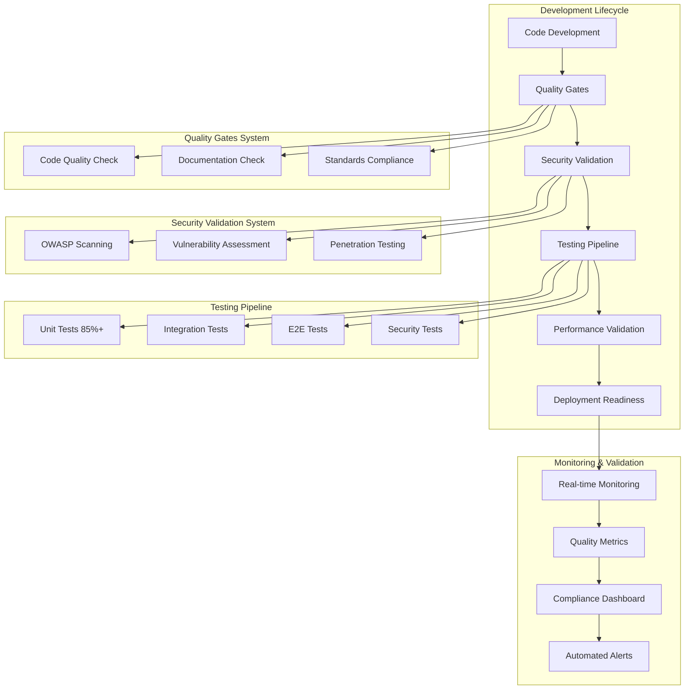

# Design Document - Definition of Done TIER 0

## Overview

The Definition of Done (DoD) for Silexar Pulse Quantum TIER 0 is designed as a comprehensive quality framework that ensures every component meets military-grade standards. This design establishes automated validation systems, quality gates, and continuous monitoring to maintain TIER 0 supremacy across all development activities.

## Architecture

### Quality Framework Architecture



### Quality Gate Implementation

The DoD is implemented through a series of automated quality gates that must be passed before code can progress through the development lifecycle:

1. **Pre-commit Gates**: Local validation before code commit
2. **CI/CD Pipeline Gates**: Automated validation in continuous integration
3. **Pre-deployment Gates**: Final validation before production deployment
4. **Post-deployment Gates**: Continuous monitoring and validation

## Components and Interfaces

### 1. Code Quality Validator

**Purpose**: Automated validation of code quality standards
**Location**: `src/lib/quality/code-quality-validator.ts`

**Key Features**:
- TypeScript strict mode validation
- ESLint enterprise configuration enforcement
- JSDoc documentation completeness checking
- Code complexity analysis
- Dependency security scanning

**Interface**:
```typescript
interface CodeQualityValidator {
  validateTypeScript(filePath: string): ValidationResult;
  validateDocumentation(filePath: string): DocumentationResult;
  validateComplexity(filePath: string): ComplexityResult;
  validateDependencies(): SecurityResult;
  generateQualityReport(): QualityReport;
}
```

### 2. Security Compliance Engine

**Purpose**: Comprehensive security validation and compliance checking
**Location**: `src/lib/quality/security-compliance-engine.ts`

**Key Features**:
- OWASP Top 10 vulnerability scanning
- Input validation and sanitization checking
- Authentication and authorization validation
- Encryption implementation verification
- Security audit trail validation

**Interface**:
```typescript
interface SecurityComplianceEngine {
  scanVulnerabilities(): VulnerabilityReport;
  validateInputSanitization(component: string): ValidationResult;
  checkAuthenticationImplementation(): AuthResult;
  verifyEncryption(): EncryptionResult;
  auditSecurityCompliance(): ComplianceReport;
}
```

### 3. Test Coverage Analyzer

**Purpose**: Automated test coverage analysis and validation
**Location**: `src/lib/quality/test-coverage-analyzer.ts`

**Key Features**:
- Unit test coverage measurement (85% minimum)
- Integration test validation
- Security test verification
- Performance test analysis
- Accessibility test compliance

**Interface**:
```typescript
interface TestCoverageAnalyzer {
  measureUnitCoverage(): CoverageReport;
  validateIntegrationTests(): TestResult;
  checkSecurityTests(): SecurityTestResult;
  analyzePerformanceTests(): PerformanceTestResult;
  validateAccessibilityTests(): AccessibilityResult;
}
```

### 4. Performance Validator

**Purpose**: Performance standards validation and monitoring
**Location**: `src/lib/quality/performance-validator.ts`

**Key Features**:
- Page load time measurement (2-second target)
- Interaction response time validation (100ms target)
- Bundle size optimization verification
- Memory usage monitoring
- Database query performance analysis

**Interface**:
```typescript
interface PerformanceValidator {
  measurePageLoadTime(url: string): PerformanceMetrics;
  validateInteractionTimes(): InteractionMetrics;
  analyzeBundleSize(): BundleAnalysis;
  monitorMemoryUsage(): MemoryMetrics;
  validateDatabasePerformance(): DatabaseMetrics;
}
```

### 5. Accessibility Compliance Checker

**Purpose**: WCAG 2.1 AA compliance validation
**Location**: `src/lib/quality/accessibility-checker.ts`

**Key Features**:
- WCAG 2.1 AA standards validation
- Keyboard navigation testing
- Screen reader compatibility checking
- Color contrast ratio validation
- Semantic HTML structure verification

**Interface**:
```typescript
interface AccessibilityChecker {
  validateWCAGCompliance(component: string): WCAGResult;
  testKeyboardNavigation(): NavigationResult;
  checkScreenReaderCompatibility(): ScreenReaderResult;
  validateColorContrast(): ContrastResult;
  verifySemanticStructure(): SemanticResult;
}
```

### 6. Documentation Validator

**Purpose**: Documentation completeness and quality validation
**Location**: `src/lib/quality/documentation-validator.ts`

**Key Features**:
- API documentation completeness checking
- User guide validation
- Architecture documentation verification
- Code comment quality analysis
- Migration guide validation

**Interface**:
```typescript
interface DocumentationValidator {
  validateAPIDocumentation(): DocumentationResult;
  checkUserGuides(): GuideResult;
  verifyArchitectureDocumentation(): ArchResult;
  analyzeCodeComments(): CommentResult;
  validateMigrationGuides(): MigrationResult;
}
```

### 7. Deployment Readiness Checker

**Purpose**: Production deployment readiness validation
**Location**: `src/lib/quality/deployment-checker.ts`

**Key Features**:
- CI/CD pipeline validation
- Environment configuration checking
- Health check endpoint verification
- Monitoring setup validation
- Rollback procedure verification

**Interface**:
```typescript
interface DeploymentChecker {
  validateCIPipeline(): PipelineResult;
  checkEnvironmentConfig(): ConfigResult;
  verifyHealthChecks(): HealthResult;
  validateMonitoring(): MonitoringResult;
  checkRollbackProcedures(): RollbackResult;
}
```

### 8. Quality Dashboard

**Purpose**: Real-time quality metrics visualization and monitoring
**Location**: `src/components/quality/quality-dashboard.tsx`

**Key Features**:
- Real-time quality metrics display
- Compliance status visualization
- Quality trend analysis
- Alert management
- Quality gate status monitoring

**Interface**:
```typescript
interface QualityDashboard {
  displayQualityMetrics(): QualityMetrics;
  showComplianceStatus(): ComplianceStatus;
  renderQualityTrends(): TrendData;
  manageAlerts(): AlertManagement;
  monitorQualityGates(): GateStatus;
}
```

## Data Models

### Quality Validation Result

```typescript
interface QualityValidationResult {
  id: string;
  component: string;
  timestamp: Date;
  overallScore: number; // 0-100
  status: 'PASSED' | 'FAILED' | 'WARNING';
  validations: {
    codeQuality: ValidationResult;
    security: SecurityResult;
    testing: TestResult;
    performance: PerformanceResult;
    accessibility: AccessibilityResult;
    documentation: DocumentationResult;
    deployment: DeploymentResult;
  };
  recommendations: string[];
  blockers: string[];
}
```

### Quality Metrics

```typescript
interface QualityMetrics {
  timestamp: Date;
  overallQualityScore: number;
  codeQualityScore: number;
  securityScore: number;
  testCoveragePercentage: number;
  performanceScore: number;
  accessibilityScore: number;
  documentationScore: number;
  deploymentReadinessScore: number;
  trendsLast30Days: {
    qualityImprovement: number;
    securityImprovements: number;
    performanceGains: number;
  };
}
```

### Compliance Report

```typescript
interface ComplianceReport {
  id: string;
  generatedAt: Date;
  complianceLevel: 'TIER_0' | 'ENTERPRISE' | 'STANDARD';
  overallCompliance: number; // 0-100
  categories: {
    security: ComplianceCategory;
    accessibility: ComplianceCategory;
    performance: ComplianceCategory;
    documentation: ComplianceCategory;
    testing: ComplianceCategory;
  };
  certifications: string[];
  auditTrail: AuditEntry[];
}
```

## Error Handling

### Quality Gate Failures

1. **Blocking Failures**: Critical issues that prevent progression
   - Security vulnerabilities (Critical/High)
   - Test coverage below 85%
   - Performance degradation >20%
   - WCAG compliance failures

2. **Warning Failures**: Issues that should be addressed but don't block
   - Documentation gaps
   - Code complexity warnings
   - Minor performance issues
   - Non-critical accessibility issues

3. **Automated Remediation**: Where possible, automatic fixes are applied
   - Code formatting
   - Documentation generation
   - Basic security fixes
   - Performance optimizations

### Error Recovery Strategies

```typescript
interface ErrorRecoveryStrategy {
  retryWithBackoff(validation: () => Promise<Result>): Promise<Result>;
  fallbackToManualReview(issue: QualityIssue): Promise<ManualReviewResult>;
  autoRemediate(issue: RemediableIssue): Promise<RemediationResult>;
  escalateToTeam(criticalIssue: CriticalIssue): Promise<EscalationResult>;
}
```

## Testing Strategy

### Automated Quality Testing

1. **Unit Tests for Quality Components**
   - Code quality validator tests
   - Security compliance engine tests
   - Performance validator tests
   - Accessibility checker tests

2. **Integration Tests for Quality Pipeline**
   - End-to-end quality gate testing
   - CI/CD pipeline integration tests
   - Cross-component validation tests

3. **Performance Tests for Quality System**
   - Quality validation performance benchmarks
   - Large codebase scanning performance
   - Real-time monitoring performance

### Quality Validation Testing

1. **Positive Test Cases**
   - Components that meet all DoD criteria
   - Perfect quality score scenarios
   - Successful deployment scenarios

2. **Negative Test Cases**
   - Components with quality issues
   - Security vulnerability scenarios
   - Performance degradation scenarios

3. **Edge Cases**
   - Large codebases
   - Complex component interactions
   - High-load scenarios

### Continuous Quality Monitoring

1. **Real-time Quality Metrics**
   - Live quality score tracking
   - Immediate failure notifications
   - Trend analysis and predictions

2. **Quality Regression Detection**
   - Automated quality degradation alerts
   - Historical quality comparison
   - Root cause analysis automation

## Implementation Phases

### Phase 1: Core Quality Framework (Week 1-2)
- Implement basic quality validators
- Set up quality gate infrastructure
- Create quality metrics collection

### Phase 2: Advanced Validation (Week 3-4)
- Implement security compliance engine
- Add performance validation
- Create accessibility checking

### Phase 3: Dashboard and Monitoring (Week 5-6)
- Build quality dashboard
- Implement real-time monitoring
- Add alerting and notifications

### Phase 4: Integration and Optimization (Week 7-8)
- Integrate with CI/CD pipelines
- Optimize validation performance
- Add automated remediation

## Quality Assurance for DoD System

The Definition of Done system itself must meet the same quality standards it enforces:

1. **Self-Validation**: The DoD system validates itself
2. **Performance Requirements**: Quality checks must complete within defined timeframes
3. **Reliability**: 99.9% uptime for quality validation services
4. **Scalability**: Handle validation for large enterprise codebases
5. **Security**: Secure handling of code analysis and metrics data

## Monitoring and Metrics

### Key Performance Indicators (KPIs)

1. **Quality Score Trends**: Overall system quality over time
2. **Gate Pass Rate**: Percentage of components passing quality gates
3. **Time to Resolution**: Average time to fix quality issues
4. **Security Posture**: Security compliance score trends
5. **Performance Trends**: System performance metrics over time

### Alerting Strategy

1. **Critical Alerts**: Security vulnerabilities, major performance degradation
2. **Warning Alerts**: Quality score drops, test coverage decreases
3. **Informational Alerts**: Quality improvements, milestone achievements

### Reporting

1. **Daily Quality Reports**: Automated daily quality status
2. **Weekly Trend Reports**: Quality trends and analysis
3. **Monthly Compliance Reports**: Comprehensive compliance status
4. **Quarterly Quality Reviews**: Strategic quality assessment