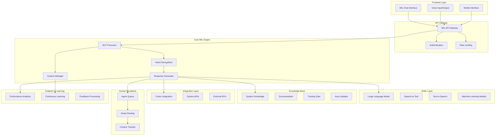
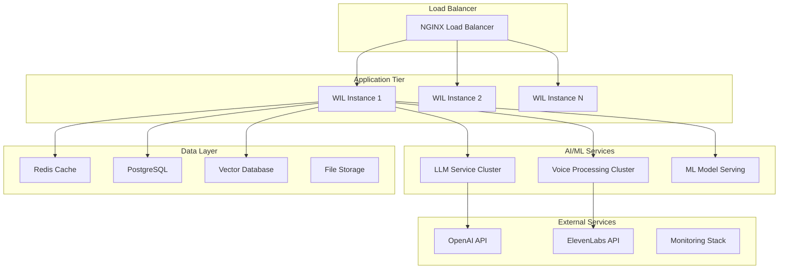

# WIL VOICE ASSISTANT - DESIGN DOCUMENT

## Overview

WIL (Workforce Intelligence Layer) Voice Assistant es un sistema de IA conversacional de próxima generación diseñado para proporcionar soporte empresarial autónomo con capacidades del año 2040. El sistema combina múltiples tecnologías de vanguardia incluyendo Large Language Models (LLMs), procesamiento de voz en tiempo real, aprendizaje continuo, y integración profunda con el ecosistema Cortex.

La arquitectura está diseñada para ser completamente escalable, segura y autónoma, con capacidades de auto-mejora y escalamiento inteligente a agentes humanos cuando sea necesario.

## Architecture

### High-Level Architecture



### Component Architecture

#### 1. Frontend Components
- **WIL Chat Interface**: React-based conversational UI with rich media support
- **Voice Interface**: Real-time voice processing with noise cancellation
- **Mobile Interface**: Responsive design optimized for mobile devices
- **Accessibility Layer**: Screen reader support and adaptive interfaces

#### 2. Core Processing Engine
- **NLP Processor**: Advanced natural language understanding with context awareness
- **Intent Recognition**: Multi-layered intent classification with confidence scoring
- **Context Manager**: Conversation state management with long-term memory
- **Response Generator**: Dynamic response creation with personalization

#### 3. AI/ML Infrastructure
- **Primary LLM**: GPT-4 Turbo or Claude-3 Opus for complex reasoning
- **Specialized Models**: Fine-tuned models for domain-specific tasks
- **Voice Processing**: Whisper for STT, ElevenLabs for TTS
- **Embedding Models**: Vector embeddings for semantic search

#### 4. Knowledge Management
- **System Documentation**: Auto-indexed system knowledge base
- **Training Corpus**: Continuously updated training data
- **Version Control**: Automatic knowledge versioning and rollback
- **Real-time Updates**: Live system integration for current state

## Components and Interfaces

### Core WIL Engine

```typescript
interface WILEngine {
  processMessage(input: MessageInput): Promise<WILResponse>
  processVoice(audio: AudioBuffer): Promise<WILResponse>
  updateKnowledge(updates: KnowledgeUpdate[]): Promise<void>
  escalateToHuman(context: ConversationContext): Promise<EscalationResult>
}

interface MessageInput {
  text: string
  userId: string
  sessionId: string
  context: ConversationContext
  metadata: MessageMetadata
}

interface WILResponse {
  text: string
  audio?: AudioBuffer
  actions: ActionSuggestion[]
  confidence: number
  escalationRecommended: boolean
  followUpQuestions: string[]
}
```

### Knowledge Base Interface

```typescript
interface KnowledgeBase {
  search(query: string, context?: string): Promise<KnowledgeResult[]>
  update(content: KnowledgeContent): Promise<void>
  getSystemState(): Promise<SystemState>
  getDocumentation(module: string): Promise<Documentation>
}

interface KnowledgeResult {
  content: string
  relevance: number
  source: string
  lastUpdated: Date
  metadata: KnowledgeMetadata
}
```

### Cortex Integration Interface

```typescript
interface CortexIntegration {
  executeAnalysis(type: AnalysisType, params: any): Promise<AnalysisResult>
  getModuleStatus(module: string): Promise<ModuleStatus>
  executeAction(action: CortexAction): Promise<ActionResult>
  getRecommendations(context: string): Promise<Recommendation[]>
}
```

### Human Escalation Interface

```typescript
interface HumanEscalation {
  findAvailableAgent(skillset: string[]): Promise<Agent | null>
  transferContext(context: ConversationContext, agent: Agent): Promise<void>
  scheduleCallback(preferences: CallbackPreferences): Promise<CallbackSchedule>
  getQueueStatus(): Promise<QueueStatus>
}
```

## Data Models

### Conversation Context

```typescript
interface ConversationContext {
  sessionId: string
  userId: string
  userProfile: UserProfile
  conversationHistory: Message[]
  currentIntent: Intent
  systemContext: SystemContext
  preferences: UserPreferences
  escalationHistory: EscalationEvent[]
}

interface Message {
  id: string
  timestamp: Date
  sender: 'user' | 'wil' | 'agent'
  content: MessageContent
  metadata: MessageMetadata
}

interface MessageContent {
  text: string
  audio?: AudioData
  attachments?: Attachment[]
  actions?: Action[]
}
```

### User Profile

```typescript
interface UserProfile {
  id: string
  name: string
  role: UserRole
  permissions: Permission[]
  preferences: UserPreferences
  skillLevel: SkillLevel
  trainingHistory: TrainingRecord[]
  interactionHistory: InteractionSummary
}

interface UserPreferences {
  language: string
  communicationMode: 'text' | 'voice' | 'mixed'
  responseStyle: 'concise' | 'detailed' | 'adaptive'
  accessibilityNeeds: AccessibilityRequirement[]
}
```

### Knowledge Models

```typescript
interface SystemKnowledge {
  modules: ModuleKnowledge[]
  processes: ProcessKnowledge[]
  integrations: IntegrationKnowledge[]
  troubleshooting: TroubleshootingKnowledge[]
  bestPractices: BestPractice[]
}

interface ModuleKnowledge {
  name: string
  description: string
  features: Feature[]
  configuration: ConfigurationGuide[]
  apis: APIDocumentation[]
  examples: UsageExample[]
}
```

## Error Handling

### Error Classification

```typescript
enum ErrorType {
  UNDERSTANDING_ERROR = 'understanding_error',
  SYSTEM_ERROR = 'system_error',
  PERMISSION_ERROR = 'permission_error',
  INTEGRATION_ERROR = 'integration_error',
  ESCALATION_ERROR = 'escalation_error'
}

interface ErrorResponse {
  type: ErrorType
  message: string
  suggestions: string[]
  escalationRecommended: boolean
  retryable: boolean
}
```

### Error Recovery Strategies

1. **Understanding Errors**: Request clarification with suggested phrasings
2. **System Errors**: Automatic retry with exponential backoff
3. **Permission Errors**: Guide user through proper authorization
4. **Integration Errors**: Fallback to alternative data sources
5. **Escalation Errors**: Queue for callback with priority handling

## Testing Strategy

### Unit Testing
- **NLP Components**: Test intent recognition accuracy >95%
- **Knowledge Base**: Verify search relevance and update mechanisms
- **Integration Layer**: Mock external services for reliable testing
- **Voice Processing**: Test STT/TTS accuracy across languages

### Integration Testing
- **End-to-End Conversations**: Test complete conversation flows
- **Cortex Integration**: Verify all motor integrations work correctly
- **Human Escalation**: Test escalation triggers and context transfer
- **Multi-modal**: Test voice + text combinations

### Performance Testing
- **Load Testing**: 1000+ concurrent users with <2s response time
- **Stress Testing**: System behavior under extreme load
- **Voice Latency**: <500ms for voice processing pipeline
- **Knowledge Search**: <100ms for knowledge base queries

### Security Testing
- **Authentication**: Test all auth mechanisms and edge cases
- **Authorization**: Verify permission enforcement
- **Data Protection**: Test encryption and data handling
- **Injection Attacks**: Test against prompt injection and XSS

## Deployment Architecture

### Production Environment



### Scalability Considerations

1. **Horizontal Scaling**: Auto-scaling based on CPU/memory usage
2. **Database Sharding**: Partition conversation data by user
3. **Caching Strategy**: Multi-layer caching for knowledge and responses
4. **CDN Integration**: Global content delivery for static assets
5. **Microservices**: Separate services for different AI capabilities

### Security Architecture

1. **API Security**: OAuth 2.0 + JWT tokens with short expiration
2. **Data Encryption**: AES-256 encryption at rest and in transit
3. **Network Security**: VPC with private subnets and security groups
4. **Audit Logging**: Comprehensive logging of all interactions
5. **Compliance**: GDPR, CCPA, and SOC 2 compliance

## Integration Specifications

### Cortex Motors Integration

Each Cortex motor will be integrated through a standardized interface:

```typescript
interface CortexMotorIntegration {
  motor: string
  capabilities: string[]
  executeFunction(func: string, params: any): Promise<any>
  getStatus(): Promise<MotorStatus>
  getDocumentation(): Promise<MotorDocumentation>
}
```

### External API Integrations

1. **OpenAI GPT-4**: Primary reasoning and conversation
2. **Anthropic Claude**: Backup LLM for complex reasoning
3. **ElevenLabs**: High-quality text-to-speech
4. **Whisper**: Speech-to-text processing
5. **Pinecone**: Vector database for semantic search

### Real-time Communication

- **WebSocket**: Real-time bidirectional communication
- **Server-Sent Events**: Live updates and notifications
- **WebRTC**: Direct voice communication for escalation
- **Socket.IO**: Fallback for older browsers

## Performance Optimization

### Response Time Targets
- **Text Responses**: <1 second for simple queries
- **Complex Analysis**: <3 seconds for Cortex integration
- **Voice Processing**: <500ms for STT/TTS pipeline
- **Knowledge Search**: <100ms for semantic search

### Optimization Strategies
1. **Predictive Caching**: Pre-cache common responses
2. **Streaming Responses**: Stream long responses as they generate
3. **Parallel Processing**: Process multiple intents simultaneously
4. **Model Optimization**: Use quantized models for faster inference
5. **Edge Computing**: Deploy models closer to users

## Monitoring and Analytics

### Key Metrics
- **Response Accuracy**: User satisfaction ratings
- **Response Time**: P95 response times across all functions
- **Escalation Rate**: Percentage of conversations escalated
- **User Engagement**: Session duration and return rate
- **System Health**: Error rates and uptime

### Monitoring Stack
- **Application Monitoring**: New Relic or DataDog
- **Infrastructure Monitoring**: Prometheus + Grafana
- **Log Aggregation**: ELK Stack (Elasticsearch, Logstash, Kibana)
- **Error Tracking**: Sentry for error monitoring
- **User Analytics**: Custom analytics dashboard

This design provides a comprehensive foundation for building the most advanced voice assistant for enterprise environments, with capabilities that exceed current market standards and prepare for future technological advances.