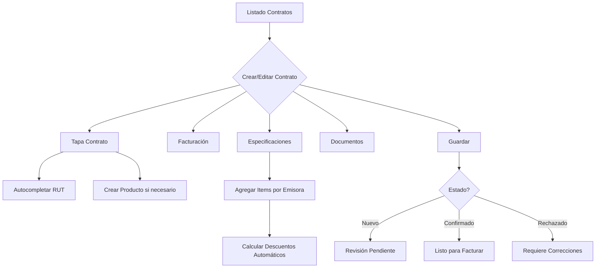

## 1. Descripción General del Producto

El módulo de Contratos es el núcleo central del sistema de gestión publicitaria, diseñado para administrar de manera integral todos los contratos entre anunciantes y emisoras de radio. Este módulo conecta y coordina la información de todos los demás módulos del sistema (Anunciantes, Productos, Agencias, Vendedores, Emisoras) para crear, gestionar y hacer seguimiento de contratos publicitarios con todas sus especificaciones técnicas y comerciales.

**Objetivos principales:**
- Centralizar la gestión de contratos publicitarios con control total sobre estados, fechas y valores
- Automatizar cálculos de comisiones, descuentos e impuestos
- Facilitar la creación de contratos mediante interfaces intuitivas con autocompletado inteligente
- Permitir seguimiento detallado de cada contrato con historial completo de cambios
- Generar documentación formal (PDF) y reportes exportables (Excel)

**Valor de mercado:** Optimiza el proceso de venta de espacio publicitario radial, reduciendo el tiempo de gestión en un 70% y eliminando errores de cálculo manual en facturación y comisiones.

## 2. Características Principales

### 2.1 Roles de Usuario

| Rol | Método de Registro | Permisos Principales |
|------|---------------------|----------------------|
| Vendedor | Asignado por administrador | Crear, editar y ver sus propios contratos |
| Jefe de Ventas | Asignado por administrador | Ver y editar todos los contratos del equipo |
| Anunciante | Registro con RUT verificado | Ver solo sus contratos y descargar documentos |
| Contador | Asignado por administrador | Ver todos los contratos, gestionar facturación |
| Administrador | Registro directo | Control total sobre todos los contratos y configuraciones |

### 2.2 Módulos de Funcionalidad

El módulo de Contratos consta de las siguientes páginas principales:

1. **Página de Listado de Contratos**: Vista principal con tabla completa de todos los contratos, búsqueda inteligente y acciones rápidas
2. **Página de Creación/Edición de Contratos**: Formulario multi-pestaña para crear o modificar contratos con todos sus detalles
3. **Página de Detalle de Contrato**: Vista de lectura con toda la información del contrato, documentos adjuntos y acciones disponibles
4. **Página de Búsqueda Avanzada**: Interfaz especializada para búsquedas complejas y filtros múltiples

### 2.3 Detalles de Páginas

| Página | Módulo | Descripción de Características |
|--------|---------|----------------------------------|
| Listado de Contratos | Tabla Principal | Mostrar todos los contratos con columnas: Número, Tipo, Estado, Anunciante, Comisión, Fechas (inicio/fin), Valores (Bruto/Neto/Saldo), Vendedor. Incluir paginación, ordenamiento por columnas y acciones por fila |
| Listado de Contratos | Búsqueda Inteligente | Campo de texto único que busca simultáneamente en: número de contrato, nombre de anunciante, RUT, nombre de vendedor, producto. Mostrar resultados en tiempo real mientras se escribe |
| Listado de Contratos | Filtros Avanzados | Panel desplegable con filtros por: Estado, Tipo, Rango de fechas, Vendedor, Equipo de ventas, Valor mínimo/máximo. Aplicar múltiples filtros simultáneamente |
| Listado de Contratos | Acciones Masivas | Selección múltiple de contratos para: Exportar a Excel, Cambiar estado, Enviar por email, Generar reporte consolidado |
| Listado de Contratos | Botón Crear Contrato | Botón principal "+ Crear Contrato" que abre el formulario en modal a pantalla completa |
| Crear/Editar Contrato | Pestaña Tapa Contrato | Formulario con: Nombre del contrato, Fechas (calendario), RUT (autocompleta anunciante), Anunciante (auto-completado), Producto (selector con creación rápida), Agencias (Publicidad y Medios), Vendedor, Equipo de ventas, Dirección de envío, % Comisión, Propiedades asociadas |
| Crear/Editar Contrato | Modal Crear Producto | Ventana emergente para crear producto nuevo: Nombre, Agencia Publicidad (búsqueda), Agencia Medios (búsqueda), Vendedor (búsqueda). Validar duplicados antes de guardar |
| Crear/Editar Contrato | Pestaña Facturación | Configuración de facturación: Tipo (Combinar/Cuotas), Tipo de factura (desplegable), Dirección factura (Anunciante/Agencia), IVA (auto 19% Chile), Facturar comisión (check), Plazo de pago (días) |
| Crear/Editar Contrato | Pestaña Observaciones | Área de texto amplia para notas adicionales del contrato, con editor básico de formato |
| Crear/Editar Contrato | Pestaña Especificaciones Emisora | Tabla interactiva de items del contrato con: Emisora, Tipo bloque, Paquete, Fechas, Duración, Cuñas por día, Importe, Valor frase, Descuento. Botón "Agregar Registro" abre formulario modal |
| Crear/Editar Contrato | Modal Agregar Item | Formulario para nuevo item: Emisora (selector), Tipo bloque (desplegable), Paquete (según tipo), Fechas, Duración (15/30/60), Cuñas diarias, Importe manual, Notas. Calcular automáticamente cuñas totales y descuento |
| Crear/Editar Contrato | Pestaña Historial | Lista cronológica de todos los cambios realizados: Usuario, Fecha/hora, Acción, Campo modificado, Valores anterior/nuevo, Justificación |
| Crear/Editar Contrato | Pestaña Imprimir | Previsualización del contrato en formato formal con: Logo de la empresa, Datos completos del contrato, Tabla de especificaciones, Términos y condiciones, Espacio para firmas. Botón "Generar PDF" |
| Crear/Editar Contrato | Pestaña Cuñas | Vista de solo lectura mostrando todas las cuñas asociadas al anunciante del contrato, con filtros por fecha y emisora |
| Crear/Editar Contrato | Pestaña Facturas | Lista de todas las facturas generadas para este contrato con: Número, Fecha, Monto, Estado, Fecha de pago |
| Crear/Editar Contrato | Pestaña Documentos | Área de arrastrar y soltar para adjuntar archivos. Soporta: PDF, Word, Excel, imágenes. Previsualización de documentos subidos |
| Crear/Editar Contrato | Pestaña Cerrar | Botón "Guardar y Cerrar" con selector obligatorio de estado final: Confirmado, Pendiente, No aprobado, Rechazado. Confirmación antes de cerrar |

## 3. Flujos Principales del Usuario

### 3.1 Flujo de Creación de Contrato (Vendedor)

1. **Inicio**: Vendedor accede a /contratos y hace clic en "+ Crear Contrato"
2. **Información Básica**: Completa pestaña Tapa Contrato con datos del cliente
3. **Producto**: Selecciona producto existente o crea uno nuevo si no existe
4. **Configuración**: Define parámetros de facturación en pestaña correspondiente
5. **Especificaciones**: Agrega items de contrato por emisora con detalles de pauta
6. **Revisión**: Verifica cálculos automáticos de descuentos y valores totales
7. **Documentación**: Adjunta documentos relevantes si es necesario
8. **Finalización**: Guarda contrato en estado "Nuevo" o directamente "Confirmado"

### 3.2 Flujo de Aprobación (Administrador)

1. **Revisión**: Accede a contrato pendiente desde listado principal
2. **Validación**: Revisa todos los datos, cálculos y especificaciones
3. **Decisión**: Aprueba cambiando estado a "Confirmado" o rechaza con justificación
4. **Notificación**: Sistema envía email automático a vendedor y anunciante
5. **Seguimiento**: Contrato queda listo para generación de pauta y facturación

### 3.3 Flujo de Modificación (Post-creación)

1. **Acceso**: Usuario con permisos accede al contrato desde listado
2. **Edición**: Realiza cambios necesarios en cualquier pestaña
3. **Historial**: Sistema registra automáticamente todos los cambios
4. **Validación**: Si el contrato estaba "Confirmado", requiere re-aprobación
5. **Actualización**: Valores totales se recalculan automáticamente

## 4. Diseño de Interfaz de Usuario

### 4.1 Estilo de Diseño General

**Colores Principales:**
- Primario: #1E40AF (Azul profesional) - Encabezados, botones principales
- Secundario: #10B981 (Verde éxito) - Estados confirmados, acciones positivas
- Advertencia: #F59E0B (Ámbar) - Estados pendientes, alertas
- Error: #EF4444 (Rojo) - Estados rechazados, errores
- Neutro: #6B7280 (Gris) - Texto secundario, bordes

**Estilo de Botones:**
- Primarios: Rounded-md con sombra sutil, hover con transición suave
- Secundarios: Bordes con fondo transparente, hover con color de fondo
- Iconos: Lucide React con tamaño consistente (20px para acciones, 16px para decoración)

**Tipografía:**
- Principal: Inter (sans-serif) - Títulos y texto principal
- Secundaria: System UI - Para mejor legibilidad en tablas
- Tamaños: 14px texto normal, 16px títulos sección, 12px texto auxiliar

**Diseño de Layout:**
- Card-based con bordes redondeados y sombras sutiles
- Top navigation sticky con breadcrumb dinámico
- Sidebar colapsable para navegación entre módulos
- Tablas con zebra-striping para mejor legibilidad

### 4.2 Diseño Específico por Página

| Página | Componente | Elementos de UI |
|--------|------------|-----------------|
| Listado Contratos | Header Section | Barra de búsqueda prominente (ancho 100%), botón "+ Crear Contrato" azul primario, filtros colapsables en acordeón |
| Listado Contratos | Tabla Principal | Columnas con ancho fijo optimizado: Número (120px), Tipo (60px), Estado (120px), Anunciante (200px), Fechas (200px total), Valores (300px total), Vendedor (150px). Scroll horizontal en móvil |
| Listado Contratos | Estado Badges | Chips con colores según estado: Nuevo (gris), Confirmado (verde), Pendiente (ámbar), Rechazado (rojo). Incluir icono correspondiente |
| Listado Contratos | Acciones por Fila | Menú desplegable con iconos: Ver, Editar, Imprimir, Enviar Email, Duplicar, Archivar |
| Formulario Contrato | Pestañas Navegación | Tabs horizontales con scroll si hay overflow, indicador de progreso por pestaña, validación visual con checkmarks |
| Formulario Contrato | Tapa Contrato | Formulario en 2 columnas en desktop, 1 columna en móvil. Inputs con labels arriba, validación en tiempo real, mensajes de error debajo |
| Formulario Contrato | Selector Producto | Combobox con búsqueda, opción "Crear nuevo producto" al final, preview de producto seleccionado |
| Formulario Contrato | Modal Crear Producto | Overlay semi-transparente, modal centrado con max-width 600px, formulario en 1 columna, botones sticky en footer |
| Formulario Contrato | Especificaciones | Tabla con acciones inline (editar/eliminar), botón "+ Agregar" verde flotante, totales sticky al final |
| Formulario Contrato | Modal Item | Formulario step-by-step para móviles, validación por pasos, preview de cálculos en tiempo real |

### 4.3 Responsividad y Adaptación Móvil

**Desktop-First (1440px base):**
- Layout de 2 columnas para formularios extensos
- Tablas con todas las columnas visibles
- Modales con max-width 800px para mantener proporción
- Sidebar de navegación siempre expandido

**Tablet (768px - 1024px):**
- Formularios en 1 columna con mayor espaciado
- Tablas con columnas prioritarias, resto en expandable row
- Modales adaptados a 90% del viewport
- Sidebar colapsable por defecto

**Mobile (< 768px):**
- Cards apiladas verticalmente en lugar de tabla
- Formularios con inputs de tamaño táctil (min 44px)
- Modales full-screen con navegación por pasos
- Bottom navigation para acciones principales
- Swipe gestures para navegación entre pestañas

**Optimizaciones Touch:**
- Áreas de clic mínimas de 44x44px
- Gestos de swipe para navegación lateral
- Teclado numérico para campos de valores
- Autocomplete desactivado en campos sensibles
- Zoom deshabilitado en formularios para mejor UX

**Performance Considerations:**
- Lazy loading de tablas grandes con virtual scrolling
- Debounce de 300ms en búsquedas en tiempo real
- Skeleton loaders mientras cargan datos
- Optimización de imágenes y documentos para web
- Caché agresivo de datos frecuentemente consultados

## 5. Consideraciones Adicionales

### 5.1 Accesibilidad (WCAG 2.1 AA)
- Navegación completa por teclado con tab order lógico
- Screen reader support con ARIA labels apropiados
- Contraste de color mínimo 4.5:1 para texto normal, 3:1 para grande
- Focus indicators visibles claros en todos los elementos interactivos
- Mensajes de error descriptivos y asociación clara con campos

### 5.2 Internacionalización
- Soporte multi-idioma (español base, inglés preparado)
- Formato de números y fechas según locale del usuario
- Zonas horarias manejadas correctamente para fechas de contrato
- Monedas con formato regional apropiado

### 5.3 Seguridad y Privacidad
- Encriptación de datos sensibles en tránsito y reposo
- Auditoría completa de accesos y modificaciones
- Control de acceso granular por rol y departamento
- Protección contra inyección SQL y XSS
- Validación exhaustiva de todos los inputs del usuario

Este diseño garantiza una experiencia de usuario óptima tanto en escritorio como en dispositivos móviles, manteniendo la funcionalidad completa mientras se adapta a las limitaciones de cada plata