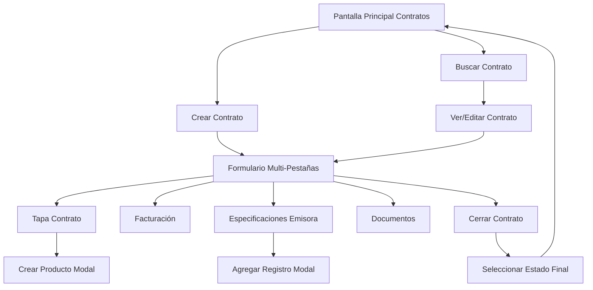

## 1. Product Overview
Módulo de gestión de contratos para sistema de administración de publicidad radial. Permite crear, administrar y hacer seguimiento de contratos publicitarios con anunciantes, incluyendo especificaciones detalladas de emisoras, facturación y documentación asociada.

El sistema automatiza el proceso de contratación de espacios publicitarios en radio, integrando información de anunciantes, agencias, productos y emisoras para un control completo del ciclo de vida del contrato.

## 2. Core Features

### 2.1 User Roles
| Role | Registration Method | Core Permissions |
|------|---------------------|------------------|
| Vendedor | Sistema interno | Crear y editar contratos, ver comisiones |
| Administrador | Sistema interno | Crear, editar, eliminar contratos, cambiar estados, generar reportes |
| Anunciante | Portal web | Ver contratos propios, descargar documentos |
| Supervisor | Sistema interno | Aprobar/rechazar contratos, ver todos los contratos |

### 2.2 Feature Module
El módulo de contratos consta de las siguientes páginas principales:
1. **Pantalla Principal Contratos**: Tabla con lista completa de contratos, búsqueda inteligente y botón de creación.
2. **Formulario Crear/Editar Contrato**: Interfaz multi-pestañas con todos los campos del contrato, especificaciones de emisoras y documentación.
3. **Modal Crear Producto**: Ventana emergente para crear productos durante la creación del contrato.
4. **Modal Agregar Registro**: Formulario para agregar líneas de especificaciones de emisoras.

### 2.3 Page Details
| Page Name | Module Name | Feature description |
|-----------|-------------|---------------------|
| Pantalla Principal Contratos | Tabla de contratos | Mostrar columnas: Número contrato (auto-generado), Tipo (A/B/C), Estado (Nuevo/Confirmado/Modificado/Pendiente/No aprobado/Rechazado), Anunciante, Comisión agencia, Fecha inicial, Fecha final, Valor bruto, Valor neto, Saldo, Nombre vendedor |
| Pantalla Principal Contratos | Búsqueda inteligente | Buscar por palabra clave, nombre completo, categoría, número de contrato con autocompletado y filtros múltiples |
| Pantalla Principal Contratos | Acciones | Botón crear contrato que abre formulario completo, botones de editar, ver, cambiar estado |
| Formulario Contrato | Pestaña Tapa Contrato | Campos: Nombre contrato, Fecha inicio/fin (con calendario), RUT (autocompleta anunciante), Anunciante (auto-llenado), Producto (con opción crear), Agencia publicidad, Agencia medios, Vendedor, Dirección envío, % Comisión, Propiedades, Valores totales, Equipo ventas |
| Formulario Contrato | Modal Crear Producto | Campos: Nombre producto, Agencia publicidad (búsqueda), Agencia medios (búsqueda), Vendedor (búsqueda), validación de existencia antes de guardar |
| Formulario Contrato | Pestaña Facturación | Campos: Facturación (Combinar por campaña/Cuotas), Tipo factura (Posterior/Adelantado/Efectivo/Transferencia/Cheque), Dirección factura, IVA (19% automático para Chile), Check facturar comisión, Plazo pago días |
| Formulario Contrato | Pestaña Observaciones | Campo de texto libre para detalles adicionales del contrato |
| Formulario Contrato | Pestaña Especificaciones Emisora | Tabla interactiva con: Emisora, Tipo bloque, Fechas, Duración, Paquete, Nota, Cuñas por día, Cuñas bonificadas, Valor neto, Valor frase, Descuento (auto-calculado), Importe total. Botón agregar registro con formulario modal |
| Formulario Contrato | Modal Agregar Registro | Formulario con: Emisora, Tipo bloque (Auspicio/Prime/Menciones/Micros/Señales), Paquete (desplegable según tipo), Fechas, Cuñas por día, Cuñas bonificadas, Importe total, Nota. Sistema calcula cuñas totales y descuento automáticamente |
| Formulario Contrato | Pestaña Historial | Log detallado de cambios: usuario, fecha, hora, tipo de modificación realizada |
| Formulario Contrato | Pestaña Imprimir | Botón para generar PDF con formato profesional incluyendo todos los detalles del contrato |
| Formulario Contrato | Pestaña Cuñas | Vista de solo lectura de todas las cuñas asociadas al anunciante del contrato |
| Formulario Contrato | Pestaña Facturas | Vista de solo lectura de todas las facturas generadas para este contrato |
| Formulario Contrato | Pestaña Documento | Área drag-and-drop para adjuntar archivos, almacenamiento automático, vista previa al hacer clic |
| Formulario Contrato | Pestaña Cerrar | Botón guardar y cerrar con selección obligatoria de estado final: Confirmado/Pendiente/No aprobado/Rechazado |

## 3. Core Process
### Flujo de Creación de Contrato (Vendedor/Administrador):
1. Usuario accede a pantalla principal de contratos
2. Clic en "Crear Contrato" → Abre formulario a pantalla completa
3. Completa pestaña Tapa Contrato con información básica
4. Si necesita crear producto, abre modal y completa datos
5. Configura opciones de facturación en pestaña correspondiente
6. Agrega observaciones si las hay
7. En Especificaciones de Emisora, agrega líneas de compra con detalles
8. Sistema calcula automáticamente descuentos y totales
9. Revisa historial de cambios
10. Adjunta documentos si necesario
11. Genera PDF para revisión si desea
12. Cierra contrato seleccionando estado final

### Flujo de Búsqueda y Edición:
1. Usuario usa campo de búsqueda inteligente en pantalla principal
2. Sistema filtra contratos en tiempo real
3. Usuario selecciona contrato para ver/editar
4. Puede modificar según permisos
5. Sistema registra todos los cambios en historial

## 4. User Interface Design
### 4.1 Design Style
- **Colores primarios**: Azul corporativo (#1E3A8A) para encabezados y acciones principales
- **Colores secundarios**: Gris claro (#F3F4F6) para fondos, Verde (#10B981) para estados confirmados, Rojo (#EF4444) para rechazados
- **Estilo de botones**: Bordes redondeados, sombra sutil, efecto hover
- **Tipografía**: Inter para textos, Montserrat para títulos, tamaños 14-16px para contenido, 18-20px para encabezados
- **Estilo de layout**: Tarjetas con bordes redondeados, espaciado consistente, navegación por pestañas
- **Iconos**: Estilo outline de Heroicons, consistencia en tamaño y color

### 4.2 Page Design Overview
| Page Name | Module Name | UI Elements |
|-----------|-------------|-------------|
| Pantalla Principal | Tabla contratos | Tabla con filas alternadas, headers fijos, columnas ordenables, badges de color para estados, barra de búsqueda prominente en top |
| Formulario Contrato | Pestañas navegación | Tabs horizontales con indicador activo, scroll horizontal si hay muchas pestañas, botón guardar siempre visible |
| Modal Crear Producto | Ventana emergente | Overlay semi-transparente, modal centrado con bordes redondeados, campos en formulario vertical, botones de acción al pie |
| Especificaciones Emisora | Tabla editable | Tabla con filas expandibles, botones de acción por fila, totales al pie, barra de herramientas con botón agregar |
| Modal Agregar Registro | Formulario compacto | Dos columnas en desktop, una en móvil, validación en tiempo real, tooltips para campos complejos |
| Documentos | Área drag-drop | Zona destacada con borde punteado al arrastrar, preview de archivos cargados, barra de progreso para uploads |

### 4.3 Responsiveness
- **Desktop-first**: Diseño optimizado para pantallas 1440px y superiores
- **Mobile-adaptive**: Breakpoints en 768px y 480px para tablets y móviles
- **Touch optimization**: Botones mínimo 44px, espaciado amplio entre elementos interactivos
- **Scroll horizontal**: En tablas complejas en dispositivos móviles
- **Pestañas colapsables**: En móviles, se agrupan en menú desplegable