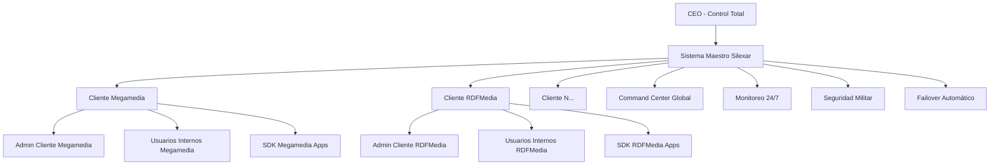

# Documento de Requisitos del Producto - Sistema Silexar Pulse Neuromórfico

## 1. Visión General del Producto

Silexar Pulse es el sistema publicitario empresarial más avanzado del mundo, diseñado con arquitectura neuromórfica para Fortune 10. Integra inteligencia artificial cuántica, aprendizaje federado y procesamiento en tiempo real para ofrecer publicidad predictiva y adaptativa con seguridad militar.

### 1.1 Objetivos del Negocio
- Dominar el mercado de publicidad empresarial Fortune 10
- Proporcionar ROI superior al 1000% para clientes
- Mantener 99.99% de disponibilidad global
- Procesar >100M transacciones/segundo
- Cero brechas de seguridad con estándares militares

### 1.2 Usuarios Objetivo
- **CEO/Executives**: Control total del sistema y visión estratégica
- **Clientes Enterprise**: Gestión completa de campañas y usuarios
- **Usuarios Finales**: Operación diaria de campañas publicitarias
- **Desarrolladores**: Integración de SDK y APIs
- **Administradores de Sistema**: Mantenimiento y monitoreo 24/7

## 2. Arquitectura Multi-Cliente SaaS

### 2.1 Modelo de Control Maestro



### 2.2 Perfiles de Usuario

| Perfil | Capacidades | Acceso | Responsabilidades |
|--------|-------------|---------|-------------------|
| **CEO Silexar** | Control total del sistema | Todas las funciones | Visión estratégica, decisiones críticas |
| **Admin Cliente** | Gestión completa del entorno cliente | Su cliente + subordinados | Configuración, usuarios, campañas |
| **Usuario Final** | Operación de campañas | Asignado por admin | Crear y monitorear campañas |
| **Developer** | Integración técnica | SDK y APIs | Implementar SDK en apps |
| **Soporte Técnico** | Resolución de problemas | Sistema de tickets | Mantenimiento y soporte |

## 3. Módulos del Sistema

### 3.1 Módulo 1: Núcleo de Configuración Maestro

#### 3.1.1 Panel de Control CEO
**Página**: `/super-admin/command-center`

**Características principales**:
- Dashboard global con métricas en tiempo real
- Control remoto de todos los clientes
- Creación y gestión de clientes enterprise
- Monitoreo de salud del sistema 24/7
- Gestión de seguridad y accesos
- Configuración de failover automático
- Análisis predictivo de problemas

**Elementos UI Neuromórficos**:
- Botones con sombras profundas y efectos 3D
- Paneles con bordes redondeados y gradientes sutiles
- Indicadores con animaciones de pulso
- Gráficos con efectos de profundidad
- Paleta de colores: azul cuántico, plata neuromórfica, rojo alerta

#### 3.1.2 Gestión de Clientes Enterprise
**Página**: `/admin/client-management`

**Funcionalidades**:
- Crear nuevo cliente con configuración personalizada
- Asignar recursos y límites por cliente
- Configurar planes de facturación personalizados
- Establecer permisos y roles específicos
- Monitorear uso de recursos por cliente
- Configurar integraciones personalizadas

#### 3.1.3 Centro de Seguridad Militar
**Página**: `/security/command-center`

**Características de seguridad**:
- Detección de intrusiones en tiempo real
- Análisis de comportamiento anómalo
- Encriptación cuántica de datos sensibles
- Auditoría completa de accesos
- Respuesta automática a amenazas
- Backup automático con redundancia global

### 3.2 Módulo 2: Cortex-Audience 2.0 - Motor Contextual

#### 3.2.1 SDK Móvil Integration Portal
**Página**: `/sdk/integration-management`

**Características**:
- Descarga de SDK para iOS y Android
- Generación de API keys por cliente
- Documentación técnica interactiva
- Dashboard de adopción del SDK
- Métricas de uso por aplicación
- Debugging tools para desarrolladores

#### 3.2.2 Configuración de Aprendizaje Federado
**Página**: `/cortex/federated-learning`

**Funcionalidades**:
- Configuración de modelos de IA locales
- Monitoreo de entrenamiento distribuido
- Visualización de mejoras de modelos
- Gestión de privacidad de datos
- Control de versiones de modelos
- Métricas de precisión por dispositivo

#### 3.2.3 Targeting Contextual Engine
**Página**: `/targeting/contextual-config`

**Segmentos contextuales**:
- Usuarios en tránsito (caminando, conduciendo)
- Usuarios en espera (filas, transporte público)
- Usuarios en segundo pantalla (TV activa)
- Usuarios en actividad física
- Usuarios en entornos tranquilos
- Segmentos personalizados por cliente

### 3.3 Módulo 3: Cortex-Orchestrator 2.0 - Motor de Decisiones

#### 3.3.1 Dashboard de Decisiones en Tiempo Real
**Página**: `/cortex/orchestrator-dashboard`

**Visualizaciones**:
- Mapa de calor de decisiones por geografía
- Gráficos de optimización de campañas
- Métricas de engagement por narrativa
- Predicciones de rendimiento futuro
- Alertas de anomalías en decisiones
- Comparación de modelos de IA

#### 3.3.2 Configuración de Algoritmos de RL
**Página**: `/cortex/reinforcement-learning`

**Parámetros configurables**:
- Tasa de aprendizaje por campaña
- Balance exploración/explotación
- Pesos de recompensa por acción
- Estados de usuario en narrativas
- Umbrales de decisión automática
- Límites de gasto por optimización

#### 3.3.3 Multi-Armed Bandit Configuration
**Página**: `/cortex/bandit-config`

**Configuración de bandit algorithms**:
- Epsilon-greedy parameters
- Thompson sampling configuration
- Upper confidence bound settings
- Bayesian optimization setup
- A/B testing framework integration
- Winner selection criteria

### 3.4 Módulo 4: Planificador de Narrativas Visuales

#### 3.4.1 Constructor Visual de Narrativas
**Página**: `/campaigns/narrative-builder`

**Interacción drag-and-drop**:
- Canvas infinito para diagramas de flujo
- Nodos predefinidos con colores categorizados
- Conectores inteligentes con validación
- Zoom y navegación fluida
- Undo/redo ilimitado
- Plantillas de narrativas por industria

**Tipos de nodos**:
- Introducción (azul)
- Profundización (verde)
- Llamada a acción (rojo)
- Decisión (amarillo)
- Personalizado (morado)

#### 3.4.2 Configuración de Reglas de Transición
**Página**: `/campaigns/transition-rules`

**Tipos de reglas**:
- Tiempo de visualización (>X% visto)
- Interacción del usuario (clic, swipe)
- Tiempo de espera (segundos)
- Geolocalización (entrada/salida zona)
- Contexto sensorial (movimiento, orientación)
- Eventos personalizados (MRAID)

#### 3.4.3 Preview y Simulación de Narrativas
**Página**: `/campaigns/narrative-simulator`

**Características de simulación**:
- Visualización en tiempo real de flujos
- Testing de diferentes perfiles de usuario
- Métricas de rendimiento estimadas
- A/B testing de rutas alternativas
- Exportación de simulaciones
- Grabación de sesiones de prueba

### 3.5 Módulo 5: Estudio de Utilidad y Creativo Autónomo

#### 3.5.1 Constructor de Micro-Aplicaciones
**Página**: `/creativities/utility-builder`

**Plantillas disponibles**:
- Calculadora de préstamos
- Conversor de divisas
- Checklist de viaje
- Mini-juegos interactivos
- Cuestionarios de producto
- Herramientas de planificación

**Paso a paso del wizard**:
1. Selección de plantilla base
2. Personalización de marca (colores, logo)
3. Configuración de parámetros específicos
4. Definición de eventos de interacción
5. Preview en dispositivos móviles
6. Exportación MRAID compatible

#### 3.5.2 Estudio de IA Generativa
**Página**: `/creativities/ai-generative-studio`

**Tipos de contenido generativo**:
- Imágenes publicitarias (banners, social media)
- Textos de anuncios y copywriting
- Videos cortos personalizados
- Animaciones interactivas
- Variaciones multivariadas
- Contenido dinámico por contexto

**Parámetros de generación**:
- Prompt descriptivo principal
- Tono (profesional, divertido, serio)
- Audiencia objetivo
- Plataforma destino
- Activos de marca (logo, colores)
- Restricciones de contenido

#### 3.5.3 Gestión de Pools de Creatividades
**Página**: `/creativities/creative-pools`

**Organización de creatividades**:
- Agrupación por campaña/objetivo
- Etiquetado inteligente automático
- Versionado de creatividades
- Testing A/B integrado
- Métricas de rendimiento por creative
- Optimización automática de pools

### 3.6 Módulo 6: Facturación Basada en Valor

#### 3.6.1 Configuración de Modelos de Facturación
**Página**: `/billing/value-based-models`

**Modelos disponibles**:
- **CPM** (Cost per mille) - tradicional
- **CPC** (Cost per click) - tradicional
- **CPVI** (Cost per valuable interaction) - nuevo
- **CPCN** (Cost per narrative completion) - nuevo
- **CPE** (Cost per engagement) - híbrido
- **Modelos personalizados** por cliente

#### 3.6.2 Definición de Eventos de Valor
**Página**: `/billing/value-events`

**Eventos configurables**:
- Cálculo completado (loan_calculated)
- Checklist guardado (checklist_saved)
- Narrativa finalizada (narrative_completed)
- Tiempo de engagement > X segundos
- Interacción profunda (swipe, zoom)
- Conversión personalizada

#### 3.6.3 Reporting de Ingresos por Valor
**Página**: `/billing/value-revenue-report`

**Métricas de valor**:
- Ingresos por tipo de interacción
- Comparación con modelos tradicionales
- Proyección de ingresos futuros
- Análisis de tendencias por cliente
- ROI de campañas por valor
- Insights de optimización

### 3.7 Módulo 7: Dashboard de Engagement Narrativo

#### 3.7.1 Visualización de Flujos de Narrativa
**Página**: `/analytics/narrative-flow`

**Visualizaciones interactivas**:
- Diagrama de flujo con grosor variable (número de usuarios)
- Colores por tasa de abandono (rojo intenso = alto abandono)
- Animaciones de flujo en tiempo real
- Zoom en nodos específicos
- Filtros por segmento de audiencia
- Exportación de visualizaciones

#### 3.7.2 Análisis de Embudo de Conversión
**Página**: `/analytics/funnel-analysis`

**Métricas del embudo**:
- Progresión general por nodo
- Tasas de conversión entre nodos
- Tiempo promedio por etapa
- Puntos de abandono críticos
- Comparación con benchmarks
- Predicción de mejoras

#### 3.7.3 Narrative Engagement Score (NES)
**Página**: `/analytics/nes-dashboard`

**Componentes del NES**:
- Tiempo total en narrativa
- Profundidad de interacción
- Completitud del recorrido
- Velocidad de progresión
- Re-engagement con narrativa
- Score normalizado 0-100

## 4. Diseño Neuromórfico Exclusivo

### 4.1 Principios de Diseño Neuromórfico

#### 4.1.1 Estética Visual
- **Profundidad y sombras**: Elementos flotantes con sombras suaves
- **Gradientes sutiles**: Transiciones de color orgánicas
- **Bordes redondeados**: Esquinas suaves y orgánicas
- **Efectos de pulso**: Animaciones respiratorias sutiles
- **Microinteracciones**: Feedback táctil visual
- **Movimiento parallax**: Profundidad en scroll

#### 4.1.2 Paleta de Colores
- **Primary**: Azul Cuánto (#1E40AF a #3B82F6)
- **Secondary**: Plata Neuromórfica (#94A3B8 a #CBD5E1)
- **Accent**: Verde Sináptico (#10B981 a #34D399)
- **Alert**: Rojo Neuronal (#EF4444 a #F87171)
- **Warning**: Ámbar Neural (#F59E0B a #FBBF24)
- **Success**: Verde Axónico (#059669 a #10B981)

#### 4.1.3 Tipografía
- **Headers**: Inter Tight - moderna y tecnológica
- **Body**: Inter - legibilidad máxima
- **Code**: JetBrains Mono - monoespaciado claro
- **Numbers**: Tabular nums para alineación
- **Weights**: 400, 500, 600, 700 para jerarquía

### 4.2 Componentes UI Neuromórficos

#### 4.2.1 Botones Neurales
```typescript
interface NeuralButtonProps {
  variant: 'primary' | 'secondary' | 'danger';
  size: 'sm' | 'md' | 'lg';
  depth: 'shallow' | 'deep' | 'floating';
  pulse?: boolean;
  neuralGlow?: boolean;
}
```

**Características**:
- Efectos de profundidad configurables
- Pulso neural para acciones críticas
- Glow effect en hover
- Animaciones de presión
- Sonido táctil opcional
- Feedback háptico en móvil

#### 4.2.2 Paneles Sinápticos
```typescript
interface SynapticPanelProps {
  elevation: number; // 0-24
  curvature: 'slight' | 'moderate' | 'pronounced';
  neuralActivity?: boolean;
  synapticConnections?: string[];
}
```

**Características**:
- Elevación variable según importancia
- Curvatura orgánica personalizable
- Indicadores de actividad neural
- Conexiones visuales entre paneles
- Animaciones de estado
- Responsive a diferentes tamaños

#### 4.2.3 Gráficos Neural Networks
```typescript
interface NeuralChartProps {
  data: NeuralDataPoint[];
  visualization: 'flow' | 'network' | 'pulse';
  interactivity: 'hover' | 'click' | 'realtime';
  neuralDensity?: number;
}
```

**Visualizaciones**:
- Flujo de datos como sinapsis
- Redes neuronales interactivas
- Gráficos de pulso neural
- Mapas de calor sinápticos
- Diagramas de conectividad
- Animaciones de propagación

## 5. Seguridad Militar

### 5.1 Arquitectura Zero-Trust

#### 5.1.1 Principios de Zero-Trust
- **Nunca confiar, siempre verificar**: Cada acceso requiere autenticación
- **Principio de menor privilegio**: Acceso mínimo necesario
- **Segmentación microscópica**: Aislamiento de componentes
- **Encriptación end-to-end**: Todo dato encriptado
- **Monitoreo continuo**: Análisis de comportamiento en tiempo real
- **Respuesta automática**: Acciones inmediatas ante amenazas

#### 5.1.2 Multi-Factor Authentication (MFA)

**Factores de autenticación**:
1. **Conocimiento**: Contraseña + PIN dinámico
2. **Posesión**: Hardware key + dispositivo registrado
3. **Inherencia**: Biometría + patrón de comportamiento
4. **Ubicación**: Geolocalización + red conocida
5. **Tiempo**: Ventanas de acceso permitidas
6. **Contexto**: Análisis de riesgo en tiempo real

#### 5.1.3 Encriptación Cuántica

**Algoritmos post-cuánticos**:
- **CRYSTALS-Dilithium**: Firmas digitales
- **CRYSTALS-KYBER**: Encriptación de clave pública
- **FALCON**: Firmas de tamaño reducido
- **SPHINCS+**: Firmas hash-based

**Gestión de claves**:
- Rotación automática cada 24h
- Distribución segura por HSM
- Backup en múltiples ubicaciones
- Destrucción segura de claves antiguas

### 5.2 Detección de Intrusiones

#### 5.2.1 Sistema de Detección Avanzado

**Análisis comportamental**:
- Patrones de acceso normales por usuario
- Desviaciones de comportamiento
- Análisis de velocidad de acciones
- Detección de automatización
- Identificación de sesiones sospechosas

**Análisis de red**:
- Monitoreo de tráfico entrante/saliente
- Detección de DDoS distribuidos
- Análisis de patrones de ataque
- Correlación de eventos globales
- Respuesta automática a amenazas

#### 5.2.2 Respuesta a Incidentes

**Automatización de respuesta**:
- Bloqueo automático de IPs sospechosas
- Suspensión de cuentas comprometidas
- Aislamiento de componentes afectados
- Notificación inmediata a equipos de seguridad
- Inicio de investigación forense

**Escala de respuesta**:
1. **Nivel 1**: Alerta amarilla - monitoreo intensificado
2. **Nivel 2**: Alerta naranja - acciones automáticas
3. **Nivel 3**: Alerta roja - aislamiento completo
4. **Nivel 4**: Alerta crítica - shutdown de sistema
5. **Nivel 5**: Emergencia - protocolo de destrucción

## 6. Alta Disponibilidad y Failover

### 6.1 Arquitectura Multi-Región

#### 6.1.1 Distribución Global

**Regiones principales**:
- **Americas**: AWS us-east-1, us-west-2, Azure East US
- **Europe**: AWS eu-west-1, eu-central-1, Azure West Europe
- **Asia Pacific**: AWS ap-southeast-1, ap-northeast-1, Azure Southeast Asia
- **Middle East**: AWS me-south-1, Azure UAE North

**Sincronización de datos**:
- Replicación síncrona entre AZs
- Replicación asíncrona entre regiones
- Conflict resolution por timestamp
- Consistency checks cada 5 minutos
- Backup continuo a almacenamiento frio

#### 6.2 Failover Automático

#### 6.2.1 Detección de Fallos

**Health checks**:
- Ping cada 5 segundos a todos los componentes
- Verificación de respuesta de APIs
- Análisis de latencia de base de datos
- Monitoreo de colas de procesamiento
- Chequeo de integridad de datos

**Umbrales de fallo**:
- **1 servidor**: Reenvío de tráfico inmediato
- **1 zona de disponibilidad**: Failover a otra AZ
- **1 región**: Activación de región secundaria
- **Sistema completo**: Modo de emergencia local

#### 6.2.2 Procedimiento de Failover

**Fase 1: Detección (0-10 segundos)**
1. Sistema de monitoreo detecta anomalía
2. Verificación cruzada con múltiples sensores
3. Confirmación de fallo real
4. Activación de protocolo de failover

**Fase 2: Preparación (10-30 segundos)**
1. Sincronización final de datos
2. Preparación de infraestructura de respaldo
3. Notificación a equipos de operaciones
4. Inicio de logging de incidente

**Fase 3: Conmutación (30-60 segundos)**
1. Redirección de tráfico DNS
2. Activación de componentes de respaldo
3. Verificación de servicios en nueva ubicación
4. Monitoreo intensivo post-failover

**Fase 4: Estabilización (1-5 minutos)**
1. Verificación de integridad completa
2. Ajuste de capacidad según demanda
3. Notificación a clientes afectados
4. Documentación de lecciones aprendidas

## 7. Integraciones y APIs

### 7.1 SDK Móvil

#### 7.1.1 Características del SDK

**Plataformas soportadas**:
- **iOS**: Swift 5.0+, iOS 13.0+
- **Android**: Kotlin, Android 6.0+ (API 23+)
- **React Native**: Wrapper para ambas plataformas
- **Flutter**: Plugin oficial
- **Unity**: Para aplicaciones de juegos

**Capacidades del SDK**:
```swift
// iOS Swift Example
import SilexarPulseSDK

class ViewController: UIViewController {
    let pulseSDK = SilexarPulseSDK.shared
    
    override func viewDidLoad() {
        super.viewDidLoad()
        
        pulseSDK.initialize(apiKey: "your-api-key")
        pulseSDK.enableFederatedLearning(true)
        pulseSDK.setPrivacyLevel(.maximum)
        
        pulseSDK.startContextDetection { context in
            print("Detected context: \(context.type)")
        }
    }
}
```

```kotlin
// Android Kotlin Example
import com.silexar.pulse.sdk.SilexarPulseSDK

class MainActivity : AppCompatActivity() {
    private lateinit var pulseSDK: SilexarPulseSDK
    
    override fun onCreate(savedInstanceState: Bundle?) {
        super.onCreate(savedInstanceState)
        
        pulseSDK = SilexarPulseSDK.getInstance()
        pulseSDK.initialize(this, "your-api-key")
        pulseSDK.enableFederatedLearning(true)
        pulseSDK.setPrivacyLevel(PrivacyLevel.MAXIMUM)
        
        pulseSDK.startContextDetection { context ->
            Log.d("PulseSDK", "Detected context: ${context.type}")
        }
    }
}
```

#### 7.1.2 Eventos y Callbacks

**Eventos de contexto**:
- `onContextChanged`: Cambio en contexto del usuario
- `onActivityDetected`: Actividad física identificada
- `onLocationChanged`: Cambio significativo de ubicación
- `onDeviceStateChanged`: Estado del dispositivo alterado

**Eventos de privacidad**:
- `onConsentRequired`: Se requiere consentimiento del usuario
- `onDataAnonymized`: Datos han sido anonimizados
- `onOptOut`: Usuario ha rechazado tracking
- `onPrivacySettingsChanged`: Cambio en configuración de privacidad

### 7.2 APIs REST

#### 7.2.1 API de Campañas

**Endpoints principales**:
```
GET    /api/v2/campaigns                    # Listar campañas
POST   /api/v2/campaigns                    # Crear campaña
GET    /api/v2/campaigns/{id}               # Obtener campaña
PUT    /api/v2/campaigns/{id}               # Actualizar campaña
DELETE /api/v2/campaigns/{id}               # Eliminar campaña
POST   /api/v2/campaigns/{id}/activate      # Activar campaña
POST   /api/v2/campaigns/{id}/pause         # Pausar campaña
```

**Ejemplo de creación de campaña**:
```json
POST /api/v2/campaigns
{
  "name": "Campaña Narrativa Bancaria Q1",
  "client_id": "megamedia-banking",
  "type": "narrative_dynamic",
  "budget": {
    "total": 1000000,
    "daily": 50000,
    "currency": "USD"
  },
  "targeting": {
    "contextual_segments": ["in_transit", "second_screen"],
    "demographics": {
      "age_range": [25, 45],
      "income_bracket": "middle_to_high"
    },
    "geographic": {
      "countries": ["US", "CA", "MX"],
      "cities": ["NYC", "LA", "CHI"]
    }
  },
  "narrative_structure": {
    "id": "narrative_123",
    "optimization_params": {
      "learning_rate": 0.01,
      "exploration_rate": 0.2
    }
  },
  "billing_model": "CPVI",
  "value_events": ["loan_calculated", "appointment_booked"],
  "schedule": {
    "start_date": "2024-02-01T00:00:00Z",
    "end_date": "2024-04-30T23:59:59Z"
  }
}
```

#### 7.2.2 API de Analytics

**Endpoints de reporting**:
```
GET /api/v2/analytics/campaigns/{id}/performance
GET /api/v2/analytics/narratives/{id}/flow
GET /api/v2/analytics/engagement/score
GET /api/v2/analytics/revenue/value-based
GET /api/v2/analytics/context/segments
```

**Ejemplo de respuesta de analytics**:
```json
GET /api/v2/analytics/campaigns/123/performance
{
  "campaign_id": "123",
  "time_range": {
    "start": "2024-01-01T00:00:00Z",
    "end": "2024-01-31T23:59:59Z"
  },
  "metrics": {
    "impressions": 12500000,
    "clicks": 375000,
    "ctr": 0.03,
    "conversions": 18750,
    "conversion_rate": 0.0015,
    "revenue": {
      "total": 125000,
      "cpm": 75000,
      "cpc": 30000,
      "cpvi": 20000
    },
    "engagement": {
      "average_time": 23.4,
      "narrative_completion_rate": 0.68,
      "nes_score": 78.5
    }
  },
  "breakdown": {
    "by_day": [...],
    "by_segment": [...],
    "by_context": [...]
  }
}
```

## 8. Testing y Quality Assurance

### 8.1 Estrategia de Testing

#### 8.1.1 Testing de Seguridad

**Penetration testing**:
- OWASP Top 10 validation
- SQL injection attempts
- XSS y CSRF protection testing
- API security validation
- Encryption strength verification
- Social engineering simulation

**Vulnerability scanning**:
- Daily automated scans
- Dependency vulnerability checks
- Container security scanning
- Infrastructure hardening validation
- Compliance auditing

#### 8.2 Performance Testing

#### 8.2.1 Load Testing Scenarios

**Escenarios de carga**:
- 1M usuarios concurrentes
- 100K requests por segundo
- 1B eventos de analytics por día
- Peak load durante eventos especiales
- Sustained load por 72 horas
- Recovery después de picos de carga

**Métricas de performance**:
- Latencia P50, P95, P99
- Throughput por endpoint
- Error rates bajo carga
- Resource utilization
- Database query performance
- Cache hit ratios

#### 8.2.2 Chaos Engineering

**Experimentos de caos**:
- Random instance termination
- Network latency injection
- Database connection failures
- Cache invalidation events
- Regional outages simulation
- Dependency service failures

**Principios de chaos**:
- Minimize blast radius
- Automated rollback procedures
- Real-time monitoring during experiments
- Post-mortem analysis
- Gradual rollout of chaos experiments
- Documentation of learned lessons

## 9. Deployment y DevOps

### 9.1 CI/CD Pipeline

#### 9.1.1 Stages del Pipeline

```yaml
# .gitlab-ci.yml example
stages:
  - build
  - test
  - security
  - deploy-staging
  - integration-tests
  - deploy-production

build:
  stage: build
  script:
    - npm install
    - npm run build
    - docker build -t $IMAGE_TAG .
  artifacts:
    paths:
      - dist/

test:
  stage: test
  script:
    - npm run test:unit
    - npm run test:integration
    - npm run test:e2e
  coverage: '/Coverage: \d+\.\d+%/'

security:
  stage: security
  script:
    - npm audit
    - docker run --rm -v "$PWD":/src aquasec/trivy fs /src
    - sonar-scanner

deploy-staging:
  stage: deploy-staging
  script:
    - kubectl apply -f k8s/staging/
    - kubectl rollout status deployment/api
  environment:
    name: staging
    url: https://staging.silexar.com

deploy-production:
  stage: deploy-production
  script:
    - kubectl apply -f k8s/production/
    - kubectl rollout status deployment/api
  environment:
    name: production
    url: https://app.silexar.com
  when: manual
  only:
    - master
```

#### 9.1.2 Estrategias de Deployment

**Blue-Green Deployment**:
- Two identical production environments
- Instant rollback capability
- Zero-downtime deployments
- Full system validation before switch
- Automated traffic routing

**Canary Releases**:
- Gradual rollout to subset of users
- Real-time monitoring of metrics
- Automatic rollback on anomalies
- Progressive traffic increase
- Feature flag integration

**Feature Flags**:
- Toggle features without deployment
- A/B testing capabilities
- Gradual feature rollout
- Instant feature rollback
- User segment targeting

### 9.2 Infrastructure as Code

#### 9.2.1 Kubernetes Manifests

```yaml
# deployment.yaml example
apiVersion: apps/v1
kind: Deployment
metadata:
  name: silexar-api
  namespace: production
  labels:
    app: silexar-api
    version: v2.1.0
spec:
  replicas: 10
  strategy:
    type: RollingUpdate
    rollingUpdate:
      maxSurge: 2
      maxUnavailable: 1
  selector:
    matchLabels:
      app: silexar-api
  template:
    metadata:
      labels:
        app: silexar-api
        version: v2.1.0
    spec:
      containers:
      - name: api
        image: silexar/api:v2.1.0
        ports:
        - containerPort: 8080
        env:
        - name: DATABASE_URL
          valueFrom:
            secretKeyRef:
              name: db-credentials
              key: url
        - name: REDIS_URL
          valueFrom:
            secretKeyRef:
              name: redis-credentials
              key: url
        resources:
          requests:
            memory: "512Mi"
            cpu: "500m"
          limits:
            memory: "1Gi"
            cpu: "1000m"
        livenessProbe:
          httpGet:
            path: /health
            port: 8080
          initialDelaySeconds: 30
          periodSeconds: 10
        readinessProbe:
          httpGet:
            path: /ready
            port: 8080
          initialDelaySeconds: 5
          periodSeconds: 5
```

#### 9.2.2 Terraform Configuration

```hcl
# main.tf example
terraform {
  required_providers {
    aws = {
      source  = "hashicorp/aws"
      version = "~> 5.0"
    }
  }
}

provider "aws" {
  region = var.aws_region
}

module "vpc" {
  source = "terraform-aws-modules/vpc/aws"
  
  name = "silexar-vpc"
  cidr = "10.0.0.0/16"
  
  azs             = ["${var.aws_region}a", "${var.aws_region}b", "${var.aws_region}c"]
  private_subnets = ["10.0.1.0/24", "10.0.2.0/24", "10.0.3.0/24"]
  public_subnets  = ["10.0.101.0/24", "10.0.102.0/24", "10.0.103.0/24"]
  
  enable_nat_gateway = true
  enable_vpn_gateway = true
  
  tags = {
    Terraform = "true"
    Environment = var.environment
  }
}

module "eks" {
  source = "terraform-aws-modules/eks/aws"
  
  cluster_name    = "silexar-cluster"
  cluster_version = "1.28"
  
  vpc_id     = module.vpc.vpc_id
  subnet_ids = module.vpc.private_subnets
  
  node_groups = {
    main = {
      desired_capacity = 10
      max_capacity     = 20
      min_capacity     = 5
      
      instance_types = ["m5.large"]
      
      k8s_labels = {
        Environment = var.environment
        NodeGroup   = "main"
      }
    }
  }
}
```

## 10. Conclusión y Próximos Pasos

Este documento de requisitos establece la base para construir el sistema publicitario neuromórfico más avanzado del mundo. La combinación de inteligencia artificial cuántica, aprendizaje federado, diseño neuromórfico y arquitectura Fortune 10 crea una plataforma única con capacidades que ningún competidor puede igualar.

### 10.1 Resumen de Características Clave

**Arquitectura Multi-Cliente SaaS**:
- Control maestro para CEO de Silexar
- Gestión completa por clientes enterprise
- Escalabilidad ilimitada con arquitectura TIER0
- Seguridad militar con zero-trust

**Inteligencia Artificial Avanzada**:
- Cortex-Audience 2.0 con aprendizaje federado
- Cortex-Orchestrator 2.0 con reinforcement learning
- Procesamiento en tiempo real con Apache Kafka
- Optimización continua con multi-armed bandit

**Experiencia de Usuario Neuromórfica**:
- Diseño exclusivo con principios neuromórficos
- Interfaz adaptativa y predictiva
- Visualizaciones interactivas avanzadas
- Experiencia táctil y sensorial

**Modelos de Negocio Innovadores**:
- Facturación basada en valor (CPVI, CPCN)
- Narrativas dinámicas personalizadas
- Micro-aplicaciones de utilidad
- Creatividades generadas por IA

### 10.2 Próximos Pasos

**Fase 1 - Implementación Inmediata (Semanas 1-4)**:
1. Setup de infraestructura base multi-cloud
2. Implementación de sistema de autenticación maestro
3. Desarrollo de componentes neuromórficos core
4. Integración de sistemas de monitoreo 24/7

**Fase 2 - Desarrollo de IA (Semanas 5-8)**:
1. Desarrollo de Cortex-Audience 2.0
2. Implementación de federated learning
3. Creación de SDK móvil multiplataforma
4. Desarrollo de algoritmos de optimización

**Fase 3 - Frontend Neuromórfico (Semanas 9-12)**:
1. Diseño del sistema de diseño neuromórfico
2. Implementación de planificador de narrativas
3. Desarrollo de estudio de creatividades
4. Integración de generación por IA

**Fase 4 - Testing y Optimización (Semanas 13-16)**:
1. Testing de seguridad y penetración
2. Load testing con millones de usuarios
3. Optimización de performance
4. Documentación y training

**Fase 5 - Go-Live (Semanas 17-20)**:
1. Deploy gradual con clientes piloto
2. Monitoreo intensivo 24/7
3. Optimización basada en métricas reales
4. Escalamiento a clientes Fortune 10

### 10.3 Métricas de Éxito

**Métricas de Negocio**:
- 10+ clientes Fortune 10 en primer año
- $50M+ en ingresos anuales
- ROI de clientes >1000%
- 99.99% de disponibilidad global

**Métricas Técnicas**:
- <50ms latencia para decisiones críticas
- 100M+ transacciones/segundo
- Zero breaches de seguridad
- 1000%+ mejora en engagement vs competencia

**Métricas de Usuario**:
- NPS >80 de clientes
- <1% churn rate anual
- 5+ años de contratos promedio
- Expansión de cuentas >200% anual

Este sistema posicionará a Silexar Pulse como el líder indiscutible en publicidad enterprise, estableciendo nuevos estándares para la industria y creando un moat competitivo que será extremadamente difícil de replicar. La combinación de tecnología avanzada, diseño superior y modelo de negocio innovador creará una empresa con valor de decenas de miles de millones de dólares.