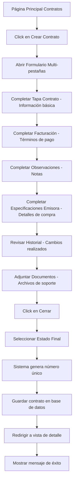
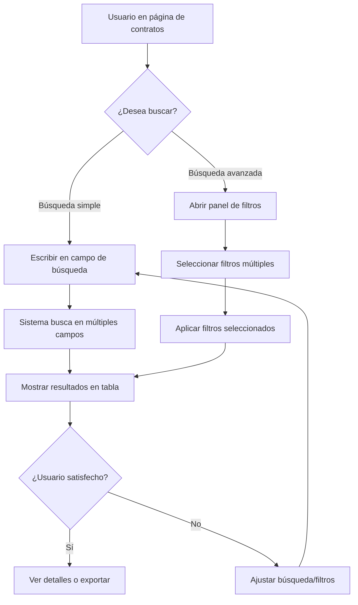
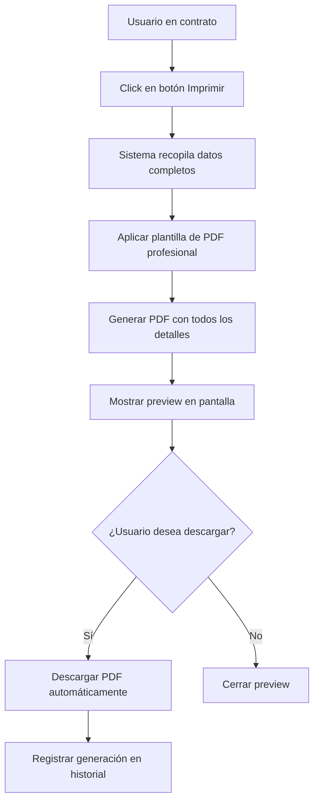

## 1. Descripción General del Producto

El módulo de CONTRATOS es el núcleo del sistema de gestión publicitaria, diseñado para administrar de forma integral todos los contratos de publicidad entre anunciantes, agencias y emisoras. El sistema automatiza la creación, gestión y seguimiento de contratos complejos con múltiples items de compra, cálculos automáticos de descuentos, y generación de documentación formal.

- **Problema a resolver:** Gestión manual y desorganizada de contratos publicitarios con múltiples variables, cálculos complejos y documentación dispersa
- **Usuarios objetivo:** Equipos de ventas, administradores de contratos, ejecutivos de cuenta y personal administrativo de agencias de publicidad
- **Valor del producto:** Centralización de información, automatización de cálculos, reducción de errores y generación instantánea de documentación legal

## 2. Funcionalidades Principales

### 2.1 Roles de Usuario

| Rol | Método de Registro | Permisos Principales |
|-----|-------------------|---------------------|
| Vendedor | Registro interno por administrador | Crear, editar y ver contratos propios |
| Ejecutivo de Cuenta | Registro interno por administrador | Gestionar contratos de su cartera de clientes |
| Administrador de Contratos | Registro interno por administrador | Control total sobre todos los contratos y configuraciones |
| Supervisor de Ventas | Registro interno por administrador | Ver y aprobar contratos de su equipo |
| Usuario de Lectura | Registro interno por administrador | Solo visualización de contratos asignados |

### 2.2 Módulos de Funcionalidad

El módulo de Contratos consta de las siguientes páginas principales:

1. **Página de Contratos**: Tabla maestra con lista completa de contratos, búsqueda inteligente y acciones rápidas
2. **Formulario de Creación de Contrato**: Interfaz multi-pestañas para crear contratos con toda la información detallada
3. **Vista de Detalle de Contrato**: Visualización completa de un contrato específico con todas sus secciones
4. **Panel de Búsqueda Avanzada**: Filtros múltiples y búsqueda inteligente por múltiples criterios
5. **Centro de Reportes**: Generación de reportes y exportación masiva de contratos

### 2.3 Detalle de Páginas

| Página | Módulo | Descripción de Funcionalidades |
|----------|---------|-------------------------------|
| **Página de Contratos** | Tabla Principal | Mostrar todos los contratos con columnas: Número contrato (auto-generado), Tipo (A,B,C), Estado (Nuevo/Confirmado/Modificado/Pendiente/No Aprobado/Rechazado), Anunciante, Comisión agencia, Fecha inicial, Fecha final, Valor bruto, Valor neto, Saldo, Nombre vendedor |
| | Búsqueda Inteligente | Campo de búsqueda que permite buscar por palabra clave, nombre completo, categoría, número de contrato con autocompletado y sugerencias |
| | Acciones Rápidas | Botones para crear nuevo contrato, exportar seleccionados, cambiar estado masivamente |
| | Paginación | Navegación por páginas con selector de cantidad de items por página (10, 20, 50, 100) |
| | Ordenamiento | Click en columnas para ordenar ascendente/descendente |
| | Filtros Avanzados | Panel lateral con filtros por estado, fechas, vendedor, anunciante, valores |
| **Formulario de Creación** | Pestaña Tapa Contrato | Campos: Nombre contrato (texto), Fecha inicio (date picker), Fecha término (date picker), RUT (autocomplete con validación), Anunciante (auto-completa al digitar RUT), Producto (selector con búsqueda y opción crear nuevo), Agencia publicidad (selector con búsqueda), Agencia medios (selector con búsqueda), Vendedor (selector con búsqueda), Equipo ventas (selector), Dirección envío (dropdown: Anunciante/Agencia Publicidad/Agencia Medio), Comisión agencia (porcentaje), Propiedades (checkbox múltiple) |
| | Modal Crear Producto | Ventana emergente con: Nombre producto, Agencia publicidad (selector), Agencia medios (selector), Vendedor (selector), validación de duplicados |
| | Pestaña Facturación | Facturación (dropdown: Combinar por campaña/Cuotas), Tipo factura (dropdown: Facturar a posterior/Factura por adelantado/Efectivo/Transferencia/Cheque), Dirección factura (dropdown: Anunciante/Agencia Medio), IVA (número, default 19% editable), Checkbox "Facturar comisión agencia", Plazo pago (días, visible si tipo es posterior) |
| | Pestaña Observaciones | Campo de texto largo multilínea para notas y detalles adicionales |
| | Pestaña Especificaciones Emisora | Tabla dinámica con columnas: Emisora, Tipo bloque, Fecha inicio, Fecha término, Duración, Paquete, Nota, Cuñas por día, Cuñas por días bonificadas, Valor neto, Cuñas totales (auto-calculado), Cuñas totales bonificadas (auto-calculado), Importe total, Valor frase, Descuento (auto-calculado) |
| | Modal Agregar Registro | Formulario para nueva línea: Emisora (selector), Tipo bloque (dropdown con todos los tipos), Paquete (selector dinámico según tipo), Fechas, Cuñas por día, Cuñas bonificadas, Importe total, Valor frase, Nota |
| | Pestaña Historial | Tabla cronológica con: Fecha/hora, Usuario, Acción realizada, Campo modificado, Valor anterior, Valor nuevo, Motivo del cambio |
| | Pestaña Imprimir | Vista previa del PDF con botón de generación y descarga, formato profesional con logo y datos completos |
| | Pestaña Cuñas | Tabla de cuñas asociadas al anunciante del contrato: Código, Nombre, Duración, Estado |
| | Pestaña Facturas | Listado de facturas relacionadas: Número, Fecha, Monto, Estado, Fecha vencimiento |
| | Pestaña Documentos | Área drag & drop para adjuntar archivos, preview de documentos existentes, organización por carpetas |
| | Pestaña Cerrar | Botón "Guardar y Cerrar" con dropdown obligatorio para seleccionar estado final: Confirmado/Pendiente/No Aprobado/Rechazado |
| **Vista de Detalle** | Encabezado | Información resumida del contrato con badges de estado, fechas, valores totales y anunciante |
| | Navegación por Tabs | Mismo sistema de pestañas que en creación pero en modo lectura con opción de editar |
| | Acciones | Botones para editar, duplicar, generar PDF, enviar por email, cambiar estado |
| **Panel de Búsqueda** | Filtros Múltiples | Búsqueda por: Número contrato, Anunciante, Vendedor, Estado, Rango de fechas, Valores (mín/máx), Tipo de contrato, Agencias |
| | Búsqueda Guardada | Opción de guardar filtros frecuentes con nombre personalizado |
| | Exportación | Exportar resultados a Excel o PDF con formato tabular |

## 3. Flujos de Proceso Principales

### 3.1 Flujo de Creación de Contrato

### 3.2 Flujo de Búsqueda y Filtrado

### 3.3 Flujo de Generación de PDF

## 4. Diseño de Interfaz de Usuario

### 4.1 Estilo de Diseño

- **Colores Principales:**
  - Primario: Azul profesional (#1E40AF) - encabezados y acciones principales
  - Secundario: Gris neutro (#6B7280) - textos y bordes
  - Éxito: Verde (#10B981) - estados confirmados y aprobados
  - Advertencia: Amarillo (#F59E0B) - estados pendientes
  - Error: Rojo (#EF4444) - estados rechazados y errores
  - Fondo: Blanco y gris muy claro (#F9FAFB)

- **Estilo de Botones:**
  - Forma: Bordes redondeados (border-radius: 0.375rem)
  - Tamaños: Pequeño (h-8), Mediano (h-10), Grande (h-12)
  - Estados: Hover, focus, disabled, loading con animaciones suaves
  - Iconos: Heroicons para consistencia

- **Tipografía:**
  - Fuente principal: Inter (sans-serif)
  - Tamaños: Encabezados (text-2xl, text-xl), Cuerpo (text-base), Pequeño (text-sm)
  - Pesos: Bold (700) para títulos, Medium (500) para subtítulos, Normal (400) para cuerpo

- **Estilo de Layout:**
  - Navegación: Sidebar fijo a la izquierda
  - Contenido: Área principal con cards y secciones
  - Tablas: Diseño limpio con bordes sutiles y hover states
  - Formularios: Etiquetas arriba, inputs con bordes claros y focus states azules

- **Iconos y Emojis:**
  - Set principal: Heroicons outline y solid
  - Estados: ✅ ❌ ⚠️ 🔄 📄 💰 📅 👥
  - Categorías: 🎯 📺 📻 📊 📈 📉

### 4.2 Diseño de Páginas Específicas

| Página | Módulo | Elementos de UI |
|--------|---------|----------------|
| **Página Principal** | Header | Logo empresa, menú de navegación, notificaciones, perfil de usuario |
| | Barra de Búsqueda | Input grande con icono de búsqueda, botón de búsqueda avanzada, filtros rápidos |
| | Tabla de Contratos | Headers con iconos de ordenamiento, badges de color para estados, columnas de valores con formato de moneda |
| | Paginación | Botones de navegación, selector de items por página, indicador de página actual |
| | Panel de Filtros | Acordeón desplegable con checkboxes, date pickers, sliders para rangos de valores |
| **Formulario Creación** | Tabs Navegación | Pestañas horizontales con iconos, indicador de progreso, botones siguiente/anterior |
| | Tapa Contrato | Formulario multi-columna con validación en tiempo real, tooltips de ayuda, botones de acción |
| | Especificaciones | Tabla editable con botones de acción por fila, modal de edición, totales automáticos |
| | Documentos | Área drag & drop con preview de archivos, barra de progreso de carga, organización por carpetas |
| **Vista Detalle** | Header | Resumen visual con cards de información, badges de estado prominentes, acciones principales |
| | Contenido | Tabs con contenido organizado, tablas de solo lectura con formato profesional |
| | Sidebar | Información contextual, acciones secundarias, enlaces relacionados |

### 4.3 Responsividad y Adaptabilidad

- **Desktop-First:** Diseño optimizado para pantallas grandes (1920x1080)
- **Breakpoints:** 
  - Desktop: 1280px y superiores
  - Laptop: 1024px - 1279px
  - Tablet: 768px - 1023px
  - Mobile: 320px - 767px

- **Adaptación Mobile:**
  - Tabla principal se convierte en cards apilables
  - Formularios multi-paso en lugar de tabs horizontales
  - Menú hamburguesa para navegación
  - Botones de acción flotantes
  - Modal fullscreen para formularios complejos

- **Optimización Touch:**
  - Áreas táctiles mínimas de 44x44px
  - Gestos de swipe para navegación entre tabs
  - Zoom automático en inputs de formulario
  - Botones grandes y espaciados para dedos

## 5. Consideraciones Técnicas Adicionales

### 5.1 Rendimiento
- **Carga Inicial:** Máximo 3 segundos para tabla principal con 1000 contratos
- **Búsqueda en Tiempo Real:** Respuesta < 500ms para búsquedas
- **Generación PDF:** Máximo 10 segundos para contratos complejos
- **Exportación Excel:** Proceso asíncrono con notificación por email

### 5.2 Accesibilidad
- **WCAG 2.1 AA:** Cumplimiento total de estándares de accesibilidad
- **Navegación Teclado:** Toda la interfaz usable sin mouse
- **Screen Readers:** Etiquetas ARIA apropiadas
- **Contraste de Colores:** Ratio mínimo 4.5:1 para texto normal
- **Tamaños de Fuente:** Mínimo 16px para contenido principal

### 5.3 Internacionalización
- **Idioma Principal:** Español (Chile)
- **Formatos Regionales:** Fecha (DD/MM/YYYY), Moneda (CLP $), Números (punto para miles, coma para decimales)
- **Zona Horaria:** America/Santiago
- **Preparado para:** Futura traducción a Portugués para expansión regional

Este documento de requisitos establece la base completa para el desarrollo del módulo de Contratos, asegurando que todos los aspectos funcionales, técnicos y de experiencia de usuario estén claramente definidos para una implementación exitosa.