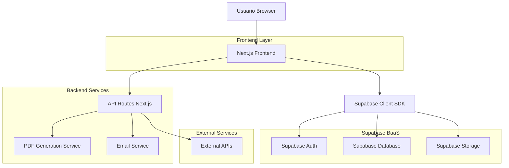
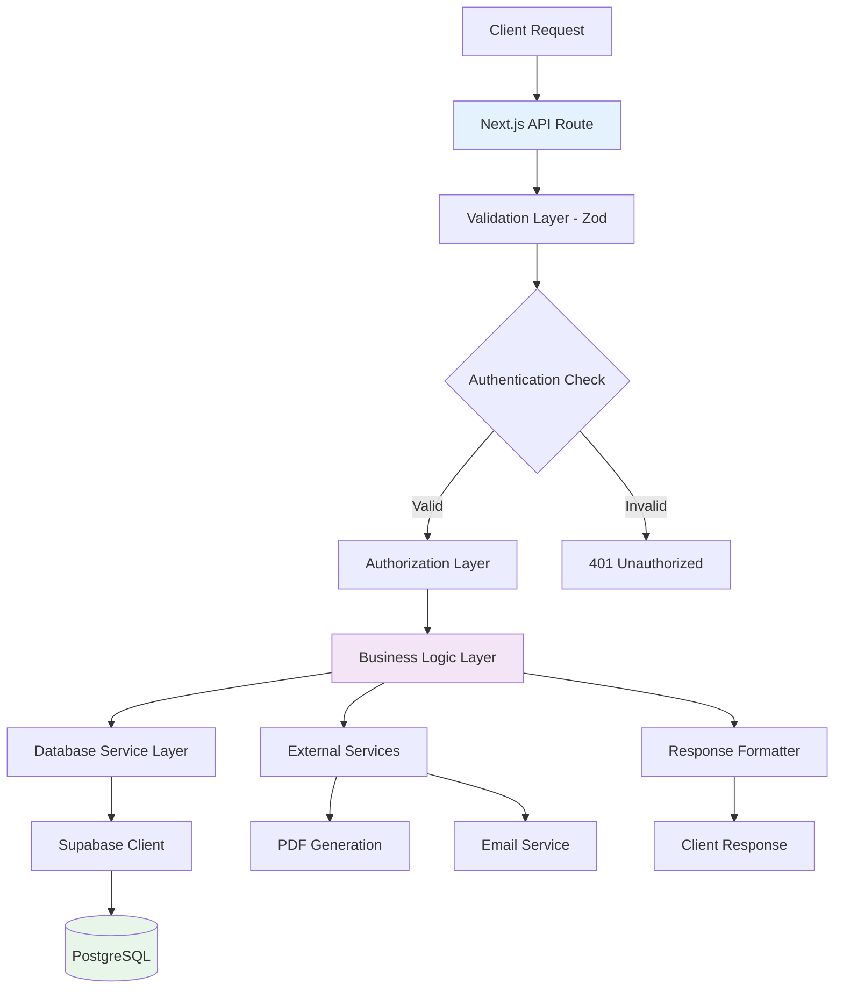
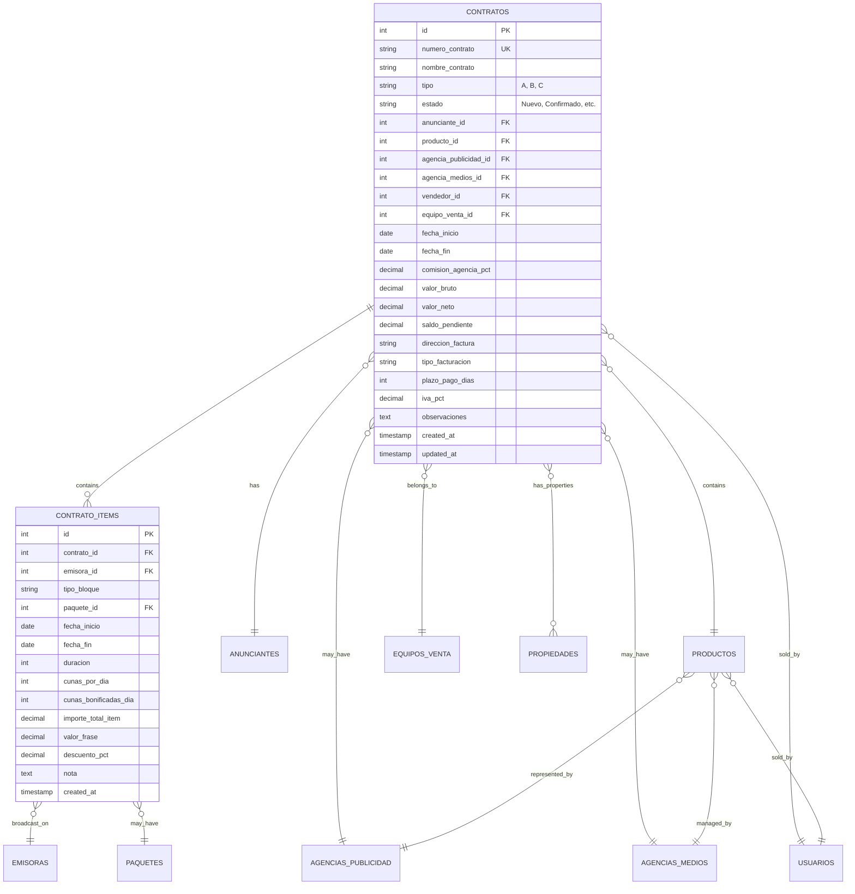

## 1. Arquitectura del Sistema



## 2. Stack Tecnológico

**Frontend:**
- Next.js 14 con App Router
- React 18 con TypeScript
- Tailwind CSS 3 para estilos
- Shadcn/ui para componentes
- React Hook Form para formularios
- Zustand para estado global
- React Query para cache de datos

**Backend Services:**
- Next.js API Routes para endpoints custom
- Supabase para autenticación y base de datos
- PDFKit para generación de contratos
- Nodemailer para envío de emails
- Zod para validación de esquemas

**Herramientas de Desarrollo:**
- TypeScript 5 para tipado fuerte
- ESLint + Prettier para calidad de código
- Husky para git hooks
- Jest + React Testing Library para tests
- Playwright para E2E testing

**Inicialización:**
```bash
npx create-next-app@latest contratos-module --typescript --tailwind --app
```

## 3. Definición de Rutas

| Ruta | Propósito | Componente Principal |
|------|-----------|---------------------|
| `/contratos` | Listado principal con tabla de contratos | ContratosTableView |
| `/contratos/nuevo` | Formulario de creación multi-pestaña | ContratoCreateForm |
| `/contratos/[id]` | Vista detalle del contrato | ContratoDetailView |
| `/contratos/[id]/editar` | Formulario de edición | ContratoEditForm |
| `/contratos/[id]/pdf` | Vista previa PDF del contrato | ContratoPDFPreview |
| `/contratos/busqueda` | Búsqueda avanzada con filtros | ContratoAdvancedSearch |
| `/api/contratos` | CRUD API para contratos | API Route Handler |
| `/api/contratos/[id]/pdf` | Generación PDF del contrato | PDF Generation API |
| `/api/contratos/[id]/historial` | API para tracking de cambios | History API |
| `/api/contratos/export` | Exportación Excel/CSV | Export API |

## 4. Definiciones de API

### 4.1 API de Contratos

#### Crear Contrato
```
POST /api/contratos
```

**Request Body:**
```typescript
interface CreateContratoRequest {
  nombre_contrato: string;
  tipo: 'A' | 'B' | 'C';
  anunciante_id: number;
  producto_id: number;
  agencia_publicidad_id?: number;
  agencia_medios_id?: number;
  vendedor_id: number;
  equipo_venta_id: number;
  fecha_inicio: string; // ISO date
  fecha_fin: string; // ISO date
  comision_agencia_pct?: number;
  direccion_factura: 'Anunciante' | 'Agencia de Medio';
  tipo_facturacion: 'Posterior' | 'Adelantado' | 'Efectivo' | 'Transferencia' | 'Cheque';
  iva_pct: number;
  plazo_pago_dias?: number;
  observaciones?: string;
  propiedades: number[]; // IDs de propiedades
  items: ContratoItemRequest[];
}

interface ContratoItemRequest {
  emisora_id: number;
  tipo_bloque: string;
  paquete_id?: number;
  fecha_inicio: string;
  fecha_fin: string;
  duracion: number;
  cunas_por_dia?: number;
  cunas_bonificadas_dia?: number;
  importe_total_item: number;
  valor_frase?: number;
  nota?: string;
}
```

**Response:**
```typescript
interface CreateContratoResponse {
  success: boolean;
  data: {
    id: number;
    numero_contrato: string;
    estado: 'Nuevo';
    valor_bruto: number;
    valor_neto: number;
    saldo_pendiente: number;
  };
  message?: string;
}
```

#### Actualizar Contrato
```
PUT /api/contratos/[id]
```

**Request Body:** Mismo que crear, más campo `razon_cambio: string`

#### Cambiar Estado
```
PATCH /api/contratos/[id]/estado
```

**Request Body:**
```typescript
interface CambiarEstadoRequest {
  nuevo_estado: 'Nuevo' | 'Confirmado' | 'Pendiente' | 'No Aprobado' | 'Rechazado' | 'Modificado';
  razon_cambio: string;
}
```

### 4.2 API de Búsqueda

#### Búsqueda Inteligente
```
GET /api/contratos/buscar?q=search_term&estado=filter&fecha_desde=date&fecha_hasta=date
```

**Parámetros:**
- `q`: Término de búsqueda (busca en todos los campos)
- `estado`: Filtrar por estado
- `vendedor_id`: Filtrar por vendedor
- `fecha_desde/hasta`: Rango de fechas
- `page`: Paginación
- `limit`: Items por página

**Response:**
```typescript
interface BusquedaResponse {
  data: ContratoListItem[];
  pagination: {
    total: number;
    page: number;
    limit: number;
    totalPages: number;
  };
}
```

### 4.3 API de Exportación

#### Exportar Excel
```
GET /api/contratos/export/excel?filters=query_params
```

**Headers:**
- `Content-Type: application/vnd.openxmlformats-officedocument.spreadsheetml.sheet`
- `Content-Disposition: attachment; filename="contratos.xlsx"`

#### Exportar PDF Masivo
```
POST /api/contratos/export/pdf-bulk
```

**Request Body:**
```typescript
interface ExportPDFBulkRequest {
  contrato_ids: number[];
  formato: 'individual' | 'consolidado';
}
```

## 5. Arquitectura del Servidor



### Capas de Servidor

**1. API Route Layer:**
- Manejo de requests HTTP
- Routing y parameter extraction
- Error handling global

**2. Validation Layer:**
- Zod schemas para validación de entrada
- Transformación de datos
- Mensajes de error localizados

**3. Authentication Layer:**
- JWT validation con Supabase
- Session management
- Token refresh automático

**4. Authorization Layer:**
- Role-based access control (RBAC)
- Resource-level permissions
- Audit logging

**5. Business Logic Layer:**
- Cálculos de valores (bruto, neto, descuentos)
- Validaciones de negocio
- Orquestación de operaciones complejas

**6. Data Access Layer:**
- Supabase queries optimizadas
- Transaction management
- Connection pooling

## 6. Modelo de Datos

### 6.1 Diagrama Entidad-Relación



### 6.2 Definición de Tablas (DDL)

#### Tabla Principal: contratos
```sql
-- Crear tabla principal de contratos
CREATE TABLE contratos (
    id SERIAL PRIMARY KEY,
    numero_contrato VARCHAR(20) UNIQUE NOT NULL,
    nombre_contrato VARCHAR(255) NOT NULL,
    tipo CHAR(1) CHECK (tipo IN ('A', 'B', 'C')),
    estado VARCHAR(20) CHECK (estado IN ('Nuevo', 'Confirmado', 'Pendiente', 'No Aprobado', 'Rechazado', 'Modificado')) DEFAULT 'Nuevo',
    anunciante_id INTEGER NOT NULL REFERENCES anunciantes(id),
    producto_id INTEGER NOT NULL REFERENCES productos(id),
    agencia_publicidad_id INTEGER REFERENCES agencias_publicidad(id),
    agencia_medios_id INTEGER REFERENCES agencias_medios(id),
    vendedor_id INTEGER NOT NULL REFERENCES usuarios(id),
    equipo_venta_id INTEGER NOT NULL REFERENCES equipos_venta(id),
    fecha_inicio DATE NOT NULL,
    fecha_fin DATE NOT NULL,
    comision_agencia_pct DECIMAL(5,2) DEFAULT 0.00,
    valor_bruto DECIMAL(12,2) DEFAULT 0.00,
    valor_neto DECIMAL(12,2) DEFAULT 0.00,
    saldo_pendiente DECIMAL(12,2) DEFAULT 0.00,
    direccion_factura VARCHAR(50) CHECK (direccion_factura IN ('Anunciante', 'Agencia de Medio')),
    tipo_facturacion VARCHAR(20) CHECK (tipo_facturacion IN ('Posterior', 'Adelantado', 'Efectivo', 'Transferencia', 'Cheque')),
    plazo_pago_dias INTEGER,
    iva_pct DECIMAL(5,2) DEFAULT 19.00,
    observaciones TEXT,
    created_at TIMESTAMP WITH TIME ZONE DEFAULT NOW(),
    updated_at TIMESTAMP WITH TIME ZONE DEFAULT NOW(),
    created_by INTEGER REFERENCES usuarios(id),
    updated_by INTEGER REFERENCES usuarios(id)
);

-- Índices para performance
CREATE INDEX idx_contratos_estado ON contratos(estado);
CREATE INDEX idx_contratos_fechas ON contratos(fecha_inicio, fecha_fin);
CREATE INDEX idx_contratos_anunciante ON contratos(anunciante_id);
CREATE INDEX idx_contratos_vendedor ON contratos(vendedor_id);
CREATE INDEX idx_contratos_equipo ON contratos(equipo_venta_id);
CREATE INDEX idx_contratos_numero ON contratos(numero_contrato);
```

#### Tabla de Items: contrato_items
```sql
-- Crear tabla de items del contrato
CREATE TABLE contrato_items (
    id SERIAL PRIMARY KEY,
    contrato_id INTEGER NOT NULL REFERENCES contratos(id) ON DELETE CASCADE,
    emisora_id INTEGER NOT NULL REFERENCES emisoras(id),
    tipo_bloque VARCHAR(100) NOT NULL,
    paquete_id INTEGER REFERENCES paquetes(id),
    fecha_inicio DATE NOT NULL,
    fecha_fin DATE NOT NULL,
    duracion INTEGER NOT NULL CHECK (duracion IN (15, 30, 60)),
    cunas_por_dia INTEGER DEFAULT 0,
    cunas_bonificadas_dia INTEGER DEFAULT 0,
    importe_total_item DECIMAL(12,2) NOT NULL,
    valor_frase DECIMAL(10,2),
    descuento_pct DECIMAL(5,2) DEFAULT 0.00,
    nota TEXT,
    created_at TIMESTAMP WITH TIME ZONE DEFAULT NOW(),
    updated_at TIMESTAMP WITH TIME ZONE DEFAULT NOW()
);

-- Índices para items
CREATE INDEX idx_contrato_items_contrato ON contrato_items(contrato_id);
CREATE INDEX idx_contrato_items_emisora ON contrato_items(emisora_id);
CREATE INDEX idx_contrato_items_fechas ON contrato_items(fecha_inicio, fecha_fin);
CREATE INDEX idx_contrato_items_tipo ON contrato_items(tipo_bloque);
```

#### Tabla de Historial: contrato_historial
```sql
-- Crear tabla de auditoría
CREATE TABLE contrato_historial (
    id SERIAL PRIMARY KEY,
    contrato_id INTEGER NOT NULL REFERENCES contratos(id) ON DELETE CASCADE,
    usuario_id INTEGER NOT NULL REFERENCES usuarios(id),
    accion VARCHAR(50) NOT NULL,
    campo_modificado VARCHAR(100),
    valor_anterior TEXT,
    valor_nuevo TEXT,
    razon_cambio TEXT,
    created_at TIMESTAMP WITH TIME ZONE DEFAULT NOW()
);

CREATE INDEX idx_historial_contrato ON contrato_historial(contrato_id);
CREATE INDEX idx_historial_usuario ON contrato_historial(usuario_id);
CREATE INDEX idx_historial_fecha ON contrato_historial(created_at);
```

#### Tabla de Propiedades (Relación Muchos a Muchos)
```sql
-- Tabla de propiedades disponibles
CREATE TABLE propiedades (
    id SERIAL PRIMARY KEY,
    nombre VARCHAR(255) NOT NULL,
    descripcion TEXT,
    activo BOOLEAN DEFAULT true,
    created_at TIMESTAMP WITH TIME ZONE DEFAULT NOW()
);

-- Tabla intermedia contrato_propiedades
CREATE TABLE contrato_propiedades (
    contrato_id INTEGER REFERENCES contratos(id) ON DELETE CASCADE,
    propiedad_id INTEGER REFERENCES propiedades(id) ON DELETE CASCADE,
    valor VARCHAR(255),
    created_at TIMESTAMP WITH TIME ZONE DEFAULT NOW(),
    PRIMARY KEY (contrato_id, propiedad_id)
);
```

### 6.3 Permisos de Supabase (RLS)

```sql
-- Habilitar RLS
ALTER TABLE contratos ENABLE ROW LEVEL SECURITY;
ALTER TABLE contrato_items ENABLE ROW LEVEL SECURITY;
ALTER TABLE contrato_historial ENABLE ROW LEVEL SECURITY;

-- Políticas de acceso
-- Vendedores: ver solo sus contratos y crear nuevos
CREATE POLICY "vendedores_ver_sus_contratos" ON contratos
    FOR SELECT
    USING (vendedor_id = auth.uid() OR EXISTS (
        SELECT 1 FROM usuarios WHERE id = auth.uid() AND rol IN ('jefe_ventas', 'admin')
    ));

-- Todos los usuarios autenticados pueden crear
CREATE POLICY "usuarios_crear_contratos" ON contratos
    FOR INSERT
    WITH CHECK (auth.uid() IS NOT NULL);

-- Solo admin y jefes pueden actualizar cualquier contrato
CREATE POLICY "admin_actualizar_contratos" ON contratos
    FOR UPDATE
    USING (EXISTS (
        SELECT 1 FROM usuarios WHERE id = auth.uid() AND rol IN ('admin', 'admin_contratos')
    ));

-- Vendedores pueden actualizar solo sus contratos en estado Nuevo
CREATE POLICY "vendedores_actualizar_propios" ON contratos
    FOR UPDATE
    USING (vendedor_id = auth.uid() AND estado = 'Nuevo');
```

### 6.4 Funciones de Base de Datos

#### Función para generar número de contrato
```sql
CREATE OR REPLACE FUNCTION generar_numero_contrato()
RETURNS TEXT AS $$
BEGIN
    RETURN 'C-' || TO_CHAR(NOW(), 'YYYY') || '-' || LPAD(nextval('contratos_numero_seq')::TEXT, 4, '0');
END;
$$ LANGUAGE plpgsql;
```

#### Trigger para calcular valores automáticos
```sql
CREATE OR REPLACE FUNCTION calcular_valores_contrato()
RETURNS TRIGGER AS $$
BEGIN
    -- Calcular valor bruto (suma de items)
    NEW.valor_bruto := COALESCE((
        SELECT SUM(importe_total_item)
        FROM contrato_items
        WHERE contrato_id = NEW.id
    ), 0.00);
    
    -- Calcular valor neto (bruto + IVA - descuentos)
    NEW.valor_neto := NEW.valor_bruto * (1 + NEW.iva_pct/100);
    
    -- Saldo pendiente (inicialmente igual al neto)
    NEW.saldo_pendiente := NEW.valor_neto;
    
    -- Actualizar timestamp
    NEW.updated_at := NOW();
    
    RETURN NEW;
END;
$$ LANGUAGE plpgsql;

CREATE TRIGGER trigger_calcular_valores
    BEFORE UPDATE ON contratos
    FOR EACH ROW
    EXECUTE FUNCTION calcular_valores_contrato();
```

## 7. Integraciones con Otros Módulos

### 7.1 Módulo de Anunciantes
- **API Integration:** GET /api/anunciantes/[id] para autocompletar
- **Data Sync:** Mantener consistencia de datos de clientes
- **Validation:** Verificar RUT y datos fiscales

### 7.2 Módulo de Productos
- **Product Creation:** Modal integrado en formulario de contrato
- **Pricing Rules:** Heredar comisiones y descuentos del producto
- **Package Association:** Relación con paquetes de emisoras

### 7.3 Módulo de Agencias
- **Agency Selection:** Dropdowns con búsqueda en tiempo real
- **Commission Calculation:** Heredar % de comisión de agencia
- **Contact Sync:** Información de contacto automática

### 7.4 Módulo de Emisoras
- **Station Availability:** Verificar disponibilidad en fechas
- **Rate Cards:** Importar tarifas oficiales para cálculo de descuentos
- **Package Management:** Asociar paquetes predefinidos

### 7.5 Módulo de Vendedores
- **Sales Team Assignment:** Equipos de venta y territorios
- **Commission Tracking:** Cálculo de comisiones individuales
- **Performance Metrics:** KPIs por vendedor y equipo

### 7.6 Módulo de Facturación
- **Invoice Generation:** Crear facturas desde contratos confirmados
- **Payment Tracking:** Actualizar saldo pendiente automáticamente
- **Revenue Recognition:** Distribución temporal de ingresos

## 8. Seguridad y Compliance

### 8.1 Data Protection
- **Encryption at Rest:** Todos los datos sensibles encriptados
- **Encryption in Transit:** HTTPS obligatorio con TLS 1.3
- **PII Handling:** Máscara de datos personales en logs
- **GDPR Compliance:** Derecho a ser olvidado implementado

### 8.2 Access Control
- **Role-Based Access:** RBAC granular por operaciones
- **Audit Trail:** Todos los cambios registrados con usuario y timestamp
- **Session Management:** Tokens con expiración y refresh automático
- **Password Policy:** Mínimo 12 caracteres, complejidad requerida

### 8.3 Business Rules Validation
- **Contract State Machine:** Transiciones válidas controladas
- **Date Validation:** No permitir fechas pasadas para nuevos contratos
- **Financial Limits:** Validar montos máximos por rol de usuario
- **Duplicate Prevention:** Detectar contratos duplicados por anunciante/fechas

## 9. Performance Optimization

### 9.1 Database Optimization
- **Indexes:** Índices compuestos para búsquedas comunes
- **Query Optimization:** EXPLAIN ANALYZE para queries complejas
- **Connection Pooling:** PgBouncer para manejar alta concurrencia
- **Partitioning:** Particionar tabla de historial por fecha

### 9.2 Frontend Optimization
- **Code Splitting:** Lazy loading por módulos y rutas
- **Data Caching:** React Query con stale-while-revalidate
- **Image Optimization:** Next.js Image component con WebP
- **Bundle Analysis:** Webpack Bundle Analyzer para identificar peso

### 9.3 API Optimization
- **Response Compression:** Gzip/Brotli para respuestas grandes
- **Pagination:** Cursor-based para tablas grandes
- **Field Selection:** GraphQL-style field selection para reducir payload
- **Rate Limiting:** Throttling por usuario y endpoint

## 10. Testing Strategy

### 10.1 Unit Tests
- **Business Logic:** Cálculos de valores, descuentos, comisiones
- **Validation Rules:** Todos los esquemas de validación
- **Data Transformations:** Mapeos entre frontend y backend
- **Error Handling:** Casos edge y manejo de errores

### 10.2 Integration Tests
- **Database Operations:** CRUD completo con datos reales
- **API Endpoints:** Todos los endpoints con autenticación
- **External Services:** Mock de servicios externos
- **File Operations:** Upload y generación de PDFs

### 10.3 E2E Tests
- **Happy Paths:** Flujo completo de creación de contrato
- **User Workflows:** Todos los roles principales
- **Error Scenarios:** Validación y manejo de errores
- **Cross-browser:** Chrome, Firefox, Safari, Edge

### 10.4 Performance Tests
- **Load Testing:** 100 usuarios concurrentes
- **Stress Testing:** Límites del sistema
- **Database Performance:** Queries lentas y optimización
- **Frontend Metrics:** TTI, FCP, LCP bajo objetivos

Esta arquitectura técnica proporciona una base sólida y escalable para el módulo de Contratos, integrándose perfectamente con el stack tecnológico existente mientras mantiene la flexibilidad necesaria para las complejas necesidades del negocio publicitario radial.