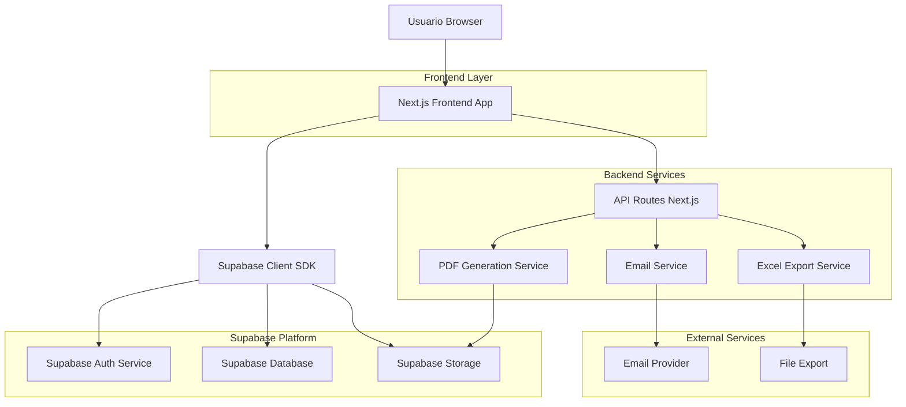
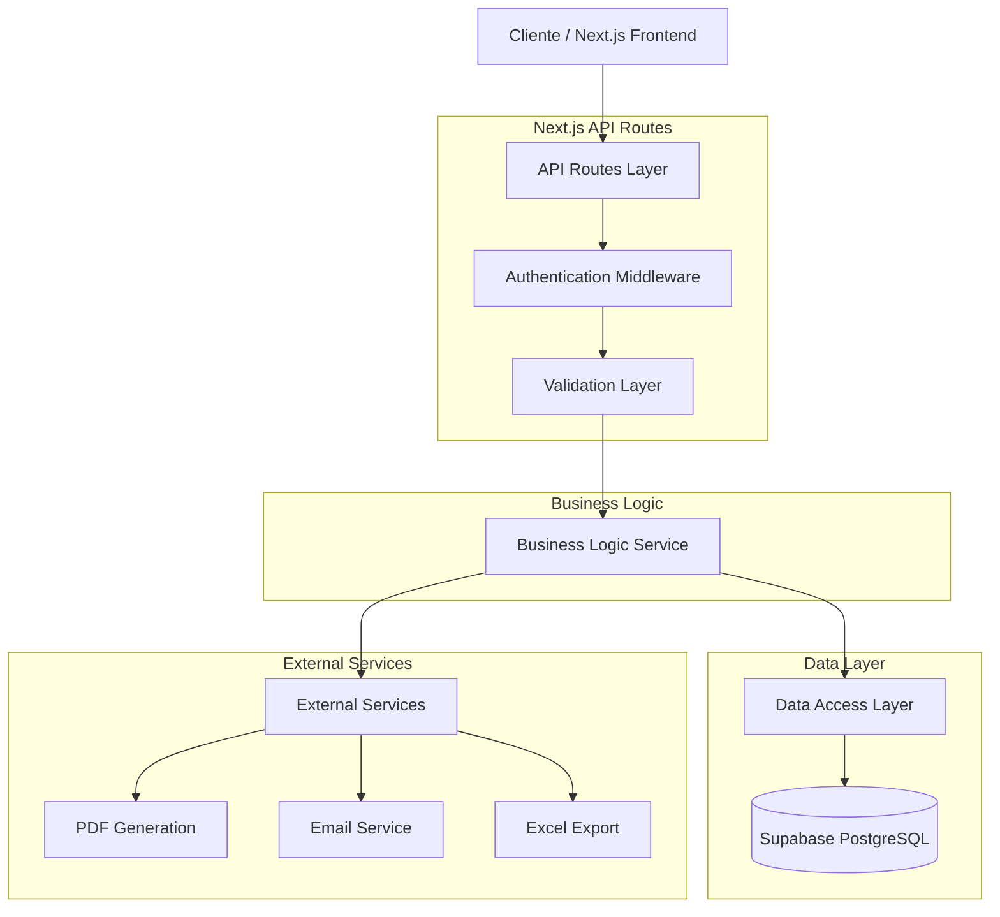
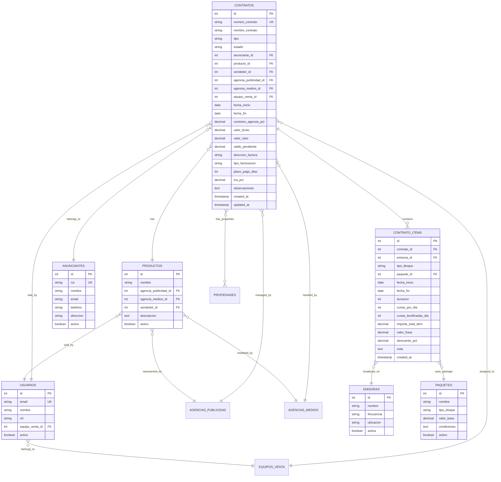

## 1. Diseño de Arquitectura



## 2. Descripción de Tecnologías

**Stack Tecnológico Principal:**
- **Frontend**: Next.js 14 + React 18 + TypeScript 5
- **Estilos**: Tailwind CSS 3 + Headless UI + Radix UI
- **Estado Global**: Zustand + React Query (TanStack Query)
- **Formularios**: React Hook Form + Zod (validación)
- **Tablas**: TanStack Table + React Virtual (rendimiento)
- **PDFs**: Puppeteer + PDFKit (generación server-side)
- **Exportación**: ExcelJS (Excel), PDFMake (PDFs simples)
- **Inicialización**: create-next-app con TypeScript template

**Servicios Backend:**
- **API Routes**: Next.js API Routes (serverless functions)
- **Autenticación**: Supabase Auth con JWT
- **Base de Datos**: Supabase PostgreSQL 15
- **Almacenamiento**: Supabase Storage para archivos
- **Tiempo Real**: Supabase Realtime para actualizaciones
- **Cache**: Redis (para reportes y exportaciones pesadas)

**Herramientas de Desarrollo:**
- **Type Checking**: TypeScript estricto
- **Linting**: ESLint + Prettier
- **Testing**: Jest + React Testing Library + Playwright
- **Monitoreo**: Sentry para errores, Analytics para uso
- **Deployment**: Vercel (frontend) + Supabase (backend)

## 3. Definición de Rutas

| Ruta | Propósito | Componente Principal |
|------|-----------|---------------------|
| `/contratos` | Vista principal con tabla de contratos | `ContractsTablePage` |
| `/contratos/nuevo` | Formulario de creación multi-pestaña | `ContractCreatePage` |
| `/contratos/[id]` | Vista detallada del contrato | `ContractDetailPage` |
| `/contratos/[id]/editar` | Editor de contrato existente | `ContractEditPage` |
| `/contratos/[id]/imprimir` | Vista previa y generación de PDF | `ContractPrintPage` |
| `/contratos/buscar` | Búsqueda avanzada y filtros | `ContractSearchPage` |
| `/contratos/reportes` | Generador de reportes y exportaciones | `ContractReportsPage` |
| `/api/contratos` | API CRUD para contratos | `API Route Handler` |
| `/api/contratos/[id]/pdf` | Generación de PDF de contrato | `PDF Generation API` |
| `/api/contratos/export` | Exportación a Excel/CSV | `Export API` |
| `/api/contratos/stats` | Estadísticas y dashboard | `Stats API` |

## 4. Definiciones de APIs

### 4.1 API Principal de Contratos

**Listar Contratos con Paginación y Filtros:**
```http
GET /api/contratos?page=1&limit=25&search=term&estado=nuevo,confirmado&sort=fecha_desc
```

**Parámetros de Query:**
| Parámetro | Tipo | Requerido | Descripción |
|-----------|------|-----------|-------------|
| page | number | No | Número de página (default: 1) |
| limit | number | No | Items por página (default: 25) |
| search | string | No | Búsqueda global en texto |
| estado | string[] | No | Filtrar por estados (array) |
| vendedor_id | number | No | Filtrar por vendedor |
| fecha_desde | date | No | Fecha inicio rango |
| fecha_hasta | date | No | Fecha fin rango |
| sort | string | No | Campo_orden (ej: fecha_desc, valor_asc) |

**Respuesta Exitosa (200):**
```json
{
  "data": [
    {
      "id": 123,
      "numero_contrato": "C-2024-0123",
      "nombre_contrato": "Campaña Navidad RadioActiva",
      "estado": "confirmado",
      "anunciante": {
        "id": 45,
        "nombre": "Tienda Deportiva S.A.",
        "rut": "76.543.210-K"
      },
      "vendedor": {
        "id": 12,
        "nombre": "Juan Pérez",
        "email": "juan@empresa.com"
      },
      "fechas": {
        "inicio": "2024-12-01",
        "fin": "2024-12-31"
      },
      "valores": {
        "bruto": 15000000,
        "neto": 12300000,
        "saldo": 8300000
      },
      "created_at": "2024-11-15T10:30:00Z",
      "updated_at": "2024-11-20T15:45:00Z"
    }
  ],
  "pagination": {
    "page": 1,
    "limit": 25,
    "total": 156,
    "totalPages": 7
  },
  "filters": {
    "estado": ["nuevo", "confirmado"],
    "applied": 2
  }
}
```

**Crear Nuevo Contrato:**
```http
POST /api/contratos
```

**Body Request:**
```json
{
  "nombre_contrato": "Campaña Verano 2025",
  "tipo": "A",
  "anunciante_id": 45,
  "producto_id": 23,
  "vendedor_id": 12,
  "agencia_publicidad_id": 8,
  "agencia_medios_id": 15,
  "fecha_inicio": "2025-01-01",
  "fecha_fin": "2025-03-31",
  "comision_agencia_pct": 15.0,
  "direccion_factura": "anunciante",
  "tipo_facturacion": "posterior",
  "plazo_pago_dias": 30,
  "iva_pct": 19.0,
  "observaciones": "Campaña especial con descuento por volumen",
  "equipo_venta_id": 3,
  "propiedades": [1, 4, 7]
}
```

**Actualizar Contrato:**
```http
PUT /api/contratos/[id]
```

**Eliminar Contrato (Soft Delete):**
```http
DELETE /api/contratos/[id]
```

### 4.2 API de Items de Contrato

**Agregar Item al Contrato:**
```http
POST /api/contratos/[id]/items
```

**Body Request:**
```json
{
  "emisora_id": 5,
  "tipo_bloque": "Prime",
  "paquete_id": 12,
  "fecha_inicio": "2025-01-01",
  "fecha_fin": "2025-01-31",
  "duracion": 30,
  "cunas_por_dia": 8,
  "cunas_bonificadas_dia": 2,
  "importe_total_item": 2500000,
  "valor_frase": 25000,
  "nota": "Bloque especial con bonificación"
}
```

### 4.3 API de Exportación y Reportes

**Generar PDF del Contrato:**
```http
POST /api/contratos/[id]/pdf
```

**Exportar a Excel:**
```http
POST /api/contratos/export/excel
```

**Body Request:**
```json
{
  "formato": "contratos_completo",
  "filtros": {
    "estado": ["confirmado", "pendiente"],
    "fecha_desde": "2024-01-01",
    "fecha_hasta": "2024-12-31"
  },
  "columnas": ["numero_contrato", "anunciante", "vendedor", "valor_neto", "estado"]
}
```

### 4.4 API de Búsqueda Avanzada

**Búsqueda Inteligente:**
```http
POST /api/contratos/search
```

**Body Request:**
```json
{
  "query": "Tienda Deportiva",
  "campos": ["anunciante.nombre", "anunciante.rut", "producto.nombre"],
  "fuzzy": true,
  "limit": 10
}
```

## 5. Diagrama de Arquitectura del Servidor



## 6. Modelo de Datos

### 6.1 Diagrama Entidad-Relación



### 6.2 Definición de Tablas (DDL)

**Tabla Principal: contratos**
```sql
-- Crear tabla principal de contratos
CREATE TABLE contratos (
    id SERIAL PRIMARY KEY,
    numero_contrato VARCHAR(20) UNIQUE NOT NULL,
    nombre_contrato VARCHAR(255) NOT NULL,
    tipo VARCHAR(10) DEFAULT 'A',
    estado VARCHAR(20) NOT NULL 
        CHECK (estado IN ('Nuevo', 'Confirmado', 'Modificado', 'Pendiente', 'No Aprobado', 'Rechazado')),
    anunciante_id INTEGER NOT NULL REFERENCES anunciantes(id),
    producto_id INTEGER NOT NULL REFERENCES productos(id),
    vendedor_id INTEGER NOT NULL REFERENCES usuarios(id),
    agencia_publicidad_id INTEGER REFERENCES agencias_publicidad(id),
    agencia_medios_id INTEGER REFERENCES agencias_medios(id),
    equipo_venta_id INTEGER NOT NULL REFERENCES equipos_venta(id),
    fecha_inicio DATE NOT NULL,
    fecha_fin DATE NOT NULL,
    comision_agencia_pct DECIMAL(5,2) DEFAULT 0.00,
    valor_bruto DECIMAL(12,2) DEFAULT 0.00,
    valor_neto DECIMAL(12,2) DEFAULT 0.00,
    saldo_pendiente DECIMAL(12,2) DEFAULT 0.00,
    direccion_factura VARCHAR(50) NOT NULL 
        CHECK (direccion_factura IN ('Anunciante', 'Agencia de Medio')),
    tipo_facturacion VARCHAR(50) NOT NULL 
        CHECK (tipo_facturacion IN ('Combinar por campaña', 'Cuotas', 'Facturar a posterior', 'Factura por adelantado', 'Efectivo', 'Transferencia', 'Cheque')),
    plazo_pago_dias INTEGER DEFAULT 30,
    iva_pct DECIMAL(5,2) DEFAULT 19.00,
    observaciones TEXT,
    facturar_comision BOOLEAN DEFAULT FALSE,
    created_at TIMESTAMP WITH TIME ZONE DEFAULT NOW(),
    updated_at TIMESTAMP WITH TIME ZONE DEFAULT NOW(),
    created_by INTEGER REFERENCES usuarios(id),
    updated_by INTEGER REFERENCES usuarios(id)
);

-- Índices para optimización
CREATE INDEX idx_contratos_numero ON contratos(numero_contrato);
CREATE INDEX idx_contratos_estado ON contratos(estado);
CREATE INDEX idx_contratos_fechas ON contratos(fecha_inicio, fecha_fin);
CREATE INDEX idx_contratos_anunciante ON contratos(anunciante_id);
CREATE INDEX idx_contratos_vendedor ON contratos(vendedor_id);
CREATE INDEX idx_contratos_equipo ON contratos(equipo_venta_id);
CREATE INDEX idx_contratos_updated ON contratos(updated_at DESC);
```

**Tabla de Items del Contrato: contrato_items**
```sql
-- Crear tabla de items/líneas del contrato
CREATE TABLE contrato_items (
    id SERIAL PRIMARY KEY,
    contrato_id INTEGER NOT NULL REFERENCES contratos(id) ON DELETE CASCADE,
    emisora_id INTEGER NOT NULL REFERENCES emisoras(id),
    tipo_bloque VARCHAR(100) NOT NULL 
        CHECK (tipo_bloque IN ('Auspicio', 'Menciones', 'Micros', 'Señal horaria', 'Señal temperatura', 'Prime', 'Prime determinado', 'Repartido', 'Repartido determinado', 'Noche')),
    paquete_id INTEGER REFERENCES paquetes(id),
    fecha_inicio DATE NOT NULL,
    fecha_fin DATE NOT NULL,
    duracion INTEGER DEFAULT 30,
    cunas_por_dia INTEGER DEFAULT 0,
    cunas_bonificadas_dia INTEGER DEFAULT 0,
    importe_total_item DECIMAL(12,2) NOT NULL,
    valor_frase DECIMAL(10,2) DEFAULT 0.00,
    descuento_pct DECIMAL(5,2) DEFAULT 0.00,
    nota TEXT,
    created_at TIMESTAMP WITH TIME ZONE DEFAULT NOW(),
    updated_at TIMESTAMP WITH TIME ZONE DEFAULT NOW()
);

-- Índices para items
CREATE INDEX idx_items_contrato ON contrato_items(contrato_id);
CREATE INDEX idx_items_emisora ON contrato_items(emisora_id);
CREATE INDEX idx_items_fechas ON contrato_items(fecha_inicio, fecha_fin);
CREATE INDEX idx_items_tipo ON contrato_items(tipo_bloque);
```

**Tabla de Auditoría: contratos_historial**
```sql
-- Crear tabla de auditoría de cambios
CREATE TABLE contratos_historial (
    id SERIAL PRIMARY KEY,
    contrato_id INTEGER NOT NULL REFERENCES contratos(id) ON DELETE CASCADE,
    usuario_id INTEGER NOT NULL REFERENCES usuarios(id),
    accion VARCHAR(50) NOT NULL,
    campo_modificado VARCHAR(100),
    valor_anterior TEXT,
    valor_nuevo TEXT,
    ip_address INET,
    user_agent TEXT,
    created_at TIMESTAMP WITH TIME ZONE DEFAULT NOW()
);

-- Índice para búsqueda rápida de historial
CREATE INDEX idx_historial_contrato ON contratos_historial(contrato_id);
CREATE INDEX idx_historial_usuario ON contratos_historial(usuario_id);
CREATE INDEX idx_historial_fecha ON contratos_historial(created_at DESC);
```

**Tabla de Propiedades: propiedades**
```sql
-- Crear tabla de propiedades configurables
CREATE TABLE propiedades (
    id SERIAL PRIMARY KEY,
    nombre VARCHAR(100) NOT NULL,
    descripcion TEXT,
    categoria VARCHAR(50),
    activo BOOLEAN DEFAULT TRUE,
    created_at TIMESTAMP WITH TIME ZONE DEFAULT NOW()
);

-- Tabla de unión para propiedades de contratos
CREATE TABLE contrato_propiedades (
    contrato_id INTEGER REFERENCES contratos(id) ON DELETE CASCADE,
    propiedad_id INTEGER REFERENCES propiedades(id) ON DELETE CASCADE,
    valor VARCHAR(255),
    PRIMARY KEY (contrato_id, propiedad_id)
);
```

### 6.3 Datos Iniciales y Configuración

**Insertar Propiedades Base:**
```sql
-- Insertar propiedades estándar del sistema
INSERT INTO propiedades (nombre, descripcion, categoria) VALUES
    ('Exclusividad de Categoría', 'El anunciante tiene exclusividad en su categoría', 'Restricciones'),
    ('Primera Opción de Renovación', 'Derecho a renovar antes que otros', 'Privilegios'),
    ('Descuento por Volumen', 'Aplica descuento especial por volumen', 'Descuentos'),
    ('Pago Anticipado Requerido', 'Requiere pago completo anticipado', 'Condiciones'),
    ('Bonificación en Cuñas', 'Incluye cuñas bonificadas', 'Bonificaciones'),
    ('Campaña Especial', 'Consideraciones especiales para campaña', 'Especiales');
```

**Insertar Tipos de Bloque Base:**
```sql
-- Insertar tipos de bloque estándar
INSERT INTO tipos_bloque (nombre, descripcion, activo) VALUES
    ('Prime', 'Bloque prime time 7:00-10:00', true),
    ('Prime determinado', 'Prime en horario específico', true),
    ('Repartido', 'Distribuido durante el día', true),
    ('Repartido determinado', 'Repartido en franjas específicas', true),
    ('Noche', 'Bloque nocturno 20:00-24:00', true),
    ('Auspicio', 'Programa auspiciado completo', true),
    ('Menciones', 'Menciones breves durante programas', true),
    ('Micros', 'Micro programas patrocinados', true),
    ('Señal horaria', 'Señales de hora patrocinadas', true),
    ('Señal temperatura', 'Señales meteorológicas patrocinadas', true);
```

**Crear Función para Generar Número de Contrato:**
```sql
-- Función para generar número de contrato automático
CREATE OR REPLACE FUNCTION generar_numero_contrato()
RETURNS VARCHAR AS $$
DECLARE
    year_actual VARCHAR(4);
    numero_secuencial INTEGER;
    nuevo_numero VARCHAR(20);
BEGIN
    year_actual := EXTRACT(YEAR FROM CURRENT_DATE)::VARCHAR;
    
    -- Obtener el último número del año actual
    SELECT COALESCE(MAX(SUBSTRING(numero_contrato FROM 9 FOR 4)::INTEGER), 0) + 1
    INTO numero_secuencial
    FROM contratos
    WHERE SUBSTRING(numero_contrato FROM 3 FOR 4) = year_actual;
    
    nuevo_numero := 'C-' || year_actual || '-' || LPAD(numero_secuencial::VARCHAR, 4, '0');
    RETURN nuevo_numero;
END;
$$ LANGUAGE plpgsql;
```

**Trigger para Actualizar Timestamps:**
```sql
-- Trigger para actualizar updated_at
CREATE OR REPLACE FUNCTION update_updated_at_column()
RETURNS TRIGGER AS $$
BEGIN
    NEW.updated_at = NOW();
    RETURN NEW;
END;
$$ LANGUAGE plpgsql;

CREATE TRIGGER update_contratos_updated_at 
    BEFORE UPDATE ON contratos 
    FOR EACH ROW 
    EXECUTE FUNCTION update_updated_at_column();

CREATE TRIGGER update_contrato_items_updated_at 
    BEFORE UPDATE ON contrato_items 
    FOR EACH ROW 
    EXECUTE FUNCTION update_updated_at_column();
```

### 6.4 Permisos y Seguridad (Supabase RLS)

**Habilitar RLS (Row Level Security):**
```sql
-- Habilitar RLS en tablas principales
ALTER TABLE contratos ENABLE ROW LEVEL SECURITY;
ALTER TABLE contrato_items ENABLE ROW LEVEL SECURITY;
ALTER TABLE contratos_historial ENABLE ROW LEVEL SECURITY;
```

**Políticas de Acceso:**
```sql
-- Política: Usuarios pueden ver contratos de su equipo
CREATE POLICY "Ver contratos del equipo" ON contratos
    FOR SELECT
    USING (
        equipo_venta_id IN (
            SELECT equipo_venta_id FROM usuarios WHERE id = auth.uid()
        ) OR 
        auth.jwt() ->> 'role' = 'admin'
    );

-- Política: Vendedores pueden crear contratos
CREATE POLICY "Crear contratos" ON contratos
    FOR INSERT
    WITH CHECK (
        auth.jwt() ->> 'role' IN ('vendedor', 'admin') AND
        vendedor_id = auth.uid()
    );

-- Política: Solo creador o admin pueden actualizar
CREATE POLICY "Actualizar contratos" ON contratos
    FOR UPDATE
    USING (
        created_by = auth.uid() OR 
        auth.jwt() ->> 'role' = 'admin'
    );

-- Política: Items heredan permisos del contrato padre
CREATE POLICY "Gestionar items de contrato" ON contrato_items
    FOR ALL
    USING (
        EXISTS (
            SELECT 1 FROM contratos 
            WHERE contratos.id = contrato_items.contrato_id
            AND (
                contratos.created_by = auth.uid() OR 
                auth.jwt() ->> 'role' = 'admin'
            )
        )
    );
```

**Permisos de Supabase para Roles:**
```sql
-- Otorgar permisos básicos al rol anon (lectura pública limitada)
GRANT SELECT ON contratos TO anon;
GRANT SELECT ON contrato_items TO anon;

-- Otorgar permisos completos al rol authenticated
GRANT ALL PRIVILEGES ON contratos TO authenticated;
GRANT ALL PRIVILEGES ON contrato_items TO authenticated;
GRANT ALL PRIVILEGES ON contratos_historial TO authenticated;
GRANT ALL PRIVILEGES ON propiedades TO authenticated;
GRANT ALL PRIVILEGES ON contrato_propiedades TO authenticated;

-- Otorgar permisos de uso de funciones
GRANT USAGE ON SCHEMA public TO authenticated;
GRANT EXECUTE ON FUNCTION generar_numero_contrato TO authenticated;
```

## 7. Consideraciones de Rendimiento y Escalabilidad

### 7.1 Optimización de Consultas
- **Índices Compuestos**: Crear índices en combinaciones frecuentes (estado + fecha_inicio)
- **Vistas Materializadas**: Para reportes complejos que no requieren datos en tiempo real
- **Particionamiento**: Considerar particionamiento por año para datos históricos
- **Cache de Consultas**: Implementar cache Redis para búsquedas frecuentes

### 7.2 Manejo de Archivos Grandes
- **Streaming para PDFs**: Generar PDFs en chunks para evitar timeout
- **Cola de Procesamiento**: Usar Bull o similar para tareas pesadas de exportación
- **Almacenamiento CDN**: Servir archivos estáticos desde CDN con cache
- **Compresión**: Habilitar gzip/brotli para respuestas de API

### 7.3 Seguridad y Compliance
- **Encriptación**: Encriptar datos sensibles en reposo (valores de contratos)
- **Auditoría**: Log detallado de todas las operaciones con IP y user agent
- **Backup Automático**: Backups diarios con retención de 30 días
- **GDPR Compliance**: Derecho a olvido y portabilidad de datos implementados

Esta arquitectura garantiza un sistema robusto, escalable y mantenible para la gestión completa del ciclo de vida de contratos publicitarios.