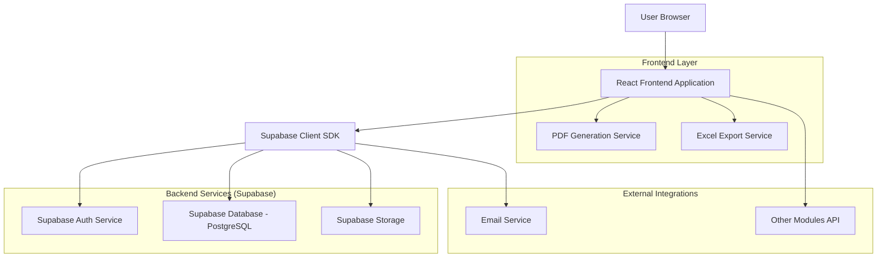
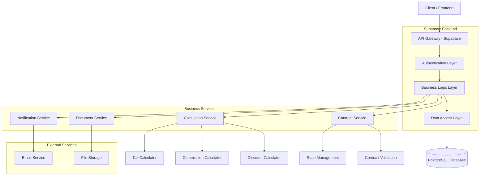
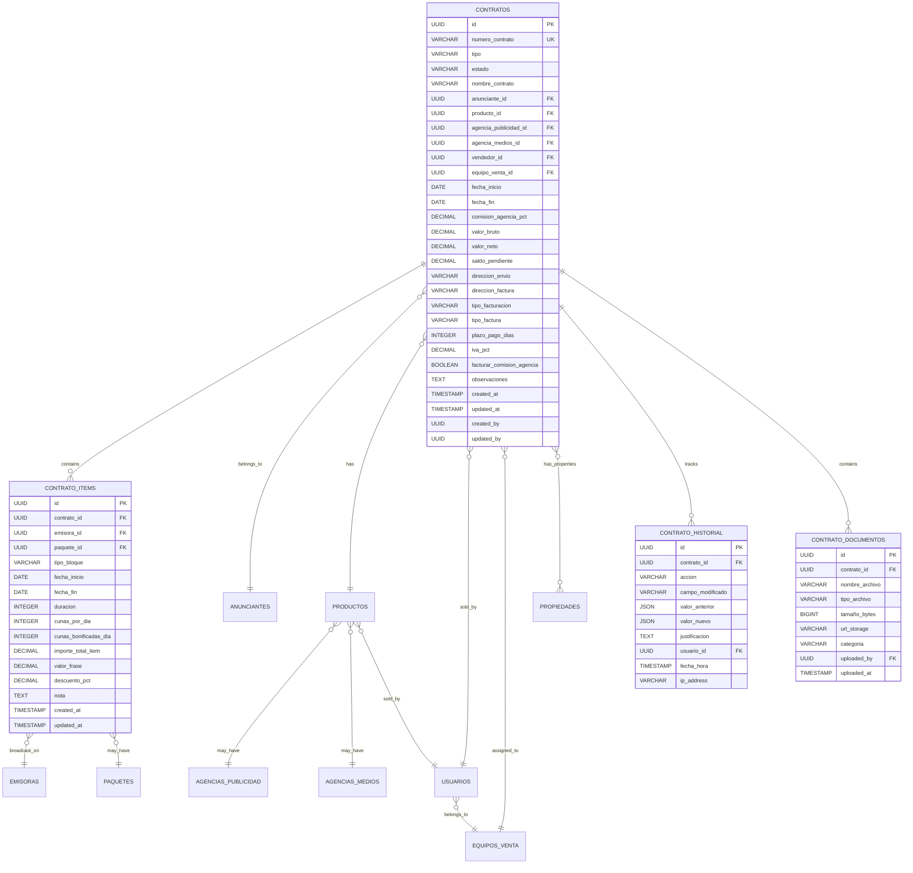

## 1. Diseño de Arquitectura



## 2. Descripción de Tecnologías

**Stack Tecnológico Principal:**

* **Frontend:** React\@18 + TypeScript\@5 + Vite

* **UI Framework:** Tailwind CSS\@3 + Headless UI + Radix UI

* **State Management:** React Query (TanStack Query) + Zustand

* **Backend:** Supabase (BaaS - Backend as a Service)

* **Database:** PostgreSQL\@15 (via Supabase)

* **Authentication:** Supabase Auth con JWT tokens

* **File Storage:** Supabase Storage para documentos adjuntos

* **Initialization Tool:** vite-init

**Librerías Esenciales:**

```json
{
  "dependencies": {
    "react": "^18.2.0",
    "react-dom": "^18.2.0",
    "react-router-dom": "^6.8.0",
    "@supabase/supabase-js": "^2.8.0",
    "@tanstack/react-query": "^4.24.0",
    "zustand": "^4.3.0",
    "react-hook-form": "^7.43.0",
    "zod": "^3.20.0",
    "@hookform/resolvers": "^2.9.0",
    "react-datepicker": "^4.10.0",
    "react-select": "^5.7.0",
    "lucide-react": "^0.310.0",
    "jspdf": "^2.5.1",
    "xlsx": "^0.18.5",
    "date-fns": "^2.29.0",
    "clsx": "^1.2.1"
  },
  "devDependencies": {
    "@types/react": "^18.0.27",
    "@types/react-dom": "^18.0.10",
    "@vitejs/plugin-react": "^3.1.0",
    "typescript": "^4.9.3",
    "vite": "^4.1.0",
    "tailwindcss": "^3.2.0",
    "autoprefixer": "^10.4.13",
    "postcss": "^8.4.21"
  }
}
```

## 3. Definición de Rutas

| Ruta                      | Propósito                      | Componente          | Protección                   |
| ------------------------- | ------------------------------ | ------------------- | ---------------------------- |
| `/contratos`              | Listado principal de contratos | ContratosListPage   | Requiere autenticación       |
| `/contratos/nuevo`        | Crear nuevo contrato           | ContratoFormPage    | Requiere rol: vendedor+      |
| `/contratos/:id`          | Ver detalle de contrato        | ContratoDetailPage  | Requiere autenticación       |
| `/contratos/:id/editar`   | Editar contrato existente      | ContratoFormPage    | Requiere permisos de edición |
| `/contratos/busqueda`     | Búsqueda avanzada              | ContratosSearchPage | Requiere autenticación       |
| `/contratos/:id/imprimir` | Vista de impresión             | ContratoPrintView   | Requiere autenticación       |
| `/contratos/importar`     | Importar desde Excel           | ContratosImportPage | Requiere rol: administrador  |

**Rutas de API (Supabase Edge Functions):**

* `/api/contracts/generate-pdf` - Generar PDF de contrato

* `/api/contracts/export-excel` - Exportar lista de contratos

* `/api/contracts/calculate-discount` - Calcular descuento automático

* `/api/contracts/send-email` - Enviar contrato por email

## 4. Definiciones de API

### 4.1 Tipos de TypeScript Compartidos

```typescript
// Tipos principales de contratos
export interface Contrato {
  id: string;
  numero_contrato: string;
  tipo: 'A' | 'B' | 'C';
  estado: 'Nuevo' | 'Confirmado' | 'Modificado' | 'Pendiente' | 'No_Aprobado' | 'Rechazado';
  nombre_contrato: string;
  anunciante_id: string;
  producto_id: string;
  agencia_publicidad_id?: string;
  agencia_medios_id?: string;
  vendedor_id: string;
  equipo_venta_id: string;
  fecha_inicio: string;
  fecha_fin: string;
  comision_agencia_pct: number;
  valor_bruto: number;
  valor_neto: number;
  saldo_pendiente: number;
  direccion_envio: 'Anunciante' | 'Agencia_Publicidad' | 'Agencia_Medio';
  direccion_factura: 'Anunciante' | 'Agencia_Medio';
  tipo_facturacion: 'Posterior' | 'Adelantado' | 'Efectivo' | 'Transferencia' | 'Cheque';
  tipo_factura: 'Combinar_Campana' | 'Cuotas_Mensuales' | 'Cuotas_Quincenales';
  plazo_pago_dias?: number;
  iva_pct: number;
  facturar_comision_agencia: boolean;
  observaciones?: string;
  created_at: string;
  updated_at: string;
  created_by: string;
  updated_by: string;
}

export interface ContratoItem {
  id: string;
  contrato_id: string;
  emisora_id: string;
  tipo_bloque: 'Auspicio' | 'Mencion' | 'Micro' | 'Senal_Horaria' | 'Senal_Temperatura' | 'Prime' | 'Prime_Determinado' | 'Repartido' | 'Repartido_Determinado' | 'Noche';
  paquete_id?: string;
  fecha_inicio: string;
  fecha_fin: string;
  duracion: 15 | 30 | 60;
  cunas_por_dia?: number;
  cunas_bonificadas_dia?: number;
  importe_total_item: number;
  valor_frase?: number;
  descuento_pct: number;
  nota?: string;
  created_at: string;
  updated_at: string;
}

export interface ContratoHistorial {
  id: string;
  contrato_id: string;
  accion: 'CREAR' | 'EDITAR' | 'CAMBIAR_ESTADO' | 'AGREGAR_ITEM' | 'ELIMINAR_ITEM' | 'GENERAR_PDF';
  campo_modificado?: string;
  valor_anterior?: any;
  valor_nuevo?: any;
  justificacion?: string;
  usuario_id: string;
  fecha_hora: string;
  ip_address?: string;
}

export interface Producto {
  id: string;
  nombre: string;
  agencia_publicidad_id?: string;
  agencia_medios_id?: string;
  vendedor_id: string;
  comision_agencia_pct?: number;
  created_at: string;
  updated_at: string;
}

export interface Paquete {
  id: string;
  nombre: string;
  tipo_bloque: string;
  valor_lista: number;
  condiciones?: string;
  activo: boolean;
  created_at: string;
  updated_at: string;
}
```

### 4.2 Endpoints de Supabase (PostgreSQL Functions)

```sql
-- Function: Calcular descuento automático
CREATE OR REPLACE FUNCTION calcular_descuento_automatico(
  p_contrato_id UUID,
  p_valor_negociado DECIMAL(12,2),
  p_tipo_bloque VARCHAR(100)
) RETURNS DECIMAL(5,2) AS $$
DECLARE
  v_valor_lista DECIMAL(12,2);
  v_descuento_pct DECIMAL(5,2);
BEGIN
  -- Obtener valor de lista del paquete o tarifa oficial
  SELECT valor_lista INTO v_valor_lista
  FROM paquetes
  WHERE tipo_bloque = p_tipo_bloque
    AND activo = true
  ORDER BY valor_lista DESC
  LIMIT 1;
  
  IF v_valor_lista > 0 THEN
    v_descuento_pct := ((v_valor_lista - p_valor_negociado) / v_valor_lista) * 100;
    RETURN ROUND(v_descuento_pct, 2);
  END IF;
  
  RETURN 0;
END;
$$ LANGUAGE plpgsql;

-- Function: Actualizar valores totales del contrato
CREATE OR REPLACE FUNCTION actualizar_valores_contrato(
  p_contrato_id UUID
) RETURNS VOID AS $$
DECLARE
  v_total_bruto DECIMAL(12,2);
  v_comision_pct DECIMAL(5,2);
  v_iva_pct DECIMAL(5,2);
  v_total_neto DECIMAL(12,2);
BEGIN
  -- Calcular total bruto de items
  SELECT COALESCE(SUM(importe_total_item), 0) INTO v_total_bruto
  FROM contrato_items
  WHERE contrato_id = p_contrato_id;
  
  -- Obtener porcentajes del contrato
  SELECT comision_agencia_pct, iva_pct INTO v_comision_pct, v_iva_pct
  FROM contratos
  WHERE id = p_contrato_id;
  
  -- Calcular valor neto
  v_total_neto := v_total_bruto - (v_total_bruto * v_comision_pct / 100);
  v_total_neto := v_total_neto + (v_total_neto * v_iva_pct / 100);
  
  -- Actualizar contrato
  UPDATE contratos
  SET valor_bruto = v_total_bruto,
      valor_neto = v_total_neto,
      saldo_pendiente = v_total_neto,
      updated_at = NOW()
  WHERE id = p_contrato_id;
END;
$$ LANGUAGE plpgsql;
```

## 5. Arquitectura del Servidor

### 5.1 Diagrama de Capas del Backend



### 5.2 Seguridad y Permisos (Row Level Security)

```sql
-- Enable RLS on contracts table
ALTER TABLE contratos ENABLE ROW LEVEL SECURITY;

-- Policy: Vendedores pueden ver y editar solo sus contratos
CREATE POLICY "vendedores_crud_own_contracts" ON contratos
    FOR ALL
    USING (
        auth.uid() = vendedor_id 
        OR 
        EXISTS (
            SELECT 1 FROM users 
            WHERE users.id = auth.uid() 
            AND users.role IN ('admin', 'sales_manager')
        )
    );

-- Policy: Anunciantes pueden ver solo sus contratos
CREATE POLICY "anunciantes_read_own_contracts" ON contratos
    FOR SELECT
    USING (
        auth.uid() = anunciante_id 
        OR 
        EXISTS (
            SELECT 1 FROM anunciantes 
            WHERE anunciantes.id = anunciante_id 
            AND anunciantes.user_id = auth.uid()
        )
    );

-- Policy: Contadores pueden ver todos los contratos para facturación
CREATE POLICY "contadores_read_all_contracts" ON contratos
    FOR SELECT
    USING (
        EXISTS (
            SELECT 1 FROM users 
            WHERE users.id = auth.uid() 
            AND users.role = 'accountant'
        )
    );
```

## 6. Modelo de Datos

### 6.1 Diagrama Entidad-Relación



### 6.2 Definición de Tablas (DDL)

```sql
-- Tabla principal de contratos
CREATE TABLE contratos (
    id UUID PRIMARY KEY DEFAULT gen_random_uuid(),
    numero_contrato VARCHAR(20) UNIQUE NOT NULL,
    tipo VARCHAR(1) NOT NULL CHECK (tipo IN ('A', 'B', 'C')),
    estado VARCHAR(20) NOT NULL CHECK (estado IN ('Nuevo', 'Confirmado', 'Modificado', 'Pendiente', 'No_Aprobado', 'Rechazado')),
    nombre_contrato VARCHAR(255) NOT NULL,
    anunciante_id UUID NOT NULL REFERENCES anunciantes(id),
    producto_id UUID NOT NULL REFERENCES productos(id),
    agencia_publicidad_id UUID REFERENCES agencias_publicidad(id),
    agencia_medios_id UUID REFERENCES agencias_medios(id),
    vendedor_id UUID NOT NULL REFERENCES usuarios(id),
    equipo_venta_id UUID NOT NULL REFERENCES equipos_venta(id),
    fecha_inicio DATE NOT NULL,
    fecha_fin DATE NOT NULL,
    comision_agencia_pct DECIMAL(5,2) DEFAULT 0,
    valor_bruto DECIMAL(12,2) DEFAULT 0,
    valor_neto DECIMAL(12,2) DEFAULT 0,
    saldo_pendiente DECIMAL(12,2) DEFAULT 0,
    direccion_envio VARCHAR(20) CHECK (direccion_envio IN ('Anunciante', 'Agencia_Publicidad', 'Agencia_Medio')),
    direccion_factura VARCHAR(20) CHECK (direccion_factura IN ('Anunciante', 'Agencia_Medio')),
    tipo_facturacion VARCHAR(30) CHECK (tipo_facturacion IN ('Combinar_Campana', 'Cuotas_Mensuales', 'Cuotas_Quincenales')),
    tipo_factura VARCHAR(20) CHECK (tipo_factura IN ('Posterior', 'Adelantado', 'Efectivo', 'Transferencia', 'Cheque')),
    plazo_pago_dias INTEGER,
    iva_pct DECIMAL(5,2) DEFAULT 19.00,
    facturar_comision_agencia BOOLEAN DEFAULT false,
    observaciones TEXT,
    created_at TIMESTAMP WITH TIME ZONE DEFAULT NOW(),
    updated_at TIMESTAMP WITH TIME ZONE DEFAULT NOW(),
    created_by UUID REFERENCES usuarios(id),
    updated_by UUID REFERENCES usuarios(id)
);

-- Índices para búsquedas rápidas
CREATE INDEX idx_contratos_numero ON contratos(numero_contrato);
CREATE INDEX idx_contratos_estado ON contratos(estado);
CREATE INDEX idx_contratos_anunciante ON contratos(anunciante_id);
CREATE INDEX idx_contratos_vendedor ON contratos(vendedor_id);
CREATE INDEX idx_contratos_fechas ON contratos(fecha_inicio, fecha_fin);
CREATE INDEX idx_contratos_created_at ON contratos(created_at DESC);

-- Tabla de items del contrato
CREATE TABLE contrato_items (
    id UUID PRIMARY KEY DEFAULT gen_random_uuid(),
    contrato_id UUID NOT NULL REFERENCES contratos(id) ON DELETE CASCADE,
    emisora_id UUID NOT NULL REFERENCES emisoras(id),
    paquete_id UUID REFERENCES paquetes(id),
    tipo_bloque VARCHAR(30) NOT NULL CHECK (tipo_bloque IN ('Auspicio', 'Mencion', 'Micro', 'Senal_Horaria', 'Senal_Temperatura', 'Prime', 'Prime_Determinado', 'Repartido', 'Repartido_Determinado', 'Noche')),
    fecha_inicio DATE NOT NULL,
    fecha_fin DATE NOT NULL,
    duracion INTEGER CHECK (duracion IN (15, 30, 60)),
    cunas_por_dia INTEGER DEFAULT 0,
    cunas_bonificadas_dia INTEGER DEFAULT 0,
    importe_total_item DECIMAL(12,2) NOT NULL,
    valor_frase DECIMAL(10,2),
    descuento_pct DECIMAL(5,2) DEFAULT 0,
    nota TEXT,
    created_at TIMESTAMP WITH TIME ZONE DEFAULT NOW(),
    updated_at TIMESTAMP WITH TIME ZONE DEFAULT NOW()
);

CREATE INDEX idx_contrato_items_contrato ON contrato_items(contrato_id);
CREATE INDEX idx_contrato_items_emisora ON contrato_items(emisora_id);
CREATE INDEX idx_contrato_items_tipo ON contrato_items(tipo_bloque);

-- Tabla de historial de cambios
CREATE TABLE contrato_historial (
    id UUID PRIMARY KEY DEFAULT gen_random_uuid(),
    contrato_id UUID NOT NULL REFERENCES contratos(id) ON DELETE CASCADE,
    accion VARCHAR(30) NOT NULL CHECK (accion IN ('CREAR', 'EDITAR', 'CAMBIAR_ESTADO', 'AGREGAR_ITEM', 'ELIMINAR_ITEM', 'GENERAR_PDF')),
    campo_modificado VARCHAR(100),
    valor_anterior JSONB,
    valor_nuevo JSONB,
    justificacion TEXT,
    usuario_id UUID NOT NULL REFERENCES usuarios(id),
    fecha_hora TIMESTAMP WITH TIME ZONE DEFAULT NOW(),
    ip_address INET
);

CREATE INDEX idx_contrato_historial_contrato ON contrato_historial(contrato_id);
CREATE INDEX idx_contrato_historial_usuario ON contrato_historial(usuario_id);
CREATE INDEX idx_contrato_historial_fecha ON contrato_historial(fecha_hora DESC);

-- Tabla de documentos adjuntos
CREATE TABLE contrato_documentos (
    id UUID PRIMARY KEY DEFAULT gen_random_uuid(),
    contrato_id UUID NOT NULL REFERENCES contratos(id) ON DELETE CASCADE,
    nombre_archivo VARCHAR(255) NOT NULL,
    tipo_archivo VARCHAR(100) NOT NULL,
    tamaño_bytes BIGINT NOT NULL,
    url_storage TEXT NOT NULL,
    categoria VARCHAR(50) CHECK (categoria IN ('Contrato', 'Orden_Compra', 'Factura', 'Otro')),
    uploaded_by UUID NOT NULL REFERENCES usuarios(id),
    uploaded_at TIMESTAMP WITH TIME ZONE DEFAULT NOW()
);

CREATE INDEX idx_contrato_documentos_contrato ON contrato_documentos(contrato_id);

-- Tabla de propiedades (características adicionales)
CREATE TABLE propiedades (
    id UUID PRIMARY KEY DEFAULT gen_random_uuid(),
    nombre VARCHAR(100) NOT NULL,
    descripcion TEXT,
    activo BOOLEAN DEFAULT true,
    created_at TIMESTAMP WITH TIME ZONE DEFAULT NOW()
);

-- Tabla intermedia para propiedades de contratos
CREATE TABLE contrato_propiedades (
    contrato_id UUID REFERENCES contratos(id) ON DELETE CASCADE,
    propiedad_id UUID REFERENCES propiedades(id) ON DELETE CASCADE,
    valor VARCHAR(255),
    PRIMARY KEY (contrato_id, propiedad_id)
);

-- Trigger para actualizar updated_at
CREATE OR REPLACE FUNCTION update_updated_at_column()
RETURNS TRIGGER AS $$
BEGIN
    NEW.updated_at = NOW();
    RETURN NEW;
END;
$$ LANGUAGE plpgsql;

CREATE TRIGGER update_contratos_updated_at BEFORE UPDATE ON contratos
    FOR EACH ROW EXECUTE FUNCTION update_updated_at_column();

CREATE TRIGGER update_contrato_items_updated_at BEFORE UPDATE ON contrato_items
    FOR EACH ROW EXECUTE FUNCTION update_updated_at_column();
```

### 6.3 Datos Iniciales de Configuración

```sql
-- Insertar propiedades estándar
INSERT INTO propiedades (nombre, descripcion) VALUES
('Exclusividad_Categoria', 'Exclusividad de categoría para el anunciante'),
('Exclusividad_Producto', 'Exclusividad de producto competencia'),
('Primera_Posicion', 'Derecho a primera posición en bloques'),
('Ultima_Posicion', 'Derecho a última posición en bloques'),
('Sponsorship', 'Patrocinio de programas específicos'),
('Mencion_Especial', 'Menciones especiales en contenido'),
('Bloqueo_Competencia', 'Bloqueo de competencia en mismo bloque');

-- Insertar paquetes de ejemplo
INSERT INTO paquetes (nombre, tipo_bloque, valor_lista, condiciones) VALUES
('Prime Mañana', 'Prime', 150000, '06:00 - 10:00 horas'),
('Prime Tarde', 'Prime', 120000, '12:00 - 15:00 horas'),
('Prime Noche', 'Prime', 180000, '20:00 - 23:00 horas'),
('Repartido Completo', 'Repartido', 80000, 'Distribuido en el día'),
('Auspicio Programa', 'Auspicio', 200000, 'Patrocinio completo');

-- Configurar permisos RLS básicos
GRANT SELECT ON contratos TO anon;
GRANT ALL ON contratos TO authenticated;
GRANT SELECT ON contrato_items TO anon;
GRANT ALL ON contrato_items TO authenticated;
GRANT SELECT ON contrato_historial TO anon;
GRANT ALL ON contrato_historial TO authenticated;
```

## 7. Integraciones y Servicios Externos

### 7.1 Servicio de Generación de PDF

```typescript
// Supabase Edge Function para generar PDF
import { serve } from 'https://deno.land/std@0.168.0/http/server.ts'
import { createClient } from 'https://esm.sh/@supabase/supabase-js@2'
import jsPDF from 'https://esm.sh/jspdf@2.5.1'

serve(async (req) => {
  const { contratoId } = await req.json()
  
  // Obtener datos del contrato
  const supabase = createClient(
    Deno.env.get('SUPABASE_URL')!,
    Deno.env.get('SUPABASE_SERVICE_ROLE_KEY')!
  )
  
  const { data: contrato } = await supabase
    .from('contratos')
    .select(`*, 
      anunciantes(*), 
      productos(*), 
      contrato_items(*, emisoras(*)),
      usuarios!contratos_vendedor_id_fkey(*)`)
    .eq('id', contratoId)
    .single()
  
  // Generar PDF
  const doc = new jsPDF()
  
  // Header
  doc.setFontSize(20)
  doc.text('CONTRATO PUBLICITARIO', 105, 20, { align: 'center' })
  
  doc.setFontSize(12)
  doc.text(`Número: ${contrato.numero_contrato}`, 20, 40)
  doc.text(`Fecha: ${new Date().toLocaleDateString('es-CL')}`, 20, 50)
  
  // Información del contrato
  doc.text(`Anunciante: ${contrato.anunciantes.nombre}`, 20, 70)
  doc.text(`Producto: ${contrato.productos.nombre}`, 20, 80)
  doc.text(`Vendedor: ${contrato.usuarios.name}`, 20, 90)
  
  // Items del contrato
  let yPosition = 110
  doc.text('ESPECIFICACIONES DE EMISORA:', 20, yPosition)
  yPosition += 10
  
  contrato.contrato_items.forEach((item) => {
    doc.text(`${item.emisoras.nombre} - ${item.tipo_bloque}`, 30, yPosition)
    doc.text(`$${item.importe_total_item.toLocaleString('es-CL')}`, 150, yPosition)
    yPosition += 8
  })
  
  // Totales
  yPosition += 10
  doc.text(`Valor Bruto: $${contrato.valor_bruto.toLocaleString('es-CL')}`, 20, yPosition)
  doc.text(`Valor Neto: $${contrato.valor_neto.toLocaleString('es-CL')}`, 20, yPosition + 10)
  
  const pdfBytes = doc.output('arraybuffer')
  
  return new Response(pdfBytes, {
    headers: {
      'Content-Type': 'application/pdf',
      'Content-Disposition': `attachment; filename="contrato_${contrato.numero_contrato}.pdf"`
    }
  })
})
```

### 7.2 Servicio de Exportación a Excel

```typescript
// Función para exportar lista de contratos a Excel
export const exportContractsToExcel = async (filters: ContractFilters) => {
  const supabase = createClient(SUPABASE_URL, SUPABASE_ANON_KEY)
  
  // Obtener datos con filtros
  let query = supabase
    .from('contratos')
    .select(`*, 
      anunciantes(nombre, rut),
      productos(nombre),
      usuarios(name)`)
    .order('created_at', { ascending: false })
  
  // Aplicar filtros
  if (filters.estado) {
    query = query.eq('estado', filters.estado)
  }
  if (filters.fechaInicio) {
    query = query.gte('fecha_inicio', filters.fechaInicio)
  }
  if (filters.fechaFin) {
    query = query.lte('fecha_fin', filters.fechaFin)
  }
  
  const { data: contratos } = await query
  
  // Preparar datos para Excel
  const excelData = contratos.map(contract => ({
    'Número Contrato': contract.numero_contrato,
    'Tipo': contract.tipo,
    'Estado': contract.estado,
    'Anunciante': contract.anunciantes.nombre,
    'RUT': contract.anunciantes.rut,
    'Producto': contract.productos.nombre,
    'Vendedor': contract.usuarios.name,
    'Fecha Inicio': contract.fecha_inicio,
    'Fecha Fin': contract.fecha_fin,
    'Valor Bruto': contract.valor_bruto,
    'Valor Neto': contract.valor_neto,
    'Comisión Agencia %': contract.comision_agencia_pct,
    'Saldo Pendiente': contract.saldo_pendiente,
    'Fecha Creación': contract.created_at
  }))
  
  // Generar Excel
  const ws = XLSX.utils.json_to_sheet(excelData)
  const wb = XLSX.utils.book_new()
  XLSX.utils.book_append_sheet(wb, ws, 'Contratos')
  
  // Auto-ajustar columnas
  const colWidths = Object.keys(excelData[0]).map(key => ({
    wch: Math.max(key.length, 15)
  }))
  ws['!cols'] = colWidths
  
  // Descargar archivo
  XLSX.writeFile(wb, `contratos_${new Date().toISOString().split('T')[0]}.xlsx`)
}
```

### 7.3 Sistema de Notificaciones

```typescript
// Configuración de notificaciones por email
export const sendContractNotification = async (
  contratoId: string, 
  action: 'created' | 'updated' | 'approved' | 'rejected'
) => {
  const supabase = createClient(SUPABASE_URL, SUPABASE_ANON_KEY)
  
  // Obtener información del contrato y usuarios relevantes
  const { data: contrato } = await supabase
    .from('contratos')
    .select(`*, 
      anunciantes(nombre, email),
      usuarios!contratos_vendedor_id_fkey(name, email),
      equipos_venta(nombre)`)
    .eq('id', contratoId)
    .single()
  
  // Determinar destinatarios según acción
  let recipients = []
  let subject = ''
  let template = ''
  
  switch (action) {
    case 'created':
      recipients = [contrato.anunciantes.email, contrato.usuarios.email]
      subject = `Nuevo Contrato Creado: ${contrato.numero_contrato}`
      template = 'contract-created'
      break
    case 'approved':
      recipients = [contrato.anunciantes.email, contrato.usuarios.email]
      subject = `Contrato Aprobado: ${contrato.numero_contrato}`
      template = 'contract-approved'
      break
    case 'rejected':
      recipients = [contrato.usuarios.email]
      subject = `Contrato Rechazado: ${contrato.numero_contrato}`
      template = 'contract-rejected'
      break
  }
  
  // Enviar notificación (integración con servicio de email)
  await fetch('/api/notifications/send-email', {
    method: 'POST',
    headers: {
      'Content-Type': 'application/json',
      'Authorization': `Bearer ${session.access_token}`
    },
    body: JSON.stringify({
      recipients,
      subject,
      template,
      data: {
        contrato_numero: contrato.numero_contrato,
        anunciante_nombre: contrato.anunciantes.nombre,
        vendedor_nombre: contrato.usuarios.name,
        valor_neto: contrato.valor_neto,
        fecha_inicio: contrato.fecha_inicio,
        fecha_fin: contrato.fecha_fin
      }
    })
  })
}
```

## 8. Consideraciones de Rendimiento y Escalabilidad

### 8.1 Optimización de Consultas

```sql
-- Vistas materializadas para reportes frecuentes
CREATE MATERIALIZED VIEW mv_contratos_resumen AS
SELECT 
    c.id,
    c.numero_contrato,
    c.estado,
    c.anunciante_id,
    an.nombre as anunciante_nombre,
    c.vendedor_id,
    u.name as vendedor_nombre,
    c.valor_bruto,
    c.valor_neto,
    c.saldo_pendiente,
    c.fecha_inicio,
    c.fecha_fin,
    COUNT(ci.id) as total_items,
    c.created_at
FROM contratos c
JOIN anunciantes an ON c.anunciante_id = an.id
JOIN usuarios u ON c.vendedor_id = u.id
LEFT JOIN contrato_items ci ON c.id = ci.contrato_id
GROUP BY c.id, an.nombre, u.name;

-- Índice compuesto para búsquedas complejas
CREATE INDEX idx_contratos_busqueda_compuesta 
ON contratos(estado, fecha_inicio, fecha_fin, anunciante_id);
```

### 8.2 Caché y Paginación

```typescript
// Implementación de caché con React Query
export const useContracts = (page: number, filters: ContractFilters) => {
  const queryClient = useQueryClient()
  
  return useQuery({
    queryKey: ['contracts', page, filters],
    queryFn: async () => {
      const supabase = createClient(SUPABASE_URL, SUPABASE_ANON_KEY)
      
      let query = supabase
        .from('contratos')
        .select('*', { count: 'exact' })
        .range(page * 25, (page + 1) * 25 - 1)
      
      // Aplicar filtros...
      
      const { data, count } = await query
      
      return {
        contracts: data,
        totalCount: count,
        page,
        pageSize: 25
      }
    },
    staleTime: 5 * 60 * 1000, // 5 minutos
    cacheTime: 10 * 60 * 1000, // 10 minutos
    keepPreviousData: true // Mantener datos mientras carga nueva página
  })
}
```

Esta arquitectura técnica proporciona una base sólida, escalable y segura para el desarrollo del módulo de Contratos, integrándose perfectamente con el stack tecnológico establecido y garantizando el cumplimiento de todos los requisitos funcionales especificados.
