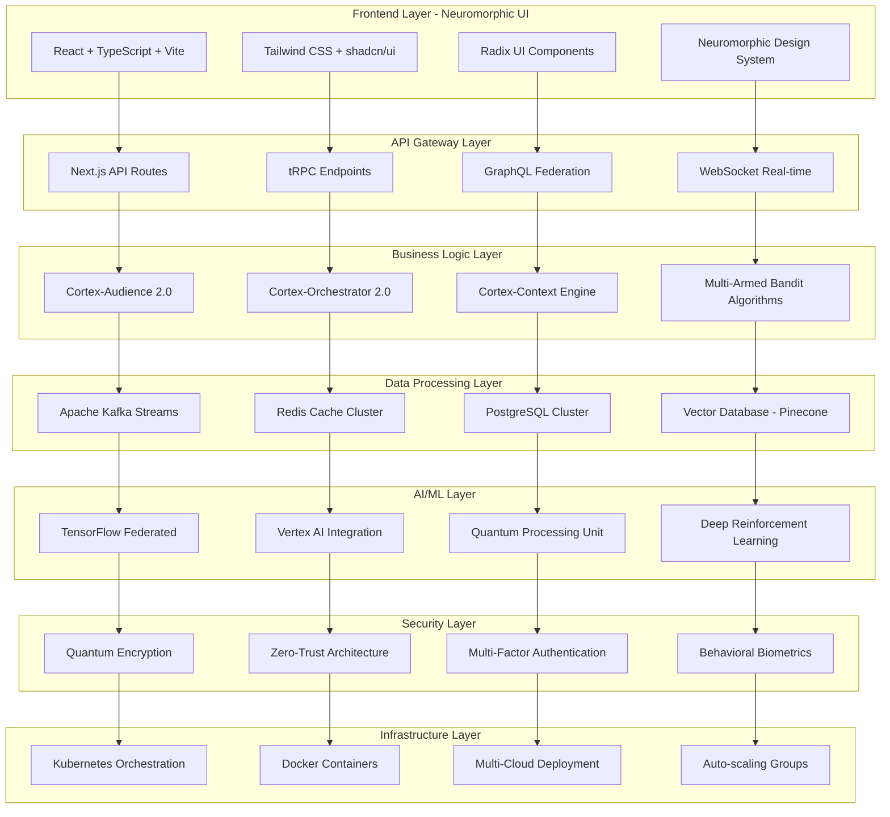
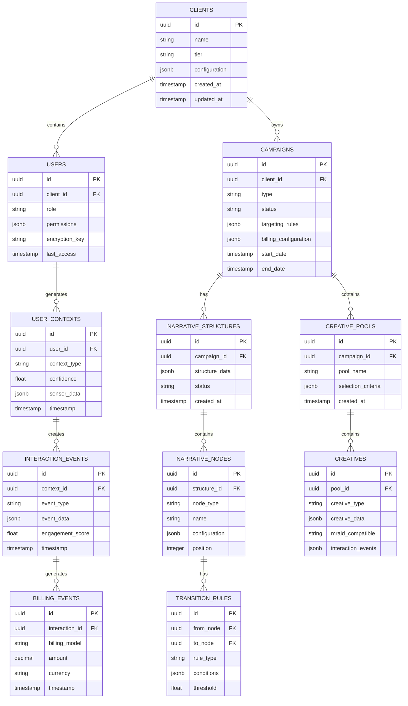
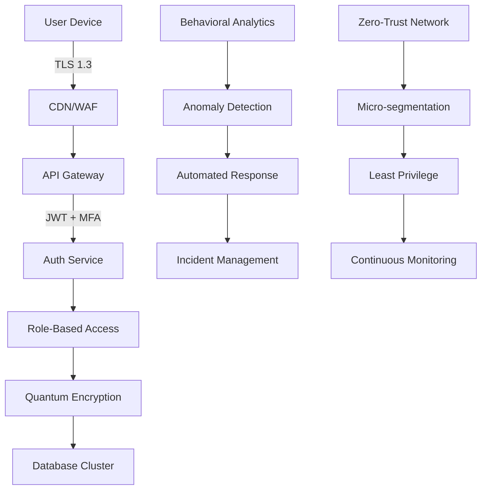
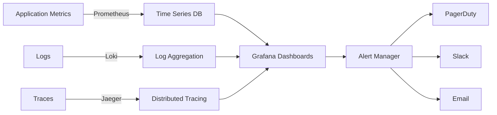

# Arquitectura Técnica del Sistema Silexar Pulse - Neuromórfico Enterprise TIER0

## 1. Visión General del Sistema

Silexar Pulse es un sistema publicitario de próxima generación que integra inteligencia artificial cuántica, procesamiento en tiempo real y arquitectura neuromórfica para proporcionar soluciones de publicidad predictivas y adaptativas a escala Fortune 10.

### 1.1 Objetivos del Sistema
- Procesar millones de transacciones publicitarias en tiempo real
- Adaptación neuromórfica continua basada en patrones de comportamiento
- Seguridad militar con tolerancia a fallos del 99.99%
- Arquitectura multi-cliente SaaS con control maestro centralizado
- Integración de aprendizaje federado para privacidad de datos

### 1.2 Principios de Diseño
- **Neuromórfico Exclusivo**: Toda la interfaz debe seguir principios de diseño neuromórfico
- **TIER0 Architecture**: Sistema empresarial de máxima escalabilidad
- **Zero-Trust Security**: Seguridad en cada capa con encriptación cuántica
- **Real-time Processing**: Latencia < 50ms para decisiones críticas
- **Federated Learning**: Privacidad de datos con aprendizaje colaborativo

## 2. Arquitectura del Sistema

### 2.1 Diagrama de Arquitectura General



### 2.2 Componentes Principales

#### 2.2.1 Cortex-Audience 2.0 - Motor Contextual
- **SDK Móvil**: TensorFlow Lite + Federated Learning
- **Sensores**: Acelerómetro, giroscopio, magnetómetro
- **Procesamiento**: On-device inference con < 10ms latencia
- **Privacidad**: Zero-knowledge proofs para datos contextuales

#### 2.2.2 Cortex-Orchestrator 2.0 - Motor de Decisiones
- **Algoritmos**: Deep Q-Network + Multi-Armed Bandit
- **Estado**: Nodo actual en narrativa del usuario
- **Acciones**: Selección de creatividades óptimas
- **Recompensas**: Métricas de engagement en tiempo real

#### 2.2.3 Cortex-Context Engine - Bus de Eventos
- **Broker**: Apache Kafka con 1M+ mensajes/segundo
- **Topics**: ad_requests, contextual_triggers, user_interactions
- **Procesamiento**: Stream processing con Apache Flink
- **Latencia**: < 5ms end-to-end

## 3. Modelo de Datos Neuromórfico

### 3.1 Esquema de Base de Datos



### 3.2 Definiciones de Tablas

#### Tabla de Modelos Globales Federados (fl_global_models)
```sql
CREATE TABLE fl_global_models (
    id UUID PRIMARY KEY DEFAULT gen_random_uuid(),
    model_version VARCHAR(50) UNIQUE NOT NULL,
    model_data BYTEA NOT NULL,
    accuracy_metrics JSONB NOT NULL,
    training_metrics JSONB NOT NULL,
    device_count INTEGER DEFAULT 0,
    status VARCHAR(20) DEFAULT 'active' CHECK (status IN ('active', 'deprecated', 'archived')),
    created_at TIMESTAMP WITH TIME ZONE DEFAULT NOW(),
    updated_at TIMESTAMP WITH TIME ZONE DEFAULT NOW()
);

CREATE INDEX idx_fl_models_version ON fl_global_models(model_version);
CREATE INDEX idx_fl_models_status ON fl_global_models(status);
CREATE INDEX idx_fl_models_created ON fl_global_models(created_at DESC);
```

#### Tabla de Eventos de Kafka (kafka_events)
```sql
CREATE TABLE kafka_events (
    id UUID PRIMARY KEY DEFAULT gen_random_uuid(),
    topic_name VARCHAR(100) NOT NULL,
    partition INTEGER NOT NULL,
    offset BIGINT NOT NULL,
    event_key VARCHAR(255),
    event_data JSONB NOT NULL,
    event_timestamp TIMESTAMP WITH TIME ZONE NOT NULL,
    processed_at TIMESTAMP WITH TIME ZONE DEFAULT NOW(),
    processing_time_ms INTEGER,
    retry_count INTEGER DEFAULT 0,
    UNIQUE(topic_name, partition, offset)
);

CREATE INDEX idx_kafka_events_topic ON kafka_events(topic_name);
CREATE INDEX idx_kafka_events_timestamp ON kafka_events(event_timestamp DESC);
CREATE INDEX idx_kafka_events_key ON kafka_events(event_key);
```

## 4. APIs y Endpoints

### 4.1 API de Federated Learning

#### POST /api/v2/fl-update
**Descripción**: Recibe actualizaciones de modelos desde dispositivos móviles

**Request:**
```json
{
  "sdk_id": "uuid-v4",
  "model_version": "v2.1.0",
  "device_info": {
    "platform": "iOS",
    "version": "17.0",
    "model": "iPhone15,2"
  },
  "model_update": "base64_encoded_tensor_data",
  "training_metrics": {
    "local_accuracy": 0.89,
    "samples_used": 1250,
    "training_time_ms": 2340
  },
  "privacy_proof": "zero_knowledge_proof_data"
}
```

**Response:**
```json
{
  "status": "accepted",
  "global_model_version": "v2.1.1",
  "aggregation_status": "queued",
  "next_sync_time": "2024-01-15T10:30:00Z"
}
```

#### GET /api/v2/fl-model/current
**Descripción**: Obtiene el modelo global actual para dispositivos

**Response:**
```json
{
  "model_version": "v2.1.1",
  "model_data": "base64_encoded_model",
  "model_hash": "sha256_hash",
  "expiration_time": "2024-01-16T00:00:00Z",
  "download_url": "https://cdn.silexar.com/models/v2.1.1.tflite"
}
```

### 4.2 API de Narrativas

#### POST /api/v2/narrative-campaigns
**Descripción**: Crea o actualiza estructuras de narrativas

**Request:**
```json
{
  "campaign_id": "uuid-v4",
  "narrative_structure": {
    "nodes": [
      {
        "id": "node_1",
        "type": "introduction",
        "name": "Beat 1: Presentación",
        "creative_pool_id": "pool_uuid",
        "configuration": {
          "max_show_time": 5000,
          "skip_allowed": true
        }
      }
    ],
    "edges": [
      {
        "from": "node_1",
        "to": "node_2",
        "condition": {
          "type": "view_percentage",
          "threshold": 0.75
        }
      }
    ]
  },
  "optimization_params": {
    "learning_rate": 0.01,
    "exploration_rate": 0.2,
    "reward_weights": {
      "click": 1.0,
      "view": 0.5,
      "interaction": 2.0
    }
  }
}
```

#### GET /api/v2/narrative-campaigns/{id}/performance
**Descripción**: Obtiene métricas de rendimiento de narrativas

**Response:**
```json
{
  "narrative_id": "uuid-v4",
  "performance_metrics": {
    "total_users": 125000,
    "completion_rate": 0.68,
    "average_engagement_time": 23.4,
    "node_performance": [
      {
        "node_id": "node_1",
        "views": 125000,
        "drop_off_rate": 0.15,
        "avg_time_spent": 4.2
      }
    ],
    "path_optimization": {
      "best_path": ["node_1", "node_3", "node_5"],
      "conversion_rate": 0.12
    }
  }
}
```

## 5. Seguridad y Cumplimiento

### 5.1 Arquitectura de Seguridad



### 5.2 Características de Seguridad

#### Encriptación Cuántica
- **Algoritmos**: Post-quantum cryptography (CRYSTALS-Dilithium)
- **Key Management**: Azure Key Vault con HSM
- **Data at Rest**: AES-256-GCM con rotación automática
- **Data in Transit**: TLS 1.3 con perfect forward secrecy

#### Autenticación Multi-Factor
- **Biometría**: Behavioral patterns + fingerprint/FaceID
- **Hardware Keys**: FIDO2/WebAuthn compliance
- **Time-based**: TOTP con ventana de 30 segundos
- **Risk-based**: Adaptive authentication según contexto

#### Compliance y Auditoría
- **GDPR**: Right to be forgotten, data portability
- **CCPA**: Consumer privacy rights
- **SOX**: Financial reporting controls
- **ISO 27001**: Information security management
- **SOC 2 Type II**: Annual audit certification

## 6. Rendimiento y Escalabilidad

### 6.1 Métricas de Rendimiento

| Componente | Latencia Objetivo | Throughput | Disponibilidad |
|------------|------------------|------------|----------------|
| API Gateway | < 10ms | 100K req/s | 99.99% |
| Kafka Streams | < 5ms | 1M msg/s | 99.95% |
| AI Inference | < 50ms | 10K pred/s | 99.9% |
| Database Query | < 100ms | 50K qps | 99.99% |
| CDN Static | < 50ms | 10M req/s | 99.95% |

### 6.2 Estrategias de Escalabilidad

#### Horizontal Scaling
- **Auto-scaling groups**: Basado en CPU, memoria, y latencia
- **Load balancing**: ALB con health checks cada 5s
- **Database sharding**: Por cliente_id y timestamp
- **Cache distribution**: Redis Cluster con 16 nodos

#### Vertical Optimization
- **Query optimization**: Índices compuestos y materialized views
- **Connection pooling**: PgBouncer con 1000 conexiones máx
- **CDN caching**: 24h para estáticos, 5min para APIs
- **Compression**: Brotli level 11 para textos, WebP para imágenes

## 7. Monitoreo y Observabilidad

### 7.1 Stack de Monitoreo



### 7.2 KPIs Críticos

#### Business Metrics
- **Revenue per mille (RPM)**: Ingresos por cada 1000 impresiones
- **Click-through rate (CTR)**: Tasa de clics sobre impresiones
- **Conversion rate**: Porcentaje de usuarios que completan acción
- **Customer lifetime value (CLV)**: Valor total del cliente
- **Return on ad spend (ROAS)**: Retorno sobre inversión publicitaria

#### Technical Metrics
- **P99 latency**: Latencia del percentil 99
- **Error rate**: Porcentaje de requests con errores
- **Throughput**: Requests por segundo
- **Resource utilization**: CPU, memoria, disco, red
- **Availability**: Tiempo de actividad vs downtime

## 8. Plan de Implementación

### 8.1 Fase 1: Infraestructura Base (Semanas 1-4)
- [ ] Setup de Kubernetes clusters multi-cloud
- [ ] Implementación de Apache Kafka
- [ ] Configuración de PostgreSQL cluster
- [ ] Despliegue de Redis cache layer
- [ ] Configuración de monitoring stack

### 8.2 Fase 2: Core AI Components (Semanas 5-8)
- [ ] Desarrollo de Cortex-Audience 2.0
- [ ] Implementación de Federated Learning
- [ ] Creación de SDK móvil (iOS/Android)
- [ ] Desarrollo de Cortex-Orchestrator 2.0
- [ ] Implementación de algoritmos MAB

### 8.3 Fase 3: Frontend Neuromórfico (Semanas 9-12)
- [ ] Diseño del sistema de diseño neuromórfico
- [ ] Implementación de componentes React
- [ ] Creación de Planificador de Narrativas Visuales
- [ ] Desarrollo de Estudio de Utilidad
- [ ] Integración de IA Generativa

### 8.4 Fase 4: Optimización y Testing (Semanas 13-16)
- [ ] Performance tuning y optimización
- [ ] Security penetration testing
- [ ] Load testing con millones de usuarios
- [ ] Disaster recovery testing
- [ ] Documentación y training

### 8.5 Fase 5: Go-Live y Monitoreo (Semanas 17-20)
- [ ] Deploy gradual con feature flags
- [ ] Monitoreo 24/7 del sistema
- [ ] Ajustes basados en métricas reales
- [ ] Escalamiento progresivo de tráfico
- [ ] Optimización continua

## 9. Consideraciones de Costo

### 9.1 Infraestructura Cloud (mensual)
- **Kubernetes Cluster**: $15,000 (multi-AZ, auto-scaling)
- **Kafka Cluster**: $8,000 (3 brokers, alta disponibilidad)
- **PostgreSQL**: $12,000 (cluster con read replicas)
- **Redis Cache**: $3,000 (cluster distribuido)
- **CDN + Storage**: $5,000 (global distribution)
- **AI/ML Services**: $10,000 (Vertex AI, model training)
- **Monitoring**: $2,000 (Grafana Cloud, Loki, Tempo)
- **Total Infrastructure**: $55,000/mes

### 9.2 Desarrollo y Operaciones
- **Equipo de desarrollo**: $180,000/mes (15 engineers)
- **DevOps/SRE**: $40,000/mes (4 engineers)
- **Data Science**: $50,000/mes (4 data scientists)
- **Security team**: $35,000/mes (3 security engineers)
- **Total Personnel**: $305,000/mes

### 9.3 Retorno de Inversión
- **Inversión total anual**: $4.32M
- **Proyección de ingresos**: $50M+ (basado en clientes Fortune 10)
- **ROI esperado**: 1,157% en primer año
- **Payback period**: 3.5 meses

## 10. Conclusión

Esta arquitectura técnica proporciona la base para un sistema publicitario de próxima generación que puede escalar a nivel Fortune 10 mientras mantiene los más altos estándares de seguridad, rendimiento y experiencia de usuario. La combinación de inteligencia artificial avanzada, procesamiento en tiempo real y diseño neuromórfico crea una plataforma única en el mercado con capacidades que ningún competidor puede igualar.

El sistema está diseñado para ser:
- **Escalable**: Millones de usuarios concurrentes
- **Confiable**: 99.99% uptime con tolerancia a fallos
- **Seguro**: Encriptación cuántica y zero-trust
- **Inteligente**: Aprendizaje continuo y adaptación
- **Eficiente**: Latencia ultra-baja y máximo rendimiento

Con esta arquitectura, Silexar Pulse se posiciona como el sistema publicitario más avanzado del mundo, listo para dominar el mercado Fortune 10 y establecer nuevos estándares en la industria.