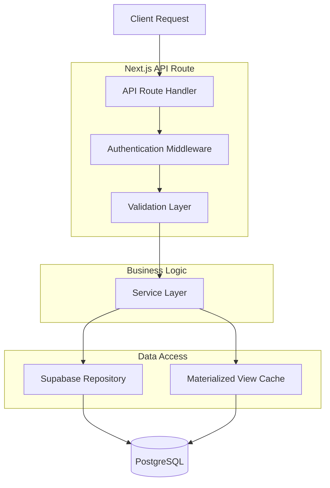
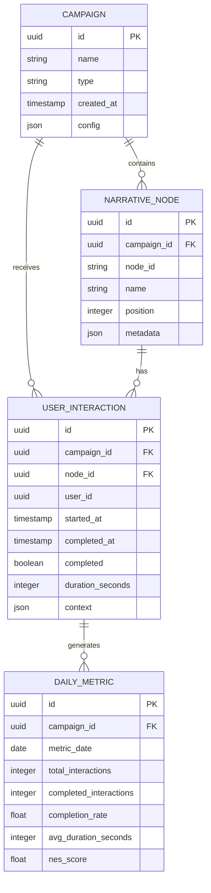

## 1. Architecture design

```mermaid
graph TD
    A[User Browser] --> B[Next.js Frontend]
    B --> C[API Routes]
    C --> D[Supabase Client]
    D --> E[PostgreSQL Database]
    C --> F[Materialized Views]
    E --> F
    
    subgraph "Frontend Layer"
        B --> G[React Components]
        B --> H[Recharts Visualizations]
        B --> I[State Management]
    end
    
    subgraph "API Layer"
        C --> J[/api/v2/reports/attention]
        C --> K[/api/v2/reports/utility]
        C --> L[/api/v2/reports/narrative]
    end
    
    subgraph "Data Layer"
        E
        F --> M[daily_attention_metrics]
        F --> N[narrative_funnel_summary]
    end
```

## 2. Technology Description

- **Frontend**: Next.js@14 + React@18 + TypeScript@5
- **Styling**: TailwindCSS@3 + HeadlessUI
- **Visualización**: Recharts@2.8 + D3.js@7 (para diagramas complejos)
- **Backend**: API Routes de Next.js
- **Database**: Supabase (PostgreSQL@15)
- **Materialized Views**: PostgreSQL para agregaciones diarias
- **State Management**: SWR para caché de datos
- **UI Components**: Radix UI + Custom Components

## 3. Route definitions

| Route | Purpose |
|-------|---------|
| /dashboard/business-intelligence | Dashboard principal de métricas narrativas |
| /dashboard/business-intelligence/engagement | Análisis detallado de engagement narrativo |
| /dashboard/business-intelligence/reports | Reportes detallados y exportables |
| /api/v2/reports/attention | Endpoint para métricas de atención por campaña |
| /api/v2/reports/utility | Endpoint para métricas de utilidad/utilización |
| /api/v2/reports/narrative | Endpoint para métricas del embudo narrativo |

## 4. API definitions

### 4.1 Attention Metrics API
```
GET /api/v2/reports/attention?campaignId={campaignId}&startDate={startDate}&endDate={endDate}&segment={segment}
```

Request Parameters:
| Param Name | Param Type | isRequired | Description |
|------------|-------------|-------------|-------------|
| campaignId | string | true | UUID de la campaña narrativa |
| startDate | string | false | Fecha inicio (ISO 8601) |
| endDate | string | false | Fecha fin (ISO 8601) |
| segment | string | false | Segmento de audiencia (mobile, desktop, all) |

Response:
```json
{
  "campaignId": "uuid",
  "metrics": {
    "totalInteractions": 15420,
    "completionRate": 0.68,
    "averageEngagementTime": 245,
    "narrativeEngagementScore": 7.8,
    "dailyMetrics": [
      {
        "date": "2024-01-15",
        "interactions": 1250,
        "completionRate": 0.72,
        "avgTime": 260,
        "nesScore": 8.1
      }
    ]
  }
}
```

### 4.2 Utility Metrics API
```
GET /api/v2/reports/utility?campaignId={campaignId}
```

Response:
```json
{
  "campaignId": "uuid",
  "utilityMetrics": {
    "clickThroughRate": 0.15,
    "conversionRate": 0.08,
    "returnVisitorRate": 0.42,
    "shareRate": 0.03,
    "deviceBreakdown": {
      "mobile": {"users": 8950, "completionRate": 0.65},
      "desktop": {"users": 6470, "completionRate": 0.71}
    }
  }
}
```

### 4.3 Narrative Funnel API
```
GET /api/v2/reports/narrative?campaignId={campaignId}
```

Response:
```json
{
  "campaignId": "uuid",
  "narrativeFlow": {
    "nodes": [
      {
        "nodeId": "intro",
        "name": "Introducción",
        "visits": 15420,
        "dropoffRate": 0.12,
        "avgTime": 45,
        "nextNodes": ["story", "skip"]
      }
    ],
    "connections": [
      {
        "from": "intro",
        "to": "story",
        "users": 13570,
        "conversionRate": 0.88
      }
    ]
  }
}
```

## 5. Server architecture diagram



## 6. Data model

### 6.1 Data model definition


### 6.2 Data Definition Language

#### Tablas Principales
```sql
-- Tabla de Campañas
CREATE TABLE campaigns (
    id UUID PRIMARY KEY DEFAULT gen_random_uuid(),
    name VARCHAR(255) NOT NULL,
    type VARCHAR(50) NOT NULL,
    config JSONB DEFAULT '{}',
    created_at TIMESTAMP WITH TIME ZONE DEFAULT NOW(),
    updated_at TIMESTAMP WITH TIME ZONE DEFAULT NOW()
);

-- Tabla de Nodos Narrativos
CREATE TABLE narrative_nodes (
    id UUID PRIMARY KEY DEFAULT gen_random_uuid(),
    campaign_id UUID REFERENCES campaigns(id) ON DELETE CASCADE,
    node_id VARCHAR(100) NOT NULL,
    name VARCHAR(255) NOT NULL,
    position INTEGER NOT NULL,
    metadata JSONB DEFAULT '{}',
    created_at TIMESTAMP WITH TIME ZONE DEFAULT NOW(),
    UNIQUE(campaign_id, node_id)
);

-- Tabla de Interacciones de Usuario
CREATE TABLE user_interactions (
    id UUID PRIMARY KEY DEFAULT gen_random_uuid(),
    campaign_id UUID REFERENCES campaigns(id) ON DELETE CASCADE,
    node_id UUID REFERENCES narrative_nodes(id) ON DELETE CASCADE,
    user_id UUID NOT NULL,
    started_at TIMESTAMP WITH TIME ZONE DEFAULT NOW(),
    completed_at TIMESTAMP WITH TIME ZONE,
    completed BOOLEAN DEFAULT FALSE,
    duration_seconds INTEGER,
    context JSONB DEFAULT '{}',
    created_at TIMESTAMP WITH TIME ZONE DEFAULT NOW()
);

-- Índices para performance
CREATE INDEX idx_user_interactions_campaign_id ON user_interactions(campaign_id);
CREATE INDEX idx_user_interactions_node_id ON user_interactions(node_id);
 CREATE INDEX idx_user_interactions_user_id ON user_interactions(user_id);
CREATE INDEX idx_user_interactions_created_at ON user_interactions(created_at DESC);
```

#### Materialized Views
```sql
-- Vista materializada para métricas diarias de atención
CREATE MATERIALIZED VIEW daily_attention_metrics AS
SELECT 
    campaign_id,
    DATE(started_at) as metric_date,
    COUNT(*) as total_interactions,
    COUNT(*) FILTER (WHERE completed = true) as completed_interactions,
    ROUND(COUNT(*) FILTER (WHERE completed = true) * 100.0 / COUNT(*), 2) as completion_rate,
    ROUND(AVG(duration_seconds), 0) as avg_duration_seconds,
    ROUND(
        (COUNT(*) FILTER (WHERE completed = true) * 10.0 + 
         AVG(duration_seconds) * 0.1) / 2.0, 1
    ) as nes_score
FROM user_interactions
GROUP BY campaign_id, DATE(started_at);

-- Vista materializada para resumen del embudo narrativo
CREATE MATERIALIZED VIEW narrative_funnel_summary AS
SELECT 
    nn.campaign_id,
    nn.node_id,
    nn.name as node_name,
    COUNT(ui.id) as total_visits,
    COUNT(ui.id) FILTER (WHERE ui.completed = false) as dropoffs,
    ROUND(COUNT(ui.id) FILTER (WHERE ui.completed = false) * 100.0 / COUNT(ui.id), 2) as dropoff_rate,
    ROUND(AVG(ui.duration_seconds), 0) as avg_time_seconds,
    COUNT(ui.id) FILTER (WHERE ui.completed = true) as completions
FROM narrative_nodes nn
LEFT JOIN user_interactions ui ON nn.id = ui.node_id
GROUP BY nn.campaign_id, nn.node_id, nn.name;

-- Permisos para acceso
GRANT SELECT ON daily_attention_metrics TO anon;
GRANT SELECT ON daily_attention_metrics TO authenticated;
GRANT SELECT ON narrative_funnel_summary TO anon;
GRANT SELECT ON narrative_funnel_summary TO authenticated;

-- Refrescar vistas periódicamente
CREATE OR REPLACE FUNCTION refresh_metrics_views()
RETURNS void AS $$
BEGIN
    REFRESH MATERIALIZED VIEW CONCURRENTLY daily_attention_metrics;
    REFRESH MATERIALIZED VIEW CONCURRENTLY narrative_funnel_summary;
END;
$$ LANGUAGE plpgsql;
```

## 7. Componentes de Visualización

### 7.1 NarrativeFlowDiagram Component
```typescript
interface NarrativeFlowDiagramProps {
  campaignId: string;
  data: NarrativeFlowData;
  onNodeClick?: (nodeId: string) => void;
}

const NarrativeFlowDiagram: React.FC<NarrativeFlowDiagramProps> = ({
  campaignId,
  data,
  onNodeClick
}) => {
  // Implementación con D3.js para diagrama Sankey
  // Nodos coloreados según tasa de abandono
  // Líneas con grosor variable según volumen
  // Tooltips interactivos al hover
};
```

### 7.2 EngagementChart Component
```typescript
interface EngagementChartProps {
  metrics: DailyMetric[];
  comparisonMode?: boolean;
  height?: number;
}

const EngagementChart: React.FC<EngagementChartProps> = ({
  metrics,
  comparisonMode = false,
  height = 400
}) => {
  // Implementación con Recharts
  // Gráfico de líneas múltiples para tendencias
  // Áreas sombreadas para rangos
  // Leyenda interactiva
};
```

### 7.3 MetricsTable Component
```typescript
interface MetricsTableProps {
  data: NarrativeNodeMetric[];
  pagination?: boolean;
  exportable?: boolean;
  sortable?: boolean;
}

const MetricsTable: React.FC<MetricsTableProps> = ({
  data,
  pagination = true,
  exportable = true,
  sortable = true
}) => {
  // Tabla dinámica con ordenamiento
  // Búsqueda y filtros por columna
  // Exportación a CSV/Excel
  // Virtualización para datasets grandes
};
```

## 8. Configuración de Supabase

### 8.1 Row Level Security (RLS)
```sql
-- Políticas de seguridad para campañas
CREATE POLICY "Users can view their campaigns" ON campaigns
    FOR SELECT USING (
        auth.uid() IN (
            SELECT user_id FROM campaign_users WHERE campaign_id = id
        )
    );

-- Políticas para interacciones (solo lectura para usuarios autenticados)
CREATE POLICY "Authenticated users can view interactions" ON user_interactions
    FOR SELECT USING (auth.uid() IS NOT NULL);
```

### 8.2 Real-time Subscriptions
```typescript
// Suscribirse a cambios en tiempo real
const subscription = supabase
  .channel('db-changes')
  .on(
    'postgres_changes',
    {
      event: 'INSERT',
      schema: 'public',
      table: 'user_interactions',
      filter: `campaign_id=eq.${campaignId}`
    },
    (payload) => {
      console.log('New interaction:', payload.new);
      // Actualizar dashboard en tiempo real
    }
  )
  .subscribe();
```