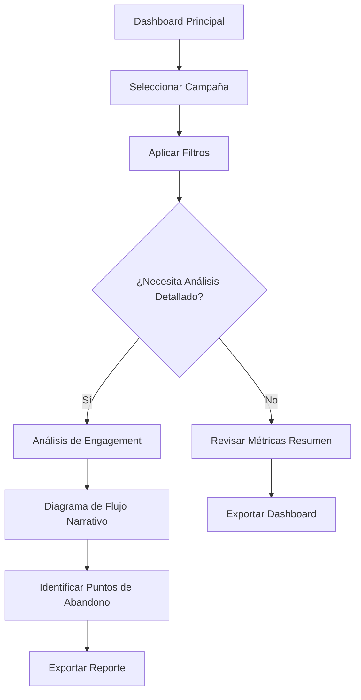

## 1. Product Overview
Módulo 12 - Inteligencia de Negocios y Dashboards de Métricas Narrativas: Sistema de análisis y visualización de datos para campañas narrativas interactivas. Permite a gerentes comerciales analizar el rendimiento de campañas, identificar puntos de abandono y optimizar la experiencia narrativa.

El producto resuelve la necesidad de visualizar métricas clave de engagement narrativo, proporcionando insights accionables para mejorar la efectividad de las campañas de marketing interactivo.

## 2. Core Features

### 2.1 User Roles
| Role | Registration Method | Core Permissions |
|------|---------------------|------------------|
| Gerente Comercial | Login empresarial | Acceso completo a dashboards, filtros avanzados, exportación de reportes |
| Analista de Datos | Asignación por gerente | Visualización de métricas, creación de reportes personalizados |
| Ejecutivo de Cuenta | Login cliente | Vista limitada a métricas de sus campañas asignadas |

### 2.2 Feature Module
El módulo de inteligencia de negocios consiste en las siguientes páginas principales:
1. **Dashboard Principal**: Vista general de métricas de campañas, filtros por fecha y campaña, widgets de resumen.
2. **Análisis de Engagement**: Diagrama de flujo narrativo interactivo, visualización de progresión de usuarios, métricas de abandono por nodo.
3. **Reportes Detallados**: Tablas dinámicas con métricas NES (Narrative Engagement Score), exportación de datos, gráficos comparativos.

### 2.3 Page Details
| Page Name | Module Name | Feature description |
|-----------|-------------|---------------------|
| Dashboard Principal | Filtros Superiores | Seleccionar campaña, rango de fechas, segmento de audiencia. Actualización en tiempo real de widgets. |
| Dashboard Principal | Widgets de Resumen | Cards mostrando: Total de interacciones, tasa de completitud, tiempo promedio de engagement, NES score promedio. |
| Dashboard Principal | Gráfico de Tendencias | Línea temporal con evolución de métricas clave. Permite comparar múltiples campañas. Interactivo con hover details. |
| Análisis de Engagement | Diagrama de Flujo Narrativo | Visualización tipo Sankey mostrando flujo de usuarios entre nodos. Grosor de líneas proporcional a volumen. Colores indican tasas de abandono. |
| Análisis de Engagement | Tabla de Nodos | Lista detallada de cada nodo con métricas: visitas, abandono, tiempo promedio, siguiente nodo más frecuente. |
| Análisis de Engagement | Embudo de Progresión | Gráfico de embudo mostrando conversión por etapas del viaje narrativo. Incluye tasas de drop-off y tiempo promedio por etapa. |
| Reportes Detallados | Tabla Dinámica | DataTable con métricas NES por campaña, segmentación por dispositivo, ubicación, hora. Ordenamiento y búsqueda avanzada. |
| Reportes Detallados | Gráficos Comparativos | Barras apiladas comparando métricas entre campañas. Heatmap de engagement por hora del día. Exportación en PDF/Excel. |

## 3. Core Process

### Flujo del Gerente Comercial
1. Accede al dashboard principal y selecciona la campaña a analizar
2. Aplica filtros de fecha y segmentación según necesidad
3. Revisa métricas de resumen para identificar tendencias generales
4. Navega al análisis de engagement para ver el flujo narrativo detallado
5. Identifica nodos con alta tasa de abandono (coloreados en rojo)
6. Exporta reportes personalizados para presentaciones ejecutivas

### Flujo del Analista de Datos
1. Accede a reportes detallados con permisos de datos completos
2. Crea visualizaciones personalizadas con múltiples dimensiones
3. Genera hipótesis sobre comportamiento de usuarios
4. Exporta datos crudos para análisis estadístico avanzado

## 4. User Interface Design

### 4.1 Design Style
- **Colores Primarios**: Azul profesional (#1E40AF) para elementos principales, verde (#059669) para métricas positivas, rojo (#DC2626) para alertas de abandono
- **Colores Secundarios**: Grises neutros (#6B7280, #9CA3AF) para textos y bordes, fondo claro (#F9FAFB)
- **Estilo de Botones**: Rounded corners (8px), hover states con elevación sutil, iconos de Material Design
- **Tipografía**: Inter para headers (semibold), Roboto para body text. Tamaños: 14px base, 16px para headers, 12px para labels
- **Layout**: Card-based design con sombras sutiles, grid de 12 columnas, espaciado consistente de 16px
- **Iconos**: Material Design Icons para consistencia, tamaños estándar 16px, 20px, 24px

### 4.2 Page Design Overview
| Page Name | Module Name | UI Elements |
|-----------|-------------|-------------|
| Dashboard Principal | Filtros Superiores | Barra horizontal con selects de campaña (ancho 300px), date picker rango, dropdown segmentación. Fondo blanco con borde inferior gris. |
| Dashboard Principal | Widgets de Resumen | Grid de 4 cards responsivas (3 columnas desktop, 2 tablet, 1 móvil). Cards con iconos grandes (48px), números prominentes (32px bold), trend indicators con flechas. |
| Dashboard Principal | Gráfico de Tendencias | Container de altura fija 400px, líneas suaves con área fill, tooltip interactivo al hover, leyenda clickable para toggle series. |
| Análisis de Engagement | Diagrama de Flujo Narrativo | Canvas SVG responsive de altura 600px, nodos circulares con tooltips, líneas curvas con grosor variable (2-8px), leyenda de colores para tasas abandono. |
| Análisis de Engagement | Tabla de Nodos | DataTable con columnas: Nodo, Visitas, Abandono %, Tiempo Promedio, Siguiente Nodo. Sortable headers, pagination de 25 filas. |
| Reportes Detallados | Tabla Dinámica | Tabla con 10+ columnas, filtros columna individuales, export buttons en header, search box global. Frozen header con scroll vertical. |

### 4.3 Responsiveness
- **Desktop-first**: Diseño optimizado para pantallas 1440px y superiores
- **Tablet adaptación**: Breakpoint en 768px, reorganización de grid y tipografías
- **Móvil optimizado**: Breakpoint en 320px, menú hamburger, cards apiladas verticalmente
- **Touch interaction**: Botones mínimo 44px para touch, swipe gestures en carruseles, pinch-to-zoom en gráficos
- **Performance**: Lazy loading de componentes pesados, virtualización de tablas largas, caché de datos en cliente