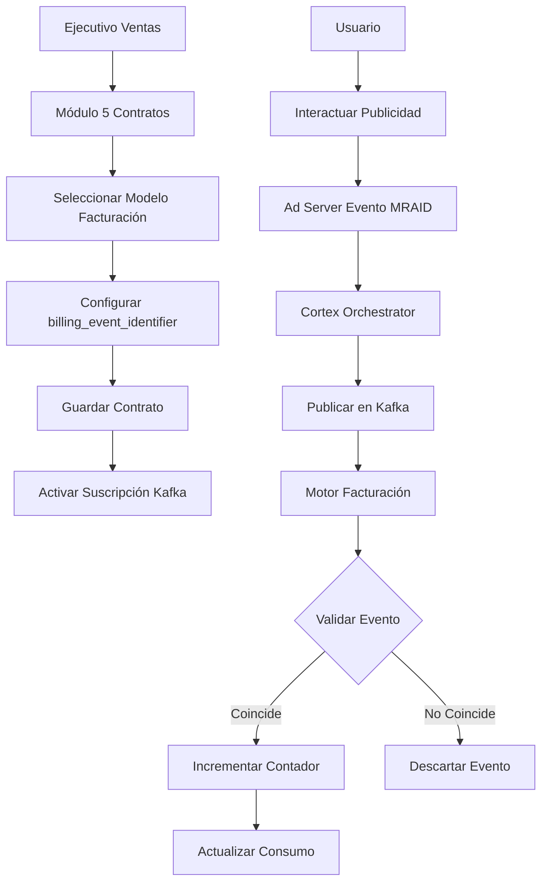

## 1. Product Overview

Módulo de Facturación Inteligente basado en valor que automatiza el proceso de facturación publicitaria mediante la suscripción a eventos de interacción y progreso narrativo. El sistema procesa eventos en tiempo real para calcular consumos según modelos de facturación CPM, CPC, CPVI y CPCN, permitiendo a los ejecutivos de ventas crear contratos con modelos de valor basados en métricas de engagement.

## 2. Core Features

### 2.1 User Roles

| Role                         | Registration Method    | Core Permissions                                            |
| ---------------------------- | ---------------------- | ----------------------------------------------------------- |
| Ejecutivo de Ventas          | Sistema interno        | Crear/editar contratos con modelos de facturación avanzados |
| Administrador de Facturación | Sistema interno        | Configurar modelos de facturación, auditar consumos         |
| Sistema Ad Server            | Integración automática | Publicar eventos MRAID para procesamiento                   |
| Cortex Orchestrator          | Integración automática | Publicar eventos de progreso narrativo                      |

### 2.2 Feature Module

El módulo de facturación inteligente consiste en las siguientes páginas principales:

1. **Panel de Facturación**: Dashboard con métricas de consumo por contrato y modelo de facturación
2. **Configuración de Modelos**: Interfaz para definir y gestionar modelos de facturación (CPM, CPC, CPVI, CPCN)
3. **Auditoría de Eventos**: Visualización de eventos procesados y contadores actualizados
4. **Reportes de Consumo**: Generación de reportes detallados por línea de contrato

### 2.3 Page Details

| Page Name                | Module Name            | Feature description                                                                                                                                       |
| ------------------------ | ---------------------- | --------------------------------------------------------------------------------------------------------------------------------------------------------- |
| Panel de Facturación     | Dashboard de Consumos  | Visualizar consumos por contrato, modelo de facturación y período. Mostrar gráficos de tendencias y alertas de límites.                                   |
| Panel de Facturación     | Filtros Avanzados      | Filtrar por cliente, modelo de facturación, rango de fechas y estado de procesamiento.                                                                    |
| Configuración de Modelos | Editor de Modelos      | Crear/editar modelos de facturación con parámetros específicos (CPM: impresiones, CPC: clicks, CPVI: interacciones válidas, CPCN: completitud narrativa). |
| Configuración de Modelos | Asignación a Contratos | Vincular modelos de facturación con líneas de contrato específicas.                                                                                       |
| Auditoría de Eventos     | Lista de Eventos       | Mostrar eventos Kafka procesados con detalles: timestamp, tipo, identificador de facturación, resultado del procesamiento.                                |
| Auditoría de Eventos     | Búsqueda y Filtrado    | Buscar eventos por identificador, tipo de evento o rango de fechas.                                                                                       |
| Reportes de Consumo      | Generador de Reportes  | Crear reportes personalizados con métricas de consumo por línea de contrato.                                                                              |
| Reportes de Consumo      | Exportación de Datos   | Exportar reportes en formatos CSV, PDF y Excel con gráficos incluidos.                                                                                    |

## 3. Core Process

### Flujo de Creación de Contrato con Modelo CPVI/CPCN:

1. Ejecutivo accede al Módulo 5 de Contratos
2. Selecciona "Nuevo Contrato" o edita existente
3. En la sección de líneas de contrato, selecciona modelo de facturación del dropdown
4. Configura el billing\_event\_identifier único para la línea
5. Establece precio y límites del modelo seleccionado
6. Guarda el contrato, activando la suscripción a eventos

### Flujo de Procesamiento de Eventos:

1. Usuario interactúa con publicidad (Ad Server detecta evento MRAID)
2. Cortex Orchestrator publica evento en Kafka topic user\_interactions
3. Motor de facturación recibe evento y valida billing\_event\_identifier
4. Si coincide, incrementa contador correspondiente en contract\_line\_items
5. Sistema genera alertas si se acercan a límites configurados

## 4. User Interface Design

### 4.1 Design Style

* **Colores Primarios**: Azul profesional (#2563EB) para elementos principales, verde (#10B981) para indicadores positivos

* **Colores Secundarios**: Gris neutro (#6B7280) para textos, rojo (#EF4444) para alertas

* **Estilo de Botones**: Bordes redondeados (8px), sombra sutil, efecto hover con transición suave

* **Tipografía**: Inter para headers (16-24px), Roboto para body (14px)

* **Layout**: Tarjetas con bordes redondeados, grid responsive de 12 columnas

* **Iconos**: Feather Icons para consistencia visual

### 4.2 Page Design Overview

| Page Name                | Module Name           | UI Elements                                                                                                                                               |
| ------------------------ | --------------------- | --------------------------------------------------------------------------------------------------------------------------------------------------------- |
| Panel de Facturación     | Dashboard de Consumos | Tarjetas KPI con métricas principales, gráfico de líneas para tendencias, tabla de consumos con sorting y paginación. Filtros en barra lateral izquierda. |
| Configuración de Modelos | Editor de Modelos     | Formulario con dropdown para tipo de modelo, campos dinámicos según selección, preview de configuración, botones de acción en footer sticky.              |
| Auditoría de Eventos     | Lista de Eventos      | Tabla con columnas: timestamp, tipo, identificador, estado, acciones. Badge de color para estados (verde=procesado, amarillo=pendiente, rojo=error).      |
| Reportes de Consumo      | Generador de Reportes | Selector de período, checklist de métricas, preview de tabla, botón de generar con ícono de descarga.                                                     |

### 4.3 Responsiveness

* Diseño mobile-first con breakpoints: 640px, 768px, 1024px, 1280px

* Sidebar colapsable en tablets y móviles

* Tablas con scroll horizontal en dispositivos pequeños

* Touch-optimized con áreas de clic mínimas de

