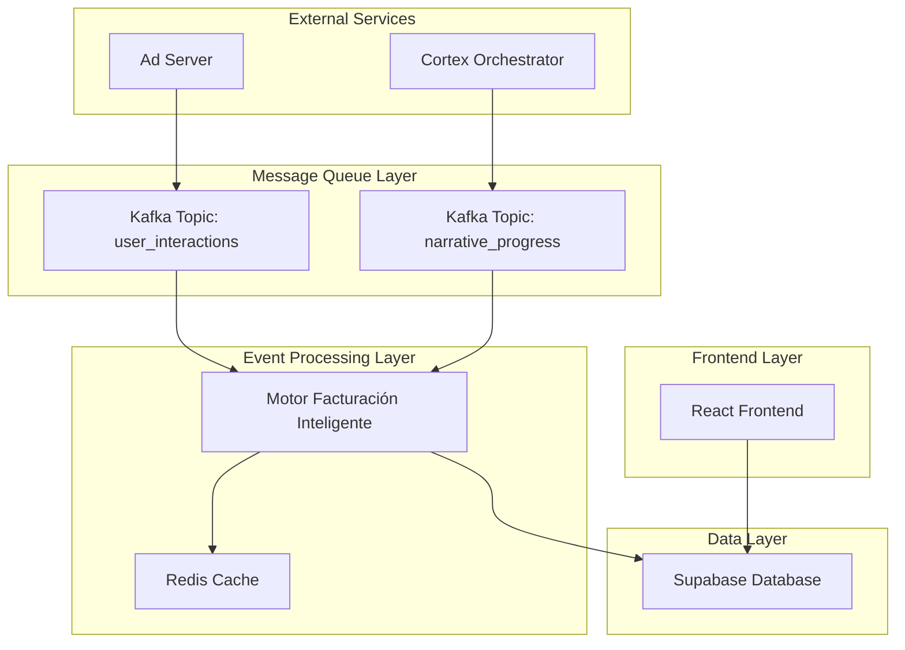
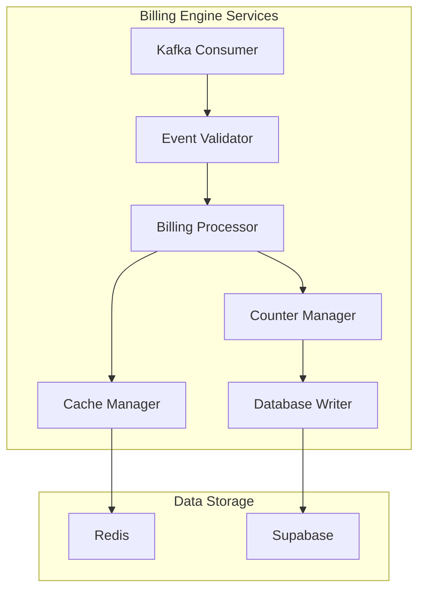
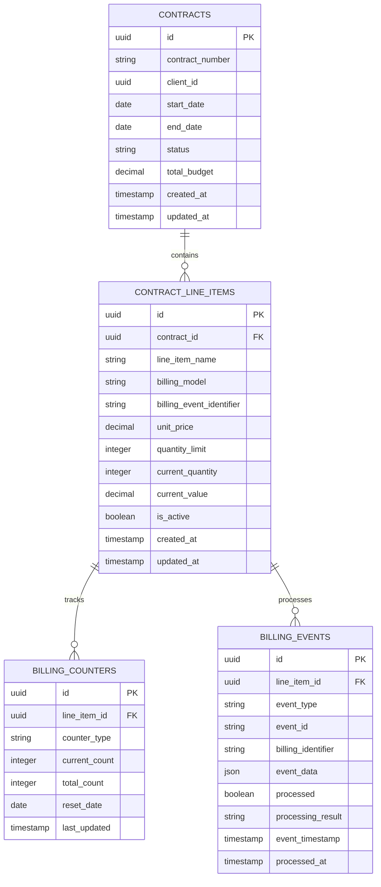

## 1. Architecture design



## 2. Technology Description
- Frontend: React@18 + tailwindcss@3 + vite
- Backend: Motor de Facturación Inteligente (Node.js@18 + Kafka Consumer)
- Database: Supabase (PostgreSQL)
- Cache: Redis@7
- Message Queue: Apache Kafka
- Event Processing: KafkaJS Client

## 3. Route definitions
| Route | Purpose |
|-------|---------|
| /billing/dashboard | Panel principal de facturación con métricas de consumo |
| /billing/models | Gestión de modelos de facturación (CPM, CPC, CPVI, CPCN) |
| /billing/audit | Auditoría de eventos procesados y contadores actualizados |
| /billing/reports | Generación de reportes de consumo por contrato |
| /contracts/:id/billing | Configuración de facturación para contrato específico |

## 4. API definitions

### 4.1 Billing Engine API

#### Event Processing Endpoint
```
POST /api/billing/process-event
```

Request:
| Param Name | Param Type | isRequired | Description |
|-----------|-------------|-------------|-------------|
| event_type | string | true | Tipo de evento: 'user_interaction' o 'narrative_progress' |
| event_data | object | true | Datos del evento con estructura específica |
| billing_identifier | string | true | Identificador único de facturación |
| timestamp | string | true | Timestamp ISO del evento |

Response:
| Param Name | Param Type | Description |
|-----------|-------------|-------------|
| processed | boolean | Estado del procesamiento |
| counter_updated | number | Valor del contador después de actualización |
| billing_model | string | Modelo de facturación aplicado |

Example Request:
```json
{
  "event_type": "user_interaction",
  "event_data": {
    "user_id": "uuid-123",
    "interaction_type": "click",
    "campaign_id": "campaign-456"
  },
  "billing_identifier": "CPVI-2024-001",
  "timestamp": "2024-11-16T10:30:00Z"
}
```

#### Contract Billing Configuration
```
PUT /api/contracts/:contractId/billing-lines/:lineId
```

Request:
| Param Name | Param Type | isRequired | Description |
|-----------|-------------|-------------|-------------|
| billing_model | string | true | Modelo: 'CPM', 'CPC', 'CPVI', 'CPCN' |
| billing_event_identifier | string | true | Identificador único para eventos |
| unit_price | number | true | Precio por unidad del modelo |
| limit_quantity | number | false | Límite máximo de unidades |

### 4.2 Kafka Consumer Configuration

#### Topic: user_interactions
```typescript
interface UserInteractionEvent {
  eventId: string;
  userId: string;
  sessionId: string;
  interactionType: 'click' | 'impression' | 'video_start' | 'video_complete';
  campaignId: string;
  creativeId: string;
  placementId: string;
  timestamp: string;
  metadata: {
    billingEventIdentifier?: string;
    mraidEvent?: boolean;
    value?: number;
  };
}
```

#### Topic: narrative_progress
```typescript
interface NarrativeProgressEvent {
  eventId: string;
  userId: string;
  sessionId: string;
  narrativeId: string;
  progressPercentage: number;
  milestone: 'start' | '25%' | '50%' | '75%' | 'complete';
  timestamp: string;
  metadata: {
    billingEventIdentifier?: string;
    completionValue?: number;
  };
}
```

## 5. Server architecture diagram



## 6. Data model

### 6.1 Data model definition



### 6.2 Data Definition Language

#### Contract Line Items Table (contract_line_items)
```sql
-- create table
CREATE TABLE contract_line_items (
    id UUID PRIMARY KEY DEFAULT gen_random_uuid(),
    contract_id UUID NOT NULL REFERENCES contracts(id) ON DELETE CASCADE,
    line_item_name VARCHAR(255) NOT NULL,
    billing_model VARCHAR(10) NOT NULL CHECK (billing_model IN ('CPM', 'CPC', 'CPVI', 'CPCN')),
    billing_event_identifier VARCHAR(100) UNIQUE NOT NULL,
    unit_price DECIMAL(10,4) NOT NULL DEFAULT 0.0000,
    quantity_limit INTEGER DEFAULT NULL,
    current_quantity INTEGER DEFAULT 0,
    current_value DECIMAL(12,4) DEFAULT 0.0000,
    is_active BOOLEAN DEFAULT true,
    created_at TIMESTAMP WITH TIME ZONE DEFAULT NOW(),
    updated_at TIMESTAMP WITH TIME ZONE DEFAULT NOW()
);

-- create indexes
CREATE INDEX idx_contract_line_items_contract_id ON contract_line_items(contract_id);
CREATE INDEX idx_contract_line_items_billing_model ON contract_line_items(billing_model);
CREATE INDEX idx_contract_line_items_billing_event_identifier ON contract_line_items(billing_event_identifier);
CREATE INDEX idx_contract_line_items_active ON contract_line_items(is_active) WHERE is_active = true;

-- grant permissions
GRANT SELECT ON contract_line_items TO anon;
GRANT ALL PRIVILEGES ON contract_line_items TO authenticated;
```

#### Billing Counters Table (billing_counters)
```sql
-- create table
CREATE TABLE billing_counters (
    id UUID PRIMARY KEY DEFAULT gen_random_uuid(),
    line_item_id UUID NOT NULL REFERENCES contract_line_items(id) ON DELETE CASCADE,
    counter_type VARCHAR(50) NOT NULL,
    current_count INTEGER DEFAULT 0,
    total_count INTEGER DEFAULT 0,
    reset_date DATE DEFAULT NULL,
    last_updated TIMESTAMP WITH TIME ZONE DEFAULT NOW()
);

-- create indexes
CREATE INDEX idx_billing_counters_line_item_id ON billing_counters(line_item_id);
CREATE INDEX idx_billing_counters_counter_type ON billing_counters(counter_type);
CREATE UNIQUE INDEX idx_billing_counters_line_item_type ON billing_counters(line_item_id, counter_type);

-- grant permissions
GRANT SELECT ON billing_counters TO anon;
GRANT ALL PRIVILEGES ON billing_counters TO authenticated;
```

#### Billing Events Table (billing_events)
```sql
-- create table
CREATE TABLE billing_events (
    id UUID PRIMARY KEY DEFAULT gen_random_uuid(),
    line_item_id UUID REFERENCES contract_line_items(id) ON DELETE SET NULL,
    event_type VARCHAR(50) NOT NULL,
    event_id VARCHAR(255) NOT NULL,
    billing_identifier VARCHAR(100) NOT NULL,
    event_data JSONB NOT NULL DEFAULT '{}',
    processed BOOLEAN DEFAULT false,
    processing_result VARCHAR(255),
    event_timestamp TIMESTAMP WITH TIME ZONE NOT NULL,
    processed_at TIMESTAMP WITH TIME ZONE,
    created_at TIMESTAMP WITH TIME ZONE DEFAULT NOW()
);

-- create indexes
CREATE INDEX idx_billing_events_line_item_id ON billing_events(line_item_id);
CREATE INDEX idx_billing_events_billing_identifier ON billing_events(billing_identifier);
CREATE INDEX idx_billing_events_processed ON billing_events(processed);
CREATE INDEX idx_billing_events_event_timestamp ON billing_events(event_timestamp);
CREATE INDEX idx_billing_events_event_type ON billing_events(event_type);

-- grant permissions
GRANT SELECT ON billing_events TO anon;
GRANT ALL PRIVILEGES ON billing_events TO authenticated;
```

#### Billing Models Enumeration
```sql
-- create type
CREATE TYPE billing_model_enum AS ENUM ('CPM', 'CPC', 'CPVI', 'CPCN');

-- add constraint to existing table if needed
ALTER TABLE contract_line_items 
ADD CONSTRAINT check_billing_model 
CHECK (billing_model::billing_model_enum IS NOT NULL);
```

### 6.3 Integration Views

#### Billing Summary View
```sql
CREATE VIEW billing_summary AS
SELECT 
    cli.id as line_item_id,
    cli.line_item_name,
    cli.billing_model,
    cli.billing_event_identifier,
    cli.unit_price,
    cli.quantity_limit,
    cli.current_quantity,
    cli.current_value,
    CASE 
        WHEN cli.quantity_limit IS NOT NULL 
        THEN ROUND((cli.current_quantity::decimal / cli.quantity_limit::decimal) * 100, 2)
        ELSE 0 
    END as completion_percentage,
    cli.is_active,
    c.contract_number,
    c.client_id,
    cli.updated_at
FROM contract_line_items cli
JOIN contracts c ON cli.contract_id = c.id;

GRANT SELECT ON billing_summary TO anon;
GRANT SELECT ON billing_summary TO authenticated;
```

## 7. Kafka Integration Configuration

### 7.1 Consumer Configuration
```javascript
const kafkaConfig = {
  clientId: 'billing-engine-client',
  brokers: ['localhost:9092'],
  connectionTimeout: 3000,
  requestTimeout: 25000,
  retry: {
    retries: 5,
    factor: 2,
    initialRetryTime: 100
  }
};

const consumerConfig = {
  groupId: 'billing-engine-group',
  sessionTimeout: 30000,
  heartbeatInterval: 3000,
  maxBytesPerPartition: 1048576,
  maxWaitTimeInMs: 5000,
  minBytes: 1,
  maxBytes: 10485760
};
```

### 7.2 Topic Subscriptions
```javascript
const topics = [
  {
    topic: 'user_interactions',
    fromBeginning: false,
    partition: 0
  },
  {
    topic: 'narrative_progress', 
    fromBeginning: false,
    partition: 0
  }
];
```

## 8. Error Handling and Monitoring

### 8.1 Error Types
- **ValidationError**: Evento con estructura inválida
- **BillingIdentifierNotFound**: Identificador de facturación no existe
- **CounterUpdateError**: Fallo al actualizar contador
- **DatabaseConnectionError**: Problemas de conexión a base de datos

### 8.2 Dead Letter Queue
```javascript
const dlqConfig = {
  topic: 'billing_events_dlq',
  maxRetryAttempts: 3,
  retryDelay: 5000
};
```

### 8.3 Metrics and Alerting
- Contador de eventos procesados por minuto
- Tasa de errores de procesamiento
- Tiempo promedio de procesamiento
- Alertas para límites de contrato cercanos