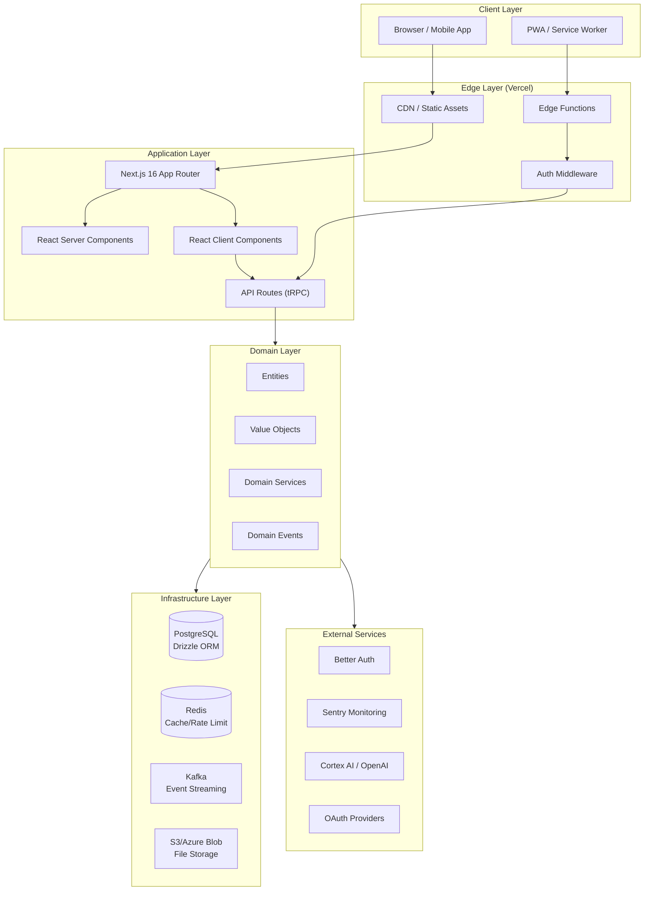
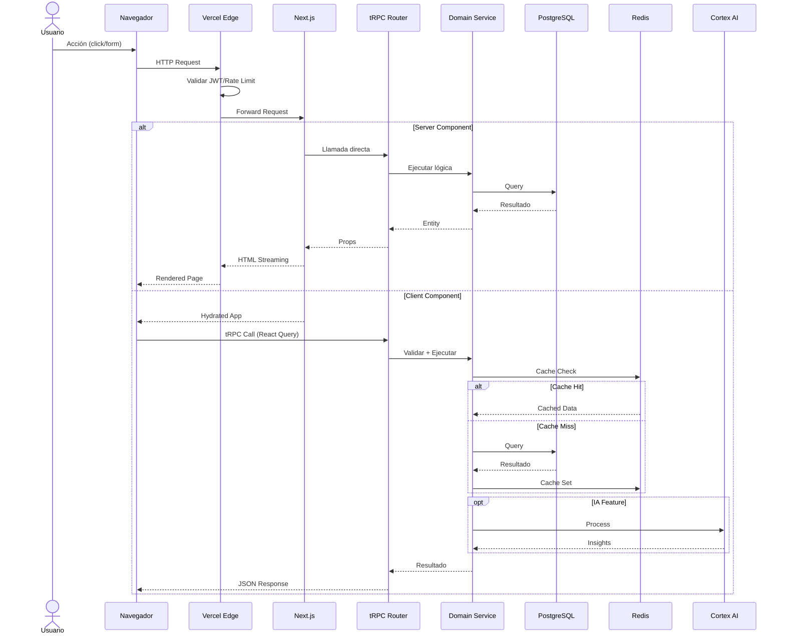
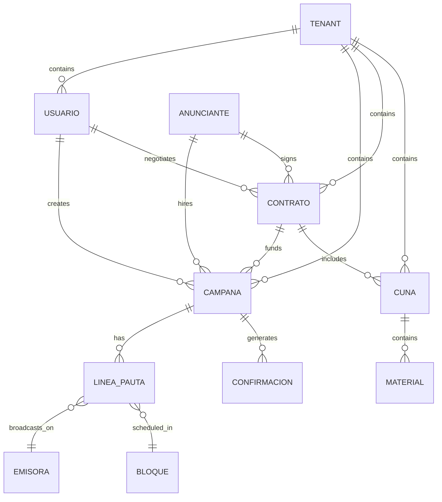
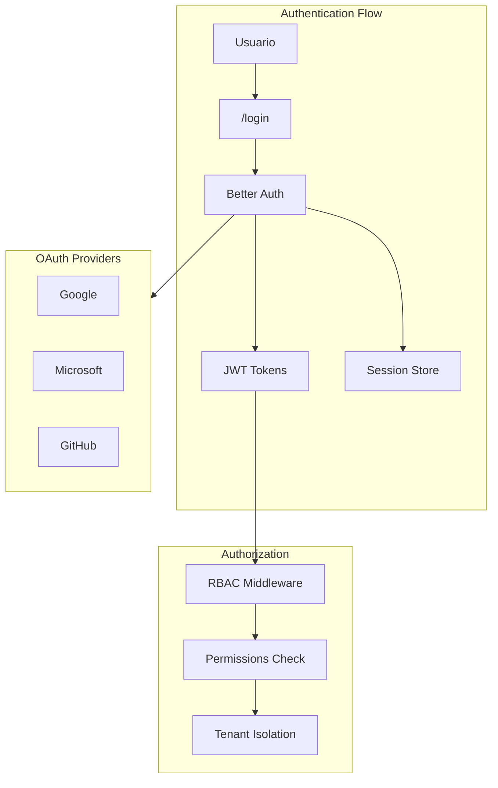
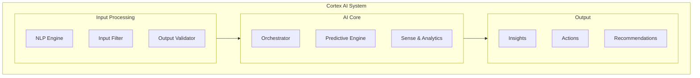
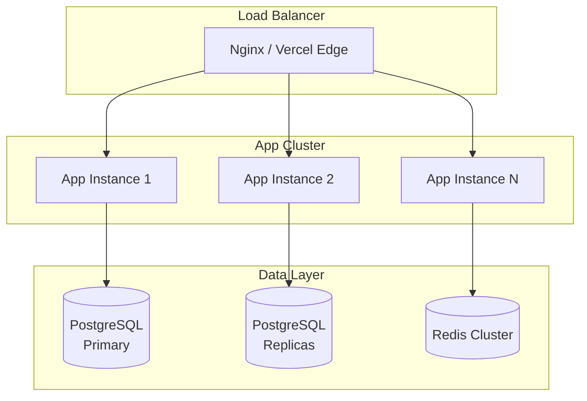
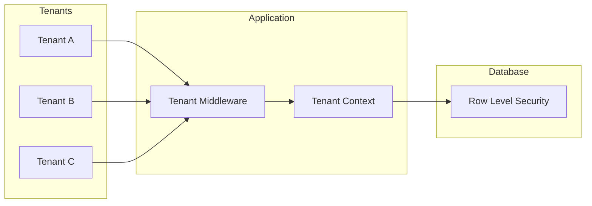
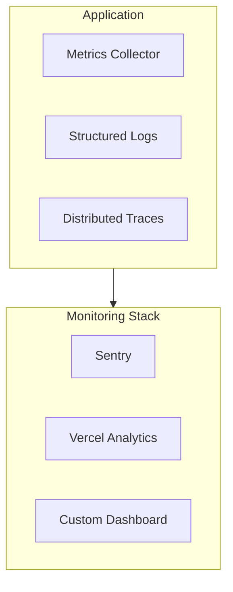
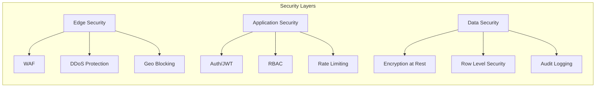

# Arquitectura de Silexar Pulse Quantum

## Visión General

Silexar Pulse Quantum sigue una arquitectura **hexagonal/layered** con principios **Domain-Driven Design (DDD)** y **Clean Architecture**. El sistema está diseñado para escalar horizontalmente y soportar múltiples tenants.

## Diagrama de Arquitectura



## Flujo de Datos



## Capas del Sistema

### 1. Presentation Layer (src/app/)

**Responsabilidades:**
- Routing y navegación
- Renderizado SSR/CSR
- Gestión de estado local
- UI/UX con Tailwind CSS

**Estructura:**
```
src/app/
├── layout.tsx          # Root layout con providers
├── page.tsx            # Home / Dashboard
├── loading.tsx         # Loading UI
├── error.tsx           # Error boundaries
├── api/                # API Routes
│   ├── auth/           # Auth endpoints
│   ├── campanas/       # Campaign endpoints
│   ├── contratos/      # Contract endpoints
│   └── trpc/           # tRPC router
├── (routes)/           # Page routes
│   ├── campanas/       # Campaign pages
│   ├── contratos/      # Contract pages
│   └── ...
```

### 2. API Layer (src/lib/trpc/)

**Responsabilidades:**
- Validación de requests (Zod)
- Rate limiting (Redis)
- Autenticación/Autorización
- Enrutamiento a domain services

**Routers:**
- `auth.router.ts` - Autenticación y sesiones
- `campaigns.router.ts` - Gestión de campañas
- `contracts.router.ts` - Gestión de contratos
- `cortex.router.ts` - IA y analytics
- `analytics.router.ts` - Reportes y métricas

### 3. Domain Layer (src/lib/modules/)

**Responsabilidades:**
- Lógica de negocio pura
- Reglas de dominio
- Validaciones complejas
- Eventos de dominio

**Módulos principales:**
- `campanas/` - Dominio de campañas
- `contratos/` - Dominio de contratos
- `cunas/` - Dominio de cuñas/spots
- `registro-emision/` - Dominio de emisiones

### 4. Infrastructure Layer (src/lib/)

**Responsabilidades:**
- Persistencia de datos
- Caching distribuido
- Comunicación con servicios externos
- Manejo de colas

**Servicios:**
- `db/` - Drizzle ORM schemas y queries
- `cache/` - Redis client y caching
- `security/` - Rate limiting, encryption
- `integrations/` - APIs externas

## Modelo de Datos



## Arquitectura de Autenticación



## Arquitectura de Cortex AI



## Decisiones Técnicas

### 1. Next.js App Router sobre Pages Router

**Decisión:** Migrar a App Router de Next.js 16

**Razones:**
- Server Components por defecto (menos JS en cliente)
- Streaming SSR para mejor TTFB
- Nested layouts más eficientes
- Mejor integración con React 19

**Trade-offs:**
- Curva de aprendizaje más pronunciada
- Algunas librerías aún no son 100% compatibles

### 2. tRPC sobre REST tradicional

**Decisión:** Usar tRPC para type-safety end-to-end

**Razones:**
- Inferencia automática de tipos
- Menor boilerplate
- Excelente DX (autocompletado)
- Subscriptions/WebSockets soportados

**Trade-offs:**
- Acoplamiento entre frontend y backend
- No es estándar HTTP puro

### 3. Drizzle ORM sobre Prisma

**Decisión:** Adoptar Drizzle ORM

**Razones:**
- Zero runtime overhead
- SQL-like API natural
- Mejor performance en queries complejas
- Más control sobre SQL generado

**Trade-offs:**
- Menos maduro que Prisma
- Menos features de migración automática

### 4. Better Auth sobre NextAuth.js

**Decisión:** Migrar a Better Auth

**Razones:**
- TypeScript first
- Plugins extensibles
- Soporte nativo multi-tenant
- RBAC integrado

**Trade-offs:**
- Más nuevo en el ecosistema
- Menos documentación comunitaria

### 5. Neumorphism Design System

**Decisión:** Implementar diseño neumórfico custom

**Razones:**
- Diferenciación visual
- Sensación táctil en UI
- Accesibilidad mantenida

**Trade-offs:**
- Más CSS custom requerido
- Testing visual más complejo

## Escalabilidad

### Horizontal Scaling



### Multi-Tenancy



## Monitoreo y Observabilidad



## Seguridad



## Stack Tecnológico Detallado

### Frontend
| Tecnología | Versión | Uso |
|------------|---------|-----|
| Next.js | 16.0.7 | Framework React |
| React | 19.2.1 | UI Library |
| TypeScript | 5.8.3 | Tipado estático |
| Tailwind CSS | 3.4.17 | Estilos |
| Framer Motion | 12.23.24 | Animaciones |
| Radix UI | 1.x | Componentes base |
| Zustand | 5.0.3 | State management |
| React Query | 5.x | Server state |

### Backend
| Tecnología | Versión | Uso |
|------------|---------|-----|
| Better Auth | 1.4.11 | Autenticación |
| tRPC | 11.7.2 | API type-safe |
| Drizzle ORM | 0.44.7 | ORM PostgreSQL |
| Zod | 4.1.13 | Validación |
| ioredis | 5.8.2 | Redis client |

### Infraestructura
| Tecnología | Uso |
|------------|-----|
| Vercel | Hosting/Edge |
| PostgreSQL | Base de datos |
| Redis | Cache/Sessions |
| Sentry | Error tracking |
| Docker | Containerización |

### Testing
| Tecnología | Uso |
|------------|-----|
| Vitest | Unit tests |
| Playwright | E2E tests |
| React Testing Library | Component tests |

## Referencias

- [Next.js Architecture](https://nextjs.org/docs/architecture)
- [tRPC Concepts](https://trpc.io/docs/concepts)
- [Drizzle ORM Docs](https://orm.drizzle.team/docs)
- [Better Auth Documentation](https://www.better-auth.com/docs)
- [Clean Architecture](https://blog.cleancoder.com/uncle-bob/2012/08/13/the-clean-architecture.html)
