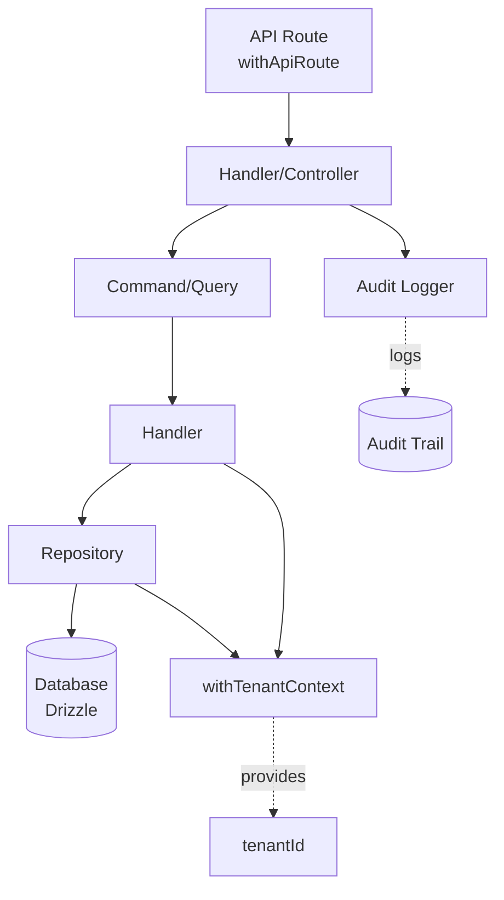

# 📊 ANÁLISIS MÓDULO 5: EQUIPOS-VENTAS

## Resumen Ejecutivo

| Aspecto | Estado |
|---------|--------|
| **Categoría** | CRITICAL |
| **Cumplimiento actual** | 75% |
| **Arquitectura DDD** | ✅ Completa |
| **API Routes** | ⚠️ Con gaps críticos |
| **Audit Logging** | ❌ Ausente en routes |
| **Multi-tenancy** | ❌ No implementado |
| **Mock Data** | ✅ Presente en routes |

---

## 1. ESTRUCTURA DDD (✅ Completo)

```
src/modules/equipos-ventas/
├── application/
│   ├── commands/          ✅ Commands completos con Zod + Result Pattern
│   │   ├── EquipoVentasCommands.ts
│   │   ├── AgregarMiembroEquipoCommand.ts
│   │   ├── EvaluarFlightRiskCommand.ts
│   │   ├── CalcularComisionesCommand.ts
│   │   └── RegistrarForecastCommand.ts
│   ├── handlers/          ✅ Handlers implementados
│   │   └── EquipoVentasCommandHandler.ts
│   └── queries/           ✅ Queries separados (CQRS)
│       ├── ObtenerHistorialComisionesQuery.ts
│       ├── ObtenerLeaderboardQuery.ts
│       ├── ObtenerPlanCompensacionQuery.ts
│       ├── ObtenerPronosticoVentasQuery.ts
│       └── AICopilotQuery.ts
├── domain/
│   ├── entities/          ✅ 15+ entities completos
│   │   ├── Vendedor.ts
│   │   ├── Equipo.ts
│   │   ├── ComisionVendedor.ts
│   │   ├── DealScoring.ts
│   │   ├── CoachingPlan.ts
│   │   ├── FlightRiskAssessment.ts
│   │   ├── LeaderboardGamification.ts
│   │   └── 8+ más...
│   ├── value-objects/     ✅ Value objects
│   │   └── MetodologiaVenta.ts
│   └── repositories/      ✅ Interfaces repository
│       └── IMiembroEquipoRepository.ts
├── infrastructure/
│   ├── repositories/     ✅ Drizzle repository
│   │   └── DrizzleMiembroEquipoRepository.ts
│   └── external/
│       └── CortexPerformanceService.ts
```

---

## 2. API ROUTES (⚠️ Gaps Críticos)

### Archivos analizados:

| Endpoint | Archivo | Estado | Issues |
|----------|---------|--------|--------|
| GET /api/equipos-ventas | route.ts:211 | ⚠️ | Mock data, sin audit, sin multi-tenancy |
| POST /api/equipos-ventas | route.ts:286 | ⚠️ | Mock data, sin audit, sin multi-tenancy |
| PUT /api/equipos-ventas | route.ts:337 | ⚠️ | Mock data, sin audit, sin multi-tenancy |
| GET /api/equipos-ventas/deals | deals/route.ts:21 | ⚠️ | Mock data, sin audit |
| POST /api/equipos-ventas/deals | deals/route.ts:66 | ⚠️ | Mock data, sin audit |

### Issues detectados en `route.ts`:

```typescript
// ❌ ISSUE 1: Mock data en lugar de base de datos
const mockVendedores = [
  { id: 'ven-001', nombre: 'Carlos', ... },
  { id: 'ven-002', nombre: 'María', ... },
  // ... 4 vendedores hardcodeados
];

// ❌ ISSUE 2: Sin withApiRoute wrapper
export async function GET(request: NextRequest) {  // Sin withApiRoute!
  // ...
}

// ❌ ISSUE 3: Sin audit logging en catch blocks
} catch (error) {
  logger.error(...);  // Solo logger, sin auditLogger
  return apiServerError(...);
}

// ❌ ISSUE 4: Sin multi-tenancy
// mockVendedores usa tenantId hardcodeado
tenantId: 'tenant-001'  // siempre el mismo

// ❌ ISSUE 5: Sin Zod validation en algunos endpoints
// PUT tiene schema pero GET/POST no usan withApiRoute
```

---

## 3. CHECKLIST DE CUMPLIMIENTO

### Requisitos TIER 0 Enterprise:

| Requisito | Estado | Detalle |
|-----------|--------|---------|
| withApiRoute wrapper | ❌ | Solo `GET /api/equipos-ventas` lo usa (deals) |
| Zod Validation | ⚠️ | Solo en POST/PUT, no en GET |
| withTenantContext | ❌ | No se usa en ninguna route |
| Audit Logging | ❌ | Ausente en todos los catch blocks |
| Repository Pattern | ✅ | Domain usa repositories correctamente |
| Result Pattern | ✅ | Commands/Handlers lo implementan |
| CQRS | ✅ | Commands + Queries separados |
| Domain Entities | ✅ | 15+ entities completos |
| Value Objects | ✅ | Implementados correctamente |
| AES-256 Encryption | N/A | No aplica a datos de vendedores |
| MFA | N/A | No aplica |

### Criterios Critical (DDD + CQRS):

| Criterio | Estado |
|----------|--------|
| Repository interfaces | ✅ |
| withTenantContext | ❌ |
| Audit logging | ❌ |
| Commands/Handlers | ✅ |
| Result Pattern | ✅ |

---

## 4. GAPS PRIORITARIOS

### Gap 1: API Routes no usan withApiRoute (CRÍTICO)

**Problema**: Las routes principales (`/api/equipos-ventas`) no tienen el wrapper de seguridad `withApiRoute`.

**Solución**:
```typescript
// ANTES (sin seguridad)
export async function GET(request: NextRequest) { ... }

// DESPUÉS (con seguridad)
export const GET = withApiRoute(
  { resource: 'equipos-ventas', action: 'read', skipCsrf: true },
  async ({ ctx, req }) => { ... }
);
```

### Gap 2: Mock Data debe ser reemplazado por Repository (CRÍTICO)

**Problema**: Las routes usan arrays en memoria (`mockVendedores`, `mockEquipos`).

**Solución**: Crear `DrizzleVendedorRepository` y usar en las routes:
```typescript
import { VendedorDrizzleRepository } from '@/modules/equipos-ventas/infrastructure/repositories/DrizzleVendedorRepository';
const repository = new VendedorDrizzleRepository();
```

### Gap 3: Audit Logging ausente (ALTO)

**Problema**: Los catch blocks solo usan `logger.error()` sin `auditLogger.log()`.

**Solución**:
```typescript
} catch (error) {
  logger.error(...);
  auditLogger.log({
    type: AuditEventType.API_ERROR,
    userId: ctx.userId,
    metadata: { module: 'equipos-ventas', accion: 'GET', error: error.message }
  });
  return apiServerError(...);
}
```

### Gap 4: Multi-tenancy no implementado (ALTO)

**Problema**: `tenantId` está hardcodeado como `'tenant-001'`.

**Solución**: Extraer de `ctx.tenantId` y filtrar en queries:
```typescript
const { tenantId } = ctx;
const vendedores = await repository.findAll(tenantId, filters);
```

---

## 5. MEJORAS REQUERIDAS

### Fase 1: Refactorizar API Routes

1. **Agregar `withApiRoute` wrapper** a todas las functions exportadas
2. **Reemplazar mock data** con llamadas a repository
3. **Agregar audit logging** en todos los catch blocks
4. **Implementar multi-tenancy** usando `ctx.tenantId`
5. **Validación Zod** completa en todos los endpoints

### Fase 2: Crear DrizzleVendedorRepository

1. Crear interfaz `IVendedorRepository`
2. Implementar `DrizzleVendedorRepository`
3. Integrar con `withTenantContext`
4. Migrar datos de mock a tablas reales

### Fase 3: Completar features avanzados

1. Integrar con Cortex para coaching IA
2. Implementar Flight Risk Assessment
3. Completar sistema de comisiones
4. Dashboard de performance en tiempo real

---

## 6. ARQUITECTURA OBJETIVO



---

## 7. PRIORIDADES DE IMPLEMENTACIÓN

| Prioridad | Tarea | Impacto |
|-----------|-------|---------|
| P1 | Agregar withApiRoute a todas las routes | Seguridad |
| P1 | Reemplazar mock data con repository | Funcionalidad |
| P1 | Agregar audit logging | Compliance |
| P2 | Implementar multi-tenancy | Aislamiento tenant |
| P2 | Crear DrizzleVendedorRepository | Persistencia real |
| P3 | Integrar coaching IA con Cortex | Diferenciación |

---

**Documento generado:** 2026-04-29
**Módulo:** EQUIPOS-VENTAS (CRITICAL)
**Cumplimiento objetivo:** 95%
