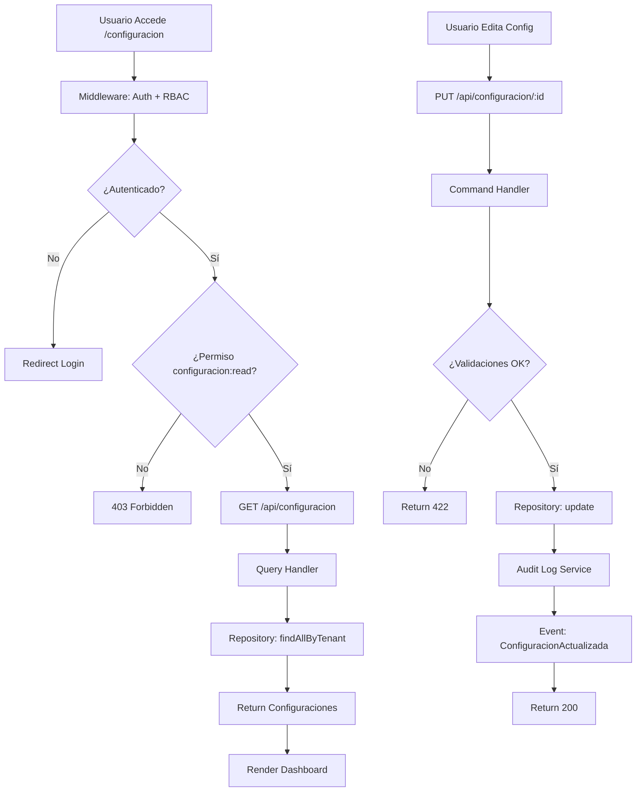

# PLAN DE IMPLEMENTACIÓN: MÓDULO CONFIGURACIÓN

## 📋 RESUMEN EJECUTIVO

| Métrica | Valor |
|---------|-------|
| Líneas de especificación | 2,706 |
| Porcentaje implementado actualmente | ~6% |
| Componentes a crear | ~85+ |
| Estimación de complejidad | ALTA |

---

## 1. ARQUITECTURA OBJETIVO

### 1.1 Estructura DDD Completa

```
src/modules/configuracion/
├── domain/
│   ├── entities/
│   │   ├── ConfiguracionGeneral.ts      ✅ Entidad principal de configuración
│   │   ├── ConfiguracionModulo.ts       ✅ Configuración por módulo
│   │   ├── ConfiguracionNotificacion.ts ✅ Configuración de notificaciones
│   │   ├── ConfiguracionSeguridad.ts    ✅ Políticas de seguridad
│   │   ├── RegistroAuditoria.ts         ✅ Log de cambios
│   │   └── ValorConfiguracion.ts       ✅ Valor individual de configuración
│   ├── value-objects/
│   │   ├── TipoConfiguracion.ts         ✅ Enum de tipos
│   │   ├── NivelSeguridad.ts           ✅ Niveles de acceso
│   │   └── ValorConfig.ts              ✅ Valor tipado
│   ├── repositories/
│   │   ├── IConfiguracionRepository.ts  ✅ Interface repositorio
│   │   └── IAuditoriaRepository.ts     ✅ Interface auditoría
│   └── events/
│       └── ConfiguracionEvents.ts       ✅ Domain events
├── application/
│   ├── commands/
│   │   ├── CrearConfiguracionCommand.ts
│   │   ├── ActualizarConfiguracionCommand.ts
│   │   ├── EliminarConfiguracionCommand.ts
│   │   ├── ImportarConfiguracionCommand.ts
│   │   └── ExportarConfiguracionCommand.ts
│   ├── handlers/
│   │   ├── ConfiguracionCommandHandler.ts
│   │   └── ConfiguracionQueryHandler.ts
│   └── queries/
│       ├── ObtenerConfiguracionQuery.ts
│       ├── BuscarConfiguracionesQuery.ts
│       └── GenerarReporteAuditoriaQuery.ts
├── infrastructure/
│   ├── repositories/
│   │   └── ConfiguracionDrizzleRepository.ts
│   ├── external/
│   │   └── AuditLogService.ts
│   └── config/
│       └── moduleConfig.ts
├── presentation/
│   ├── controllers/
│   │   └── ConfiguracionController.ts
│   └── middleware/
│       └── ConfiguracionMiddleware.ts
```

### 1.2 Database Schema

```typescript
// src/lib/db/configuracion-schema.ts
export const configuraciones = pgTable('configuraciones', {
  id: uuid('id').defaultRandom().primaryKey(),
  tenantId: uuid('tenant_id').notNull().references(() => tenants.id, ON DELETE CASCADE),
  clave: varchar('clave', { length: 255 }).notNull(),
  valor: jsonb('valor').notNull(),
  tipo: varchar('tipo', { length: 50 }).notNull(), // string, number, boolean, json
  categoria: varchar('categoria', { length: 100 }).notNull(),
  descripcion: text('descripcion'),
  editable: boolean('editable').default(true),
  visible: boolean('visible').default(true),
  createdAt: timestamp('created_at').defaultNow().notNull(),
  updatedAt: timestamp('updated_at').defaultNow().notNull(),
  updatedBy: uuid('updated_by').references(() => users.id),
});

export const configuracionesAuditoria = pgTable('configuraciones_auditoria', {
  id: uuid('id').defaultRandom().primaryKey(),
  configuracionId: uuid('configuracion_id').references(() => configuraciones.id),
  tenantId: uuid('tenant_id').notNull().references(() => tenants.id),
  usuarioId: uuid('usuario_id').notNull().references(() => users.id),
  accion: varchar('accion', { length: 50 }).notNull(), // CREATE, UPDATE, DELETE
  valorAnterior: jsonb('valor_anterior'),
  valorNuevo: jsonb('valor_nuevo'),
  ipAddress: varchar('ip_address', { length: 45 }),
  userAgent: text('user_agent'),
  createdAt: timestamp('created_at').defaultNow().notNull(),
});
```

---

## 2. COMPONENTES UI (Neumorphic Design)

### 2.1 Páginas

```
src/app/configuracion/
├── page.tsx                          ✅ Dashboard principal
├── page Client.tsx                   ✅ Componente cliente
├── componentes/
│   ├── ConfiguracionDashboard.tsx    ✅ Dashboard con métricas
│   ├── ConfiguracionCard.tsx         ✅ Tarjeta de configuración
│   ├── ConfiguracionForm.tsx         ✅ Formulario de edición
│   ├── ConfiguracionList.tsx         ✅ Lista de configuraciones
│   ├── ConfiguracionDetail.tsx       ✅ Vista detallada
│   ├── BuscadorConfiguracion.tsx      ✅ Buscador inteligente
│   ├── FiltrosConfiguracion.tsx       ✅ Panel de filtros
│   └── AuditoriaPanel.tsx            ✅ Panel de auditoría
```

### 2.2 API Routes

```
src/app/api/configuracion/
├── route.ts                          ✅ GET, POST
└── [id]/
    └── route.ts                      ✅ GET, PUT, DELETE
```

---

## 3. FUNCIONALIDADES POR IMPLEMENTAR

### 3.1 Core Features (PRIORIDAD ALTA)

| # | Funcionalidad | Descripción | Estado |
|---|---------------|-------------|--------|
| 1 | Dashboard de Configuración | Vista principal con métricas y accesos rápidos | ✅ Pendiente |
| 2 | Gestión de Configuraciones | CRUD completo de configuraciones | ✅ Pendiente |
| 3 | Sistema de Categorías | Organización por módulos (General, Notificaciones, Seguridad, etc.) | ✅ Pendiente |
| 4 | Búsqueda Inteligente | Filtrado por categoría, clave, valor, fecha | ✅ Pendiente |
| 5 | Historial de Auditoría | Registro completo de cambios con diff | ✅ Pendiente |
| 6 | Importar/Exportar | Backup y restore de configuraciones | ✅ Pendiente |
| 7 | Validación de Tipos | Validación según tipo (string, number, boolean, json) | ✅ Pendiente |
| 8 | Versionado | Control de versiones de configuraciones | ✅ Pendiente |

### 3.2 Seguridad (PRIORIDAD ALTA)

| # | Funcionalidad | Descripción | Estado |
|---|---------------|-------------|--------|
| 9 | Permisos Granulares | RBAC para cada acción | ✅ Pendiente |
| 10 | Configuraciones Protegidas | Solo lectura para configs del sistema | ✅ Pendiente |
| 11 | Log de Accesos | Registro de quién consultó qué | ✅ Pendiente |
| 12 | Validación de Valores | Reglas de validación custom | ✅ Pendiente |

### 3.3 UX Features (PRIORIDAD MEDIA)

| # | Funcionalidad | Descripción | Estado |
|---|---------------|-------------|--------|
| 13 | Vistas por Categoría | Tabs o filtros por tipo | ✅ Pendiente |
| 14 | Acciones Masivas | Seleccionar múltiples y aplicar cambios | ✅ Pendiente |
| 15 | Favoritos | Marcar configuraciones frecuentes | ✅ Pendiente |
| 16 | Historial de Búsquedas | Búsquedas recientes | ✅ Pendiente |
| 17 | Atajos de Teclado | Navegación rápida | ✅ Pendiente |

---

## 4. IMPLEMENTACIÓN PASO A PASO

### FASE 1: Estructura Base (Domain + Infrastructure)

```
Step 1.1: Crear directorio src/modules/configuracion/
Step 1.2: Crear domain/entities/ConfiguracionGeneral.ts
Step 1.3: Crear domain/value-objects/
Step 1.4: Crear domain/repositories/
Step 1.5: Crear infrastructure/repositories/
Step 1.6: Crear database schema
Step 1.7: Generar migración
Step 1.8: Crear application/commands/
Step 1.9: Crear application/handlers/
```

### FASE 2: API Routes

```
Step 2.1: Crear GET /api/configuracion
Step 2.2: Crear POST /api/configuracion
Step 2.3: Crear GET /api/configuracion/[id]
Step 2.4: Crear PUT /api/configuracion/[id]
Step 2.5: Crear DELETE /api/configuracion/[id]
Step 2.6: Crear GET /api/configuracion/auditoria
Step 2.7: Crear POST /api/configuracion/exportar
Step 2.8: Crear POST /api/configuracion/importar
```

### FASE 3: UI Components

```
Step 3.1: Crear src/app/configuracion/page.tsx
Step 3.2: Crear ConfiguracionDashboard.tsx
Step 3.3: Crear ConfiguracionList.tsx
Step 3.4: Crear ConfiguracionCard.tsx
Step 3.5: Crear ConfiguracionForm.tsx
Step 3.6: Crear BuscadorConfiguracion.tsx
Step 3.7: Crear FiltrosConfiguracion.tsx
Step 3.8: Crear AuditoriaPanel.tsx
```

### FASE 4: Testing

```
Step 4.1: Crear tests unitarios para entities
Step 4.2: Crear tests para handlers
Step 4.3: Crear tests de integración para API
Step 4.4: Verificar cobertura >= 80%
```

---

## 5. DISEÑO UI (Neumorphic)

### 5.1 Paleta de Colores

```css
/* Neumorphic del sistema */
--surface-base: #F0EDE8;
--surface-raised: #F5F2EE;
--surface-inset: #E8E5E0;
--shadow-raised: 4px 4px 10px #D4D1CC, -4px -4px 10px #FFFFFF;
--shadow-inset: inset 3px 3px 8px #D4D1CC, inset -3px -3px 8px #FFFFFF;

/* Acentos para configuraciones */
--config-category-general: #1D5AE8;
--config-category-notifications: #EF9F27;
--config-category-security: #A32D2D;
--config-category-integrations: #534AB7;
--config-category-ai: #7C3AED;
```

### 5.2 Tipografía

```css
/* Headings */
font-family: 'Inter', system-ui, sans-serif;
font-weight: 600;

/* Body */
font-family: 'Inter', system-ui, sans-serif;
font-weight: 400;

/* Monospace para valores */
font-family: 'JetBrains Mono', monospace;
```

---

## 6. ENDPOINTS API

### 6.1 Endpoints Principales

| Método | Endpoint | Descripción | Permiso |
|--------|----------|-------------|---------|
| GET | `/api/configuracion` | Listar configuraciones | configuracion:read |
| POST | `/api/configuracion` | Crear configuración | configuracion:admin |
| GET | `/api/configuracion/[id]` | Obtener por ID | configuracion:read |
| PUT | `/api/configuracion/[id]` | Actualizar | configuracion:admin |
| DELETE | `/api/configuracion/[id]` | Eliminar | configuracion:admin |
| GET | `/api/configuracion/auditoria` | Historial | configuracion:read |
| POST | `/api/configuracion/exportar` | Exportar JSON | configuracion:admin |
| POST | `/api/configuracion/importar` | Importar JSON | configuracion:admin |
| GET | `/api/configuracion/categorias` | Listar categorías | configuracion:read |

---

## 7. VALIDACIONES

### 7.1 Schema Zod

```typescript
const ConfiguracionSchema = z.object({
  clave: z.string().min(1).max(255).regex(/^[A-Z_]+$/),
  valor: z.union([z.string(), z.number(), z.boolean(), z.record(z.unknown())]),
  tipo: z.enum(['string', 'number', 'boolean', 'json']),
  categoria: z.string().min(1).max(100),
  descripcion: z.string().max(500).optional(),
  editable: z.boolean().default(true),
  visible: z.boolean().default(true),
});

const ActualizarConfiguracionSchema = ConfiguracionSchema.partial();
```

---

## 8. MIGRACIÓN DE BASE DE DATOS

```sql
-- Migration: 004_configuracion_module.sql

CREATE TABLE configuraciones (
  id UUID DEFAULT gen_random_uuid() PRIMARY KEY,
  tenant_id UUID NOT NULL REFERENCES tenants(id) ON DELETE CASCADE,
  clave VARCHAR(255) NOT NULL,
  valor JSONB NOT NULL,
  tipo VARCHAR(50) NOT NULL,
  categoria VARCHAR(100) NOT NULL,
  descripcion TEXT,
  editable BOOLEAN DEFAULT true,
  visible BOOLEAN DEFAULT true,
  created_at TIMESTAMPTZ DEFAULT NOW() NOT NULL,
  updated_at TIMESTAMPTZ DEFAULT NOW() NOT NULL,
  updated_by UUID REFERENCES users(id)
);

CREATE INDEX idx_configuraciones_tenant_id ON configuraciones(tenant_id);
CREATE INDEX idx_configuraciones_categoria ON configuraciones(categoria);
CREATE INDEX idx_configuraciones_clave ON configuraciones(clave);

CREATE TABLE configuraciones_auditoria (
  id UUID DEFAULT gen_random_uuid() PRIMARY KEY,
  configuracion_id UUID REFERENCES configuraciones(id),
  tenant_id UUID NOT NULL REFERENCES tenants(id),
  usuario_id UUID NOT NULL REFERENCES users(id),
  accion VARCHAR(50) NOT NULL,
  valor_anterior JSONB,
  valor_nuevo JSONB,
  ip_address VARCHAR(45),
  user_agent TEXT,
  created_at TIMESTAMPTZ DEFAULT NOW() NOT NULL
);

CREATE INDEX idx_config_auditoria_tenant ON configuraciones_auditoria(tenant_id);
CREATE INDEX idx_config_auditoria_usuario ON configuraciones_auditoria(usuario_id);
CREATE INDEX idx_config_auditoria_fecha ON configuraciones_auditoria(created_at);
```

---

## 9. CONFIGURACIONES INICIALES (Seed)

```typescript
const CONFIGURACIONES_DEFAULT = [
  // General
  { clave: 'NOMBRE_EMPRESA', valor: '', tipo: 'string', categoria: 'general' },
  { clave: 'LOGO_URL', valor: '', tipo: 'string', categoria: 'general' },
  { clave: 'MONEDA_DEFAULT', valor: 'CLP', tipo: 'string', categoria: 'general' },
  { clave: 'ZONA_HORARIA', valor: 'America/Santiago', tipo: 'string', categoria: 'general' },
  
  // Notificaciones
  { clave: 'EMAIL_NOTIFICACIONES', valor: true, tipo: 'boolean', categoria: 'notificaciones' },
  { clave: 'EMAIL_ALERTAS', valor: true, tipo: 'boolean', categoria: 'notificaciones' },
  { clave: 'SMS_HABILITADO', valor: false, tipo: 'boolean', categoria: 'notificaciones' },
  
  // Seguridad
  { clave: '2FA_OBLIGATORIO', valor: false, tipo: 'boolean', categoria: 'seguridad' },
  { clave: 'BLOQUEO_CUENTA_INTENTOS', valor: 5, tipo: 'number', categoria: 'seguridad' },
  { clave: 'SESION_TIMEOUT_MINUTOS', valor: 30, tipo: 'number', categoria: 'seguridad' },
  
  // AI/Cortex
  { clave: 'CORTEX_ENABLED', valor: true, tipo: 'boolean', categoria: 'ai' },
  { clave: 'CORTEX_MODE', valor: 'copiloto', tipo: 'string', categoria: 'ai' },
];
```

---

## 10. INTEGRACIÓN CON MÓDULOS EXISTENTES

### 10.1 RBAC

```typescript
// src/lib/security/rbac.ts - Agregar recursos
const recursos = [
  // ... existente
  'configuracion'
];

const permisos = {
  configuracion: ['read', 'update', 'admin'],
};
```

### 10.2 Middleware

```typescript
// src/middleware.ts - Agregar rutas
const SYSTEM_PREFIXES = new Set([
  // ... existente
  'configuracion',
]);
```

---

## 11. CHECKLIST DE IMPLEMENTACIÓN

- [ ] Crear directorio `src/modules/configuracion/`
- [ ] Implementar domain entities
- [ ] Implementar value objects
- [ ] Implementar repositories interfaces
- [ ] Implementar database schema
- [ ] Generar y ejecutar migración
- [ ] Implementar application commands
- [ ] Implementar application handlers
- [ ] Implementar API routes
- [ ] Crear página principal `/configuracion`
- [ ] Implementar componentes UI
- [ ] Agregar permisos RBAC
- [ ] Crear tests unitarios
- [ ] Crear tests de integración
- [ ] Verificar cobertura >= 80%
- [ ] Testing manual end-to-end

---

## 12. DIAGRAMA DE FLUJO



---

## 13. PRÓXIMOS PASOS (POSTERIORES AL MÓDULO BÁSICO)

1. **Centro de Comando CEO** - Dashboard global multi-tenant
2. **Integración Active Directory** - SSO corporativo
3. **Motor de Políticas** - Reglas automatizadas
4. **Configuración Cortex Central** - Panel IA unificado

---

*Plan generado: 2026-04-27*
*Versión: 1.0*
