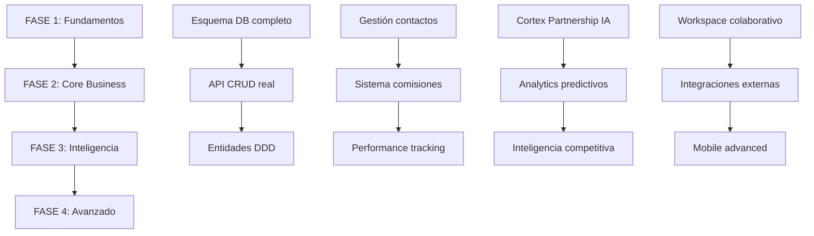

# 🏢 MÓDULO AGENCIAS DE MEDIOS - ANÁLISIS COMPLETO Y PLAN DE IMPLEMENTACIÓN

## 📋 RESUMEN EJECUTIVO

| Aspecto | Estado |
|---------|--------|
| **Especificación** | TIER 0 COMPLETA (831 líneas) |
| **Implementación Actual** | ~5% (Básico/Mock) |
| **Arquitectura DDD** | ❌ NO EXISTE |
| **Integración IA (Cortex)** | ❌ NO IMPLEMENTADO |
| **Módulo Similar de Referencia** | `agencias-creativas` (bien implementado) |

---

## 🔍 ANÁLISIS COMPARATIVO: ESPECIFICADO VS IMPLEMENTADO

### 1. ESTRUCTURA DE MÓDULO DDD

#### Especificado (según `🏢 MÓDULO AGENCIAS DE MEDIOS - ESPE.txt`):
```
src/modules/agencias/
├── domain/
│   ├── entities/
│   │   ├── AgenciaMedios.ts
│   │   ├── ContactoAgencia.ts
│   │   ├── RelacionAnunciante.ts
│   │   ├── EstructuraComisiones.ts
│   │   ├── PortfolioClientes.ts
│   │   ├── PerformanceAgencia.ts
│   │   ├── ColaboracionCampana.ts
│   │   ├── ContratosMarco.ts
│   │   ├── InteligenciaCompetitiva.ts
│   │   ├── HistorialTransacciones.ts
│   │   ├── AlertasEstrategicas.ts
│   │   └── CertificacionesAgencia.ts
│   ├── value-objects/
│   │   ├── RutAgencia.ts
│   │   ├── TipoAgencia.ts
│   │   ├── EspecializacionVertical.ts
│   │   ├── EstructuraComision.ts
│   │   ├── ScorePartnership.ts (0-1000 con IA)
│   │   ├── NivelColaboracion.ts
│   │   ├── CapacidadesDigitales.ts
│   │   ├── CertificacionesPlataforma.ts
│   │   └── VolumetriaEsperada.ts
│   └── repositories/ (5 interfaces)
├── application/
│   ├── commands/ (11 comandos)
│   ├── queries/ (10 queries)
│   └── handlers/ (8 handlers)
├── infrastructure/
│   ├── repositories/ (4 implementaciones)
│   ├── external/ (15 servicios integrados)
│   └── messaging/ (4 publishers)
└── presentation/
    ├── controllers/ (8 controllers)
    ├── dto/ (5 DTOs)
    └── middleware/ (4 middlewares)
```

#### Implementado ACTUALMENTE:
```
src/
├── app/api/agencias-medios/route.ts  (136 líneas - MOCK DATA)
├── app/agencias-medios/page.tsx     (253 líneas - UI básica)
├── app/agencias-medios/movil/page.tsx
└── lib/db/agencias-medios-schema.ts (155 líneas - Schema DB básico)
```

**VEREDICTO: ❌ 0% de la estructura DDD implementada**

---

### 2. SCHEMA DE BASE DE DATOS

#### Lo que EXISTE (`agencias-medios-schema.ts`):
- ✅ Tabla `agencias_medios` con campos básicos
- ✅ Tabla `contactos_agencia` 
- ✅ Relaciones bemployee-tenant
- ✅ Índices básicos

#### Lo que FALTA:
- ❌ `relaciones_anunciantes` (mapeo agencia-cliente)
- ❌ `estructuras_comisiones` (esquemas dinámicos)
- ❌ `certificaciones_agencia` (badges, Google Premier, etc.)
- ❌ `performance_agencia` (métricas históricas)
- ❌ `colaboraciones_campana` (proyectos conjuntos)
- ❌ `contratos_marco` (acuerdos comerciales)
- ❌ `inteligencia_competitiva` (análisis vs otras agencias)
- ❌ `alertas_estrategicas` (sistema de alertas)
- ❌ `historial_transacciones` (timeline)

---

### 3. API ROUTES

#### Implementación ACTUAL (`/api/agencias-medios`):
```typescript
✅ GET  - Lista agencias con búsqueda (MOCK DATA)
✅ POST - Crea agencia nueva (MOCK DATA)
❌ GET /:id - Detalle completo con analytics
❌ PUT /:id - Actualización completa
❌ DELETE /:id - Eliminación lógica
❌ POST /:id/contactos - Gestión de contactos
❌ GET /:id/performance - Métricas de rendimiento
❌ POST /:id/comisiones - Configurar comisiones
❌ GET /:id/analytics - Analytics predictivos
❌ POST /:id/certificaciones - Gestionar certificaciones
❌ GET /pipeline - Pipeline de partnerships
❌ GET /metrics - Métricas generales
```

---

### 4. CAPAS DE NEGOCIO (DDD)

#### Commands Implementados: ❌ NINGUNO
```typescript
// ESPECIFICADO:
✅ CrearAgenciaCommand
✅ ActualizarAgenciaCommand
✅ AsignarAnuncianteCommand
✅ ConfigurarComisionesCommand
✅ IniciarColaboracionCommand
✅ ActualizarPerformanceCommand
✅ GenerarContratoMarcoCommand
✅ ActivarAlertasCommand
✅ CertificarCapacidadesCommand
✅ OptimizarPartnershipCommand
✅ SincronizarPortfolioCommand
✅ EvaluarRenovacionCommand

// IMPLEMENTADO: ❌ NINGUNO
```

#### Queries Implementadas: ❌ NINGUNO
```typescript
// ESPECIFICADO:
✅ ObtenerPerfilAgenciaQuery
✅ BuscarAgenciasQuery
✅ ObtenerPortfolioClientesQuery
✅ AnalisisPerfomanceQuery
✅ ObtenerComisionesQuery
✅ GenerarReporteColaboracionQuery
✅ BuscarOportunidadesQuery
✅ CompararAgenciasQuery
✅ ProyectarIngresosQuery
✅ AnalisisCompetitivoQuery

// IMPLEMENTADO: ❌ NINGUNO
```

#### Handlers Implementados: ❌ NINGUNO
```typescript
// ESPECIFICADO:
✅ AgenciaCommandHandler
✅ ColaboracionWorkflowHandler
✅ PerformanceAnalysisHandler
✅ ComisionAutomationHandler
✅ PartnershipOptimizationHandler
✅ InteligenciaCompetitivaHandler
✅ AlertasEstrategicasHandler
✅ IntegracionExternaHandler

// IMPLEMENTADO: ❌ NINGUNO
```

---

### 5. INTEGRACIONES EXTERNAS

#### Especificadas (15 servicios):
| Servicio | Descripción | Estado |
|----------|-------------|--------|
| SIIValidationService | Validación RUT Chile | ❌ |
| GoogleAdsPartnerService | Google Partners API | ❌ |
| MetaBusinessService | Meta Business Partners | ❌ |
| LinkedInSalesService | Prospección ejecutivos | ❌ |
| CortexPartnershipService | IA de partnerships | ❌ |
| CortexIntelligenceService | Inteligencia competitiva | ❌ |
| WebScrapingService | Monitoreo público | ❌ |
| EmailParsingService | Procesamiento briefs | ❌ |
| WhatsAppBusinessService | Comunicación directa | ❌ |
| CalendlyIntegrationService | Scheduling reuniones | ❌ |
| SlackIntegrationService | Colaboración en tiempo real | ❌ |
| TrelloAsanaService | Project management | ❌ |
| DocuSignService | Firmas digitales | ❌ |
| BankingAPIService | Pagos y comisiones | ❌ |
| ReportingAdvancedService | Analytics avanzados | ❌ |

**IMPLEMENTADO: 0 de 15**

---

### 6. FRONTEND / UI

#### Implementación ACTUAL:
- ✅ Dashboard básico con lista de agencias
- ✅ Búsqueda por texto
- ✅ Filtro por estado
- ✅ Tarjetas con información básica
- ✅ Navegación a detalle/editar

#### Lo que FALTA (Especificación TIER 0):
- ❌ **Centro de Inteligencia de Partnerships** con IA en tiempo real
- ❌ **Panel de Métricas Predictivas** (revenue, satisfacción, comisiones)
- ❌ **Score Partnership 0-1000** con tendencia visual
- ❌ **Pipeline Kanban** (Prospección → Negociación → Contracting → Activas)
- ❌ **Análisis Predictivo Cortex-Partnership**
- ❌ **Workspace Colaborativo** en tiempo real (chat, tasks, files)
- ❌ **Wizard de Creación IA** (validación SII automática, detección por URL/LinkedIn)
- ❌ **Dashboard Gerencial** con Revenue, Growth, Satisfaction
- ❌ **Alertas Estratégicas** con next best actions
- ❌ **Comparador de Agencias**
- ❌ **Sistema de Scorings** automáticos
- ❌ **Mobile App** avanzada con WhatsApp integration

---

### 7. SEGURIDAD Y PERMISOS

#### Especificado:
| Rol | Permisos |
|-----|----------|
| Partnership Manager | Ver todas, crear hasta Estándar, configurar comisiones hasta 15% |
| Gerente Comercial | Acceso completo, términos avanzados, override límites |
| CEO/Director | Acceso total, políticas estratégicas, override total |

#### Implementado:
- ❌ Sin middleware de autorización granular
- ❌ RBAC básico (recurso: `anunciantes`, acción: `read/create`)

---

## 🎯 PROPUESTAS DE MEJORA (BASADAS EN BEST PRACTICES)

### 1. ARQUITECTURA DDD COMPLETA
Basado en el módulo `agencias-creativas` bien implementado, crear la misma estructura para agencias de medios.

### 2. SCORE PARTNERSHIP INTELIGENTE
Sistema de scoring 0-1000 que evalúe:
- Performance histórica
- Crecimiento YoY
- Satisfacción del contacto
- Certificaciones vigentes
- Nivel de colaboración

### 3. AUTOMATIZACIÓN DE COMISIONES
- Cálculo automático basado en partnership level
- Incentivos por volumen y crecimiento
- Alertas de desviaciones

### 4. INTELIGENCIA COMPETITIVA
- Monitoreo de actividades de agencias competidoras
- Detección de oportunidades de partnership
- Benchmarking automático

### 5. WORKSPACE COLABORATIVO
- Chat en tiempo real entre equipos Silexar y agencia
- Tasks y milestones compartidos
- Documentos colaborativos

### 6. ANALYTICS PREDICTIVOS
- Predicción de renovaciones
- Detección de agencias en riesgo
- Proyecciones de revenue

---

## 📅 PLAN DE IMPLEMENTACIÓN FASES



### FASE 1: FUNDAMENTOS (Semanas 1-3)
1. ✅ Expandir schema DB con todas las tablas especificadas
2. ✅ Crear entidades DDD (`AgenciaMedios`, `ContactoAgencia`, etc.)
3. ✅ Implementar repositorios con lógica de dominio
4. ✅ Refactorizar API routes para usar BD real
5. ✅ CRUD completo con validaciones

### FASE 2: CORE BUSINESS (Semanas 4-6)
1. ✅ Sistema de contactos avanzados
2. ✅ Gestión de estructuras de comisiones
3. ✅ Tracking de performance histórico
4. ✅ Sistema de certificaciones
5. ✅ Dashboard de métricas básicas

### FASE 3: INTELIGENCIA (Semanas 7-10)
1. ✅ Motor Cortex-Partnership (scoring IA)
2. ✅ Analytics predictivos
3. ✅ Detección automática de oportunidades
4. ✅ Sistema de alertas inteligentes
5. ✅ Inteligencia competitiva

### FASE 4: AVANZADO (Semanas 11-14)
1. ✅ Workspace colaborativo en tiempo real
2. ✅ Integraciones externas (SII, Google, Meta, etc.)
3. ✅ Mobile app avanzada
4. ✅ Automated brief intelligence
5. ✅ Revenue optimization engine

---

## 📊 PRIORIDADES SUGERIDAS

| Prioridad | Item | Impacto | Esfuerzo |
|-----------|------|---------|----------|
| 🔴 ALTA | Schema DB completo | Crítico | Medio |
| 🔴 ALTA | API CRUD real vs MOCK | Crítico | Bajo |
| 🔴 ALTA | Entidad AgenciaMedios DDD | Crítico | Alto |
| 🟡 MEDIA | Sistema comisiones | Alto | Medio |
| 🟡 MEDIA | Contactos avanzados | Alto | Medio |
| 🟡 MEDIA | Performance tracking | Alto | Medio |
| 🟢 BAJA | Cortex IA | Medio | Alto |
| 🟢 BAJA | Workspaces colaborativos | Medio | Alto |

---

## 🔗 REFERENCIAS

- **Módulo similar bien implementado**: `src/modules/agencias-creativas/`
- **Schema DB actual**: `src/lib/db/agencias-medios-schema.ts`
- **API routes**: `src/app/api/agencias-medios/route.ts`
- **UI actual**: `src/app/agencias-medios/page.tsx`
- **Especificación completa**: `Modulos/🏢 MÓDULO AGENCIAS DE MEDIOS - ESPE.txt`
