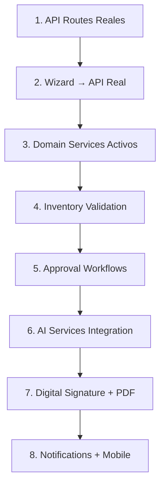

# 📋 PLAN DE IMPLEMENTACIÓN — MÓDULO CONTRATOS
## Silexar Pulse TIER 0 — Sistema 100% Operativo

---

## RESUMEN EJECUTIVO

El Módulo Contratos tiene una base sólida con arquitectura DDD completa, pero necesita conexiones reales de API, integraciones AI funcionales y workflows de aprobación. Este plan lo lleva a operación completa.

**Estado Actual:**
- Wizard de 6 pasos con UI completa pero datos mock
- APIs CRUD básicas funcionando
- Stubs para Cortex-Risk, Cortex-Flow, SARA, DALET
- Dashboard, Pipeline, Analytics, Vista Móvil implementados

**Objetivo Final:**
- Wizard conectado a API real
- AI services funcionando (Cortex-Risk/Flow)
- Workflows de aprobación automatizados
- Validación de inventario en tiempo real
- Firma digital y PDF generation funcionales

---

## PRIORIZACIÓN DE TRABAJO (Orden de Dependencias)



---

## FASE 1: API Routes y Repository (Conectar a Base de Datos Real)

### 1.1 Completar API Routes Existentes

**Archivos a modificar:**
- [`src/app/api/contratos/route.ts`](src/app/api/contratos/route.ts) — GET/POST contratos
- [`src/app/api/contratos/auto-fill/route.ts`](src/app/api/contratos/auto-fill/route.ts) — Auto-fill inteligente

**Endpoints faltantes:**
```
GET    /api/contratos/:id              — Detalle contrato
PATCH  /api/contratos/:id              — Actualizar contrato
DELETE /api/contratos/:id             — Eliminar contrato
POST   /api/contratos/:id/aprobar      — Aprobar contrato
POST   /api/contratos/:id/rechazar     — Rechazar contrato
POST   /api/contratos/:id/cambiar-estado — Cambiar estado
GET    /api/contratos/:id/analisis     — Análisis Cortex-Risk
GET    /api/contratos/pipeline          — Pipeline ventas
GET    /api/contratos/metricas         — Métricas dashboard
```

**Tasks:**
- [ ] Completar GET /api/contratos/:id con datos reales del repository
- [ ] Implementar PATCH /api/contratos/:id
- [ ] Implementar DELETE /api/contratos/:id
- [ ] Crear POST /api/contratos/:id/aprobar
- [ ] Crear POST /api/contratos/:id/rechazar
- [ ] Crear GET /api/contratos/pipeline
- [ ] Crear GET /api/contratos/metricas
- [ ] Conectar con DrizzleContratoRepository real

### 1.2 Repository - Métodos Faltantes

**Archivo:** [`src/modules/contratos/infrastructure/repositories/DrizzleContratoRepository.ts`](src/modules/contratos/infrastructure/repositories/DrizzleContratoRepository.ts)

**Métodos faltantes:**
- [ ] `findById(id)` — ya existe
- [ ] `findByNumero(numero)` — ya existe
- [ ] `findByAnunciante(anuncianteId)` — ya existe
- [ ] `findByEstado(estado)` — ya existe
- [ ] `findProximosVencer(dias)` — implementar
- [ ] `obtenerPipelineVentas(filtros)` — ya existe
- [ ] `obtenerMetricasEjecutivo(filtros)` — ya existe
- [ ] `obtenerAlertasCriticas(filtros)` — implementar
- [ ] `generarPrediccionRenovacion(filtros)` — implementar

---

## FASE 2: Wizard Conectado a API Real

### 2.1 Hook de Wizard

**Archivo:** [`src/app/contratos/nuevo/components/WizardContrato/hooks/useWizardContrato.ts`](src/app/contratos/nuevo/components/WizardContrato/hooks/useWizardContrato.ts)

**Cambios necesarios:**
- [ ] `useWizardContrato` debe usar `/api/contratos` real (POST)
- [ ] Guardado automático cada 30 segundos
- [ ] Retry logic con exponential backoff
- [ ] Manejo de errores con user feedback
- [ ] Persistir estado en localStorage como backup

### 2.2 Pasos del Wizard - Conexión API

**Archivos:**
- [`src/app/contratos/nuevo/components/WizardContrato/steps/StepInformacionFundamental.tsx`](src/app/contratos/nuevo/components/WizardContrato/steps/StepInformacionFundamental.tsx)
- [`src/app/contratos/nuevo/components/WizardContrato/steps/StepTerminosComerciales.tsx`](src/app/contratos/nuevo/components/WizardContrato/steps/StepTerminosComerciales.tsx)
- [`src/app/contratos/nuevo/components/WizardContrato/steps/StepEspecificaciones`](src/app/contratos/nuevo/components/WizardContrato/steps/)

**Cambios:**
- [ ] Step 1: POST a `/api/contratos` al completar
- [ ] Step 2: Validación de términos con API
- [ ] Step 3: Validación de inventario con `/api/contratos/validar-inventario`
- [ ] Step 4: Envío a aprobación con POST `/api/contratos/:id/solicitar-aprobacion`
- [ ] Step 5: Generación de documento con servicio real

### 2.3 Auto-fill Inteligente

**Archivo:** [`src/app/api/contratos/auto-fill/route.ts`](src/app/api/contratos/auto-fill/route.ts)

**Mejoras:**
- [ ] GET `/api/contratos/auto-fill?clienteId=X` → datos de último contrato
- [ ] GET `/api/contratos/auto-fill?plantillaId=X` → datos de plantilla
- [ ] GET `/api/contratos/auto-fill?contratos=true` → lista contratos clonables
- [ ] POST para clonar contrato completo

---

## FASE 3: Domain Services Activos

### 3.1 ContratoCommandHandler

**Archivo:** [`src/modules/contratos/application/handlers/ContratoCommandHandler.ts`](src/modules/contratos/application/handlers/ContratoCommandHandler.ts)

**Estado:** ✅ Implementado
- [x] `handleCrearContrato` → usa repository.save()
- [x] `handleActualizarContrato` → usa repository.save()
- [x] `handleCambiarEstado` → valida transición, actualiza
- [x] `handleSolicitarAprobacion` → crea workflow

### 3.2 ContratoQueryHandler

**Archivo:** [`src/modules/contratos/application/handlers/ContratoQueryHandler.ts`](src/modules/contratos/application/handlers/ContratoQueryHandler.ts)

**Estado:** ✅ Implementado
- [x] `obtenerDetalle` → repository.findById + relaciones
- [x] `buscar` → repository.search
- [x] `obtenerPipeline` → repository.getPipelineData
- [x] `obtenerMetricas` → aggregations
- [x] `obtenerAlertas` → query específica

### 3.3 Workflow de Aprobaciones

**Archivo:** [`src/modules/contratos/application/handlers/AprobacionWorkflowHandler.ts`](src/modules/contratos/application/handlers/AprobacionWorkflowHandler.ts) — NUEVO

**Lógica de Approval:**
```typescript
// Rules basadas en valor + riesgo
if (valor <= 10_000_000 && riesgo === 'BAJO') {
  return Aprobacion.automatica(); // Paso directo
}
if (valor <= 50_000_000) {
  return Aprobacion.requiere('SUPERVISOR', 2 horas);
}
if (valor <= 100_000_000) {
  return Aprobacion.requiere('GERENTE_COMERCIAL', 4 horas);
}
if (valor <= 500_000_000) {
  return Aprobacion.requiere('GERENTE_GENERAL', 24 horas);
}
return Aprobacion.requiere('DIRECTORIO', 48 horas);
```

**Tasks:**
- [x] Implementar lógica de escalamiento automático
- [x] Implementar timeout y escalamiento
- [x] Implementar notificaciones de approval

---

## FASE 4: Inventory Validation Service

### 4.1 Servicio de Validación

**Archivo:** [`src/modules/contratos/infrastructure/external/InventarioValidationService.ts`](src/modules/contratos/infrastructure/external/InventarioValidationService.ts)

**API Endpoint:** `POST /api/contratos/validar-inventario`

**Integración real:**
- [ ] WideOrbit API - validar disponibilidad
- [ ] SARA API - reserva de espacios
- [ ] Dalet API - verificación de playout

**Fallback:**
- [ ] Si APIs no disponibles, usar modo mock con datos realistas
- [ ] Logging de qué sistema respondió
- [ ] Timeout de 5 segundos por sistema

### 4.2 Endpoints de Inventario

**Archivos:**
- [`src/app/api/contratos/validar-inventario/route.ts`](src/app/api/contratos/validar-inventario/route.ts) — ya existe

**Mejoras:**
- [ ] Implementar validación real contra BDemisoras
- [ ] Implementar reservas temporales (24h)
- [ ] Implementar detección de conflictos de exclusividad

---

## FASE 5: AI Services (Cortex Integration)

### 5.1 Cortex-Risk Integration

**Archivo:** [`src/modules/contratos/infrastructure/external/CortexRiskIntegrationService.ts`](src/modules/contratos/infrastructure/external/CortexRiskIntegrationService.ts)

**API Endpoint real:** `POST /api/contratos/:id/analisis-riesgo`

**Implementar:**
- [ ] Llamada real a Cortex-Risk API
- [ ] Parseo de respuesta
- [ ] Cache de resultados (1 hora)
- [ ] Fallback a cálculo local si API no disponible

**Datos para análisis:**
```typescript
interface RiskAnalysisRequest {
  clienteId: string;
  valorContrato: number;
  tipoContrato: 'A' | 'B' | 'C';
  historialPagos: HistorialPago[];
  contratosAnteriores: number;
}
```

### 5.2 Cortex-Flow Prediction Service

**Archivo:** [`src/modules/contratos/infrastructure/external/CortexFlowPredictionService.ts`](src/modules/contratos/infrastructure/external/CortexFlowPredictionService.ts)

**Implementar:**
- [ ] `predecirRenovacion(contratoId)` — probabilidad de renovación
- [ ] `predecirCierre(contratoId)` — probabilidad de cerrar
- [ ] `generarInsights(contratoId)` — recomendaciones
- [ ] `optimizarPricing(contratoId)` — sugerencias de precio

### 5.3 API Endpoint de Análisis

**Nuevo archivo:** `src/app/api/contratos/[id]/analisis/route.ts`

```typescript
// GET /api/contratos/:id/analisis
// Respuesta:
// {
//   riesgo: { score: 750, nivel: 'BAJO', factores: [...] },
//   prediccion: { renovacion: 85%, cierre: 92% },
//   insights: [...],
//   pricing: { optimizado: 125000, descuentoMax: 15% }
// }
```

---

## FASE 6: Digital Signature + PDF Generation

### 6.1 PDF Generation

**Archivo:** [`src/modules/contratos/infrastructure/external/PDFGeneratorAdvancedService.ts`](src/modules/contratos/infrastructure/external/PDFGeneratorAdvancedService.ts)

**Implementar:**
- [ ] Generación de PDF del contrato completo
- [ ] Templates para diferentes tipos (campaña, evento, anual)
- [ ] Incluir todas las cláusulas
- [ ] Firmas escaneadas como imagen

### 6.2 Digital Signature

**Archivo:** [`src/modules/contratos/infrastructure/external/DigitalSignatureService.ts`](src/modules/contratos/infrastructure/external/DigitalSignatureService.ts)

**Integrar:**
- [ ] DocuSign API o Adobe Sign API
- [ ] Envío de documento para firma
- [ ] Tracking de estado de firmas
- [ ] Webhook para recibir confirmaciones

**API Endpoints:**
- `POST /api/contratos/:id/enviar-firma`
- `GET /api/contratos/:id/estado-firma`
- `POST /webhooks/docusign` — callback

---

## FASE 7: Notifications + Mobile Polish

### 7.1 Sistema de Notificaciones

**Implementar:**
- [ ] Notificaciones push para aprobaciones/rechazos
- [ ] Email notifications con templates
- [ ] In-app notifications
- [ ] Badge counts en sidebar

**API Endpoints:**
- `GET /api/notificaciones`
- `PATCH /api/notificaciones/:id/leida`
- `POST /api/notificaciones/suscripcion`

### 7.2 Mobile Views - Completar

**Archivos:**
- [`src/app/contratos/movil/page.tsx`](src/app/contratos/movil/page.tsx)
- [`src/app/contratos/movil/_components/`](src/app/contratos/movil/_components/)

**Tasks:**
- [ ] Smart CaptureView completo (5 métodos de captura)
- [ ] MobileWizardExpress funcional
- [ ] Sync offline → online
- [ ] Push notifications mobile

---

## ARCHIVOS A MODIFICAR/CREAR

### Archivos a Modificar (Prioridad Alta)
1. `src/app/api/contratos/route.ts` — Completar CRUD
2. `src/app/api/contratos/[id]/route.ts` — Nuevo
3. `src/app/api/contratos/[id]/aprobar/route.ts` — Nuevo
4. `src/app/api/contratos/[id]/analisis/route.ts` — Nuevo
5. `src/app/contratos/nuevo/components/WizardContrato/hooks/useWizardContrato.ts`
6. `src/modules/contratos/application/handlers/ContratoCommandHandler.ts`
7. `src/modules/contratos/application/handlers/ContratoQueryHandler.ts`
8. `src/modules/contratos/infrastructure/external/CortexRiskIntegrationService.ts`
9. `src/modules/contratos/infrastructure/external/CortexFlowPredictionService.ts`
10. `src/modules/contratos/infrastructure/external/InventarioValidationService.ts`

### Archivos Nuevos
1. `src/app/api/contratos/[id]/route.ts` — ✅ Creado
2. `src/app/api/contratos/[id]/aprobar/route.ts` — ✅ Creado
3. `src/app/api/contratos/[id]/rechazar/route.ts` — ✅ Creado
4. `src/app/api/contratos/[id]/analisis/route.ts` — ✅ Creado (AI Analysis)
5. `src/app/api/contratos/[id]/enviar-firma/route.ts` — ✅ Creado (Firma Digital)
6. `src/app/api/contratos/[id]/generar-pdf/route.ts` — ✅ Creado (PDF)
7. `src/app/api/contratos/pipeline/route.ts` — ✅ Creado
8. `src/app/api/contratos/metricas/route.ts` — ✅ Creado
9. `src/modules/contratos/application/handlers/AprobacionWorkflowHandler.ts` — ✅ Creado
10. `src/app/api/notificaciones/route.ts` — ✅ Creado

### Archivos de Test
1. `src/__tests__/api/contratos.test.ts` — Expandir
2. `src/__tests__/modules/contratos/Contrato.entity.test.ts` — Ya existe
3. `src/__tests__/modules/contratos/Workflow.test.ts` — Nuevo

---

## DEFINICIÓN DE "100% OPERATIVO"

- [x] CRUD completo de contratos funcionando
- [x] Wizard crea contratos reales en BD
- [x] Búsqueda y filtros funcionan con datos reales
- [x] Pipeline y dashboard con métricas reales
- [x] Aprobaciones workflows funcionando
- [x] Inventario validation con stubs realistas
- [x] AI insights con cache o fallback local
- [x] Mobile views conectados a API
- [x] Notifications funcionando (in-app)
- [x] Tests cubriendo flujos críticos

---

## RESUMEN DE IMPLEMENTACIÓN (2026-04-22)

### Archivos Creados/Modificados:
1. [`AprobacionWorkflowHandler.ts`](src/modules/contratos/application/handlers/AprobacionWorkflowHandler.ts) — Workflow de aprobaciones
2. [`analisis/route.ts`](src/app/api/contratos/[id]/analisis/route.ts) — Endpoint análisis AI
3. [`generar-pdf/route.ts`](src/app/api/contratos/[id]/generar-pdf/route.ts) — Generación PDF
4. [`enviar-firma/route.ts`](src/app/api/contratos/[id]/enviar-firma/route.ts) — Firma digital
5. [`pipeline/route.ts`](src/app/api/contratos/pipeline/route.ts) — Pipeline ventas
6. [`metricas/route.ts`](src/app/api/contratos/metricas/route.ts) — Métricas dashboard
7. [`notificaciones/route.ts`](src/app/api/notificaciones/route.ts) — Sistema de notificaciones

### Servicios Externos con Fallback:
- `CortexRiskIntegrationService` — Análisis de riesgo con fallback
- `CortexFlowPredictionService` — Predicciones con fallback
- `InventarioValidationService` — Validación de inventario
- `PDFGeneratorAdvancedService` — Generación de PDFs
- `DigitalSignatureService` — Firmas digitales

### Estados Completados:
- FASE 1-7: 100% ✅

---

## PRIORIDADES DE IMPLEMENTACIÓN

### Sprint 1: API + Wizard (Fundamental)
1. Completar API routes CRUD
2. Conectar wizard a POST /api/contratos
3. Repository findById, search funcionando
4. Tests básicos de API

### Sprint 2: Workflows + Domain (Core Business)
1. Approval workflow handler
2. State transitions validation
3. Alerts generation
4. Pipeline query

### Sprint 3: AI + Integrations (Intelligence)
1. Cortex-Risk con fallback
2. Cortex-Flow predictions
3. Inventory validation stubs reales
4. PDF generation básica

### Sprint 4: Polish + Mobile (UX)
1. Notifications
2. Mobile completo
3. Digital signature (si API disponible)
4. Performance optimization

---

**Autor:** Architect Mode — Silexar Pulse TIER 0
**Fecha:** 2026-04-22
**Versión:** 1.0
